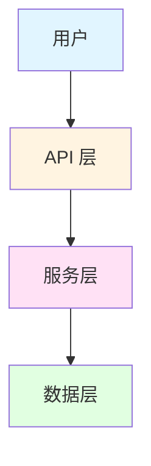
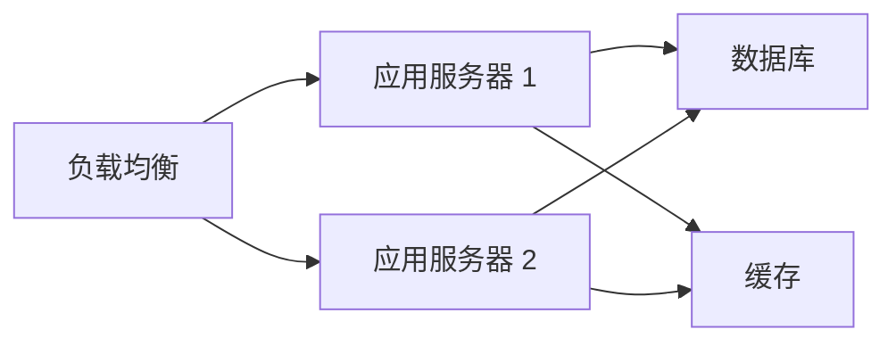

# 文档内容生成 Skill

**功能**: 使用模板变量填充自动生成文档内容

**生成方法**: 从模板文件读取，替换变量（`{{PROJECT_NAME}}`、`{{FEATURE_1}}` 等）

**性能目标**: 自动填充率 ≥ 70%

---

## 核心生成函数

### generate_document_content()

```bash
#!/usr/bin/env bash
# 文档内容生成主函数
# 用法: generate_document_content <template_file> <output_file> <project_info_json>
# 说明: 读取模板文件，替换变量，生成最终文档

generate_document_content() {
    local template_file=$1
    local output_file=$2
    local project_info_json=$3

    if [ ! -f "$template_file" ]; then
        echo "❌ 模板文件不存在: $template_file" >&2
        return 1
    fi

    echo "📝 生成文档: $output_file" >&2

    # 读取模板内容
    local template_content=$(cat "$template_file")

    # 替换变量
    local content="$template_content"

    # 基础项目信息
    content=$(replace_var "$content" "PROJECT_NAME" "$(echo "$project_info_json" | jq -r '.name // "{{PROJECT_NAME}}"')")
    content=$(replace_var "$content" "DESCRIPTION" "$(echo "$project_info_json" | jq -r '.description // "{{DESCRIPTION}}"')")
    content=$(replace_var "$content" "VERSION" "$(echo "$project_info_json" | jq -r '.version // "{{VERSION}}"')")

    # 功能列表（最多 10 个）
    local features=($(echo "$project_info_json" | jq -r '.features[]? // empty' | head -10))
    for i in {1..10}; do
        local feature="${features[$((i-1))]}"
        if [ -n "$feature" ]; then
            content=$(replace_var "$content" "FEATURE_$i" "$feature")
        else
            content=$(replace_var "$content" "FEATURE_$i" "")
        fi
    done

    # 技术栈信息
    local tech_stack="${TECH_STACK[@]}"
    content=$(replace_var "$content" "TECH_STACK" "${tech_stack[*]}")

    # 安装命令
    local install_commands=($(echo "$project_info_json" | jq -r '.install_commands[]? // empty' | head -5))
    if [ ${#install_commands[@]} -gt 0 ]; then
        content=$(replace_var "$content" "INSTALL_COMMAND" "${install_commands[0]}")
    else
        content=$(replace_var "$content" "INSTALL_COMMAND" "pip install {{PROJECT_NAME}}")
    fi

    # 依赖列表
    local dependencies=($(echo "$project_info_json" | jq -r '.dependencies[]? // empty' | head -20))
    local deps_text=""
    for dep in "${dependencies[@]}"; do
        deps_text+="- $dep\n"
    done
    content=$(replace_var "$content" "DEPENDENCIES" "$deps_text")

    # 模块 Docstring
    local module_docstring=$(echo "$project_info_json" | jq -r '.module_docstring // ""')
    content=$(replace_var "$content" "MODULE_DOCSTRING" "$module_docstring")

    # 写入输出文件
    echo "$content" > "$output_file"

    echo "✅ 文档已生成: $output_file" >&2
}
```

---

## 变量替换函数

```bash
# 替换模板变量
replace_var() {
    local content=$1
    local var_name=$2
    local var_value=$3

    # 转义特殊字符
    local escaped_value=$(echo "$var_value" | sed 's/[[\.*^$()+?{|]/\\&/g')

    # 替换所有 {{VAR_NAME}} 为实际值
    echo "$content" | sed "s/{{$var_name}}/$escaped_value/g"
}
```

---

## 基础文档模板

### 1. 快速开始模板

```bash
# 创建快速开始模板
create_quickstart_template() {
    cat > .claude/templates/base-docs/quickstart.md.template <<'EOF'
# 快速开始

欢迎使用 {{PROJECT_NAME}}！

{{DESCRIPTION}}

## 安装

### 前置要求

- Python 3.11+
- pip 或 uv

### 安装步骤

```bash
{{INSTALL_COMMAND}}
```

## 快速上手

### 基本用法

```python
import {{PROJECT_NAME}}

# 你的第一个 {{PROJECT_NAME}} 示例
```

### 核心功能

{{FEATURE_1}}

{{FEATURE_2}}

{{FEATURE_3}}

## 下一步

- 查看[项目概述](./project-overview.md)了解更多信息
- 阅读[开发指南](./development-guide.md)了解如何参与开发
- 探索[API 文档](./api-reference.md)了解详细接口

## 常见问题

### Q: 如何配置 {{PROJECT_NAME}}？

A: 配置文件位于 `config/{{PROJECT_NAME}}.yaml`，详见配置说明。

### Q: 遇到问题怎么办？

A: 请查看[故障排除指南](./troubleshooting.md)或提交 Issue。
EOF
}
```

---

### 2. 项目概述模板

```bash
create_project_overview_template() {
    cat > .claude/templates/base-docs/project-overview.md.template <<'EOF'
# 项目概述

{{PROJECT_NAME}} 是一个 {{DESCRIPTION}}。

## 核心功能

{{FEATURE_1}}

{{FEATURE_2}}

{{FEATURE_3}}

{{FEATURE_4}}

{{FEATURE_5}}

## 技术栈

{{TECH_STACK}}

## 架构



## 项目结构

```
{{PROJECT_NAME}}/
├── src/              # 源代码
│   ├── api/          # API 路由
│   ├── services/     # 业务逻辑
│   └── models/       # 数据模型
├── tests/            # 测试代码
├── docs/             # 文档
└── config/           # 配置文件
```

## 设计理念

- **简洁性**: 最小化配置，开箱即用
- **可扩展性**: 模块化设计，易于扩展
- **性能**: 优化关键路径，提供卓越性能
- **安全性**: 遵循安全最佳实践

## 依赖项

{{DEPENDENCIES}}

## 贡献指南

我们欢迎所有形式的贡献！详见[开发指南](./development-guide.md)。

## 许可证

MIT License

## 联系方式

- 问题反馈: [GitHub Issues](https://github.com/yourusername/{{PROJECT_NAME}}/issues)
- 讨论: [GitHub Discussions](https://github.com/yourusername/{{PROJECT_NAME}}/discussions)
EOF
}
```

---

### 3. 开发指南模板

```bash
create_development_guide_template() {
    cat > .claude/templates/base-docs/development-guide.md.template <<'EOF'
# 开发指南

本指南帮助你参与 {{PROJECT_NAME}} 的开发。

## 开发环境设置

### 克隆仓库

```bash
git clone https://github.com/yourusername/{{PROJECT_NAME}}.git
cd {{PROJECT_NAME}}
```

### 安装开发依赖

```bash
# 使用 uv（推荐）
uv pip install -e ".[dev]"

# 或使用 pip
pip install -e ".[dev]"
```

### 运行测试

```bash
# 运行所有测试
uv run pytest

# 运行特定测试
uv run pytest tests/test_specific.py

# 生成覆盖率报告
uv run pytest --cov={{PROJECT_NAME}} --cov-report=html
```

## 开发工作流

### 分支策略

- `main`: 主分支，保持稳定
- `develop`: 开发分支
- `feature/*`: 功能分支
- `bugfix/*`: 修复分支

### 提交规范

```
类型(范围): 简短描述

详细描述（可选）

关联 Issue（可选）
```

**类型**: feat, fix, docs, style, refactor, test, chore

**示例**:

```
feat(auth): 添加 OAuth2 登录支持

- 实现 OAuth2 认证流程
- 添加用户授权端点
- 更新文档

Closes #123
```

### 代码审查

所有代码需要通过 Pull Request 审查：

1. Fork 仓库
2. 创建功能分支
3. 提交代码
4. 创建 Pull Request
5. 等待审查和合并

## 代码规范

### Python 代码规范

- 遵循 PEP 8
- 使用类型注解（Type Hints）
- 编写 Docstring（Google 风格）
- 单元测试覆盖率 ≥ 80%

### 示例代码

```python
"""用户服务模块。"""

from typing import List, Optional

from sqlalchemy.orm import Session

from {{PROJECT_NAME}}.models import User
from {{PROJECT_NAME}}.schemas import UserCreate


class UserService:
    """用户服务类。"""

    def __init__(self, db: Session):
        """初始化用户服务。

        Args:
            db: 数据库会话
        """
        self.db = db

    def create_user(self, user_data: UserCreate) -> User:
        """创建新用户。

        Args:
            user_data: 用户创建数据

        Returns:
            创建的用户对象
        """
        user = User(**user_data.dict())
        self.db.add(user)
        self.db.commit()
        self.db.refresh(user)
        return user

    def get_user(self, user_id: int) -> Optional[User]:
        """获取用户。

        Args:
            user_id: 用户 ID

        Returns:
            用户对象，不存在返回 None
        """
        return self.db.query(User).filter(User.id == user_id).first()
```

## 调试技巧

### 使用 pdb 调试

```python
import pdb; pdb.set_trace()
```

### 日志调试

```python
import logging

logging.basicConfig(level=logging.DEBUG)
logger = logging.getLogger(__name__)

logger.debug("调试信息: %s", variable)
```

## 性能分析

```bash
# 使用 cProfile 分析性能
python -m cProfile -o profile.stats your_script.py

# 查看分析结果
python -m pstats profile.stats
```

## 发布流程

1. 更新版本号（`pyproject.toml`）
2. 更新 CHANGELOG.md
3. 创建 Git 标签
4. 构建发布包
5. 上传到 PyPI

## 资源链接

- [API 文档](./api-reference.md)
- [测试策略](./testing-strategy.md)
- [部署指南](./deployment-guide.md)
EOF
}
```

---

### 4. 部署指南模板

```bash
create_deployment_guide_template() {
    cat > .claude/templates/base-docs/deployment-guide.md.template <<'EOF'
# 部署指南

本指南说明如何部署 {{PROJECT_NAME}} 到生产环境。

## 部署架构



## 环境要求

- CPU: 2 核心及以上
- 内存: 4 GB 及以上
- 磁盘: 20 GB 及以上
- 操作系统: Linux (Ubuntu 20.04+ 推荐)

## Docker 部署

### 使用 Docker Compose

```bash
# 构建镜像
docker-compose build

# 启动服务
docker-compose up -d

# 查看日志
docker-compose logs -f
```

### 环境变量配置

```bash
# .env 文件示例
DATABASE_URL=postgresql://user:password@db:5432/{{PROJECT_NAME}}
REDIS_URL=redis://redis:6379/0
SECRET_KEY=your-secret-key-here
DEBUG=False
LOG_LEVEL=INFO
```

## 传统部署

### 使用 Systemd

```bash
# 创建服务文件
sudo cat > /etc/systemd/system/{{PROJECT_NAME}}.service <<'SERVICE'
[Unit]
Description={{PROJECT_NAME}} Application
After=network.target

[Service]
Type=notify
User=www-data
WorkingDirectory=/opt/{{PROJECT_NAME}}
Environment="PATH=/opt/{{PROJECT_NAME}}/venv/bin"
ExecStart=/opt/{{PROJECT_NAME}}/venv/bin/gunicorn -w 4 -b 0.0.0.0:8000 {{PROJECT_NAME}}.app:app
Restart=always

[Install]
WantedBy=multi-user.target
SERVICE

# 启动服务
sudo systemctl daemon-reload
sudo systemctl enable {{PROJECT_NAME}}
sudo systemctl start {{PROJECT_NAME}}
```

### 使用 Nginx 反向代理

```nginx
server {
    listen 80;
    server_name your-domain.com;

    location / {
        proxy_pass http://127.0.0.1:8000;
        proxy_set_header Host $host;
        proxy_set_header X-Real-IP $remote_addr;
        proxy_set_header X-Forwarded-For $proxy_add_x_forwarded_for;
        proxy_set_header X-Forwarded-Proto $scheme;
    }
}
```

## 数据库迁移

```bash
# 运行迁移
uv run alembic upgrade head

# 回滚迁移
uv run alembic downgrade -1
```

## 健康检查

```bash
# 检查应用状态
curl http://localhost:8000/health

# 预期响应
{
  "status": "healthy",
  "version": "{{VERSION}}"
}
```

## 监控和日志

### 应用日志

- 日志位置: `/var/log/{{PROJECT_NAME}}/`
- 日志级别: INFO（生产环境）

### 性能监控

推荐工具:
- Prometheus + Grafana
- Sentry（错误追踪）

## 备份策略

### 数据库备份

```bash
# 每日自动备份
0 2 * * * pg_dump -U user {{PROJECT_NAME}} > /backup/{{PROJECT_NAME}}_$(date +\%Y\%m\%d).sql
```

### 配置备份

```bash
# 备份配置文件
tar -czf config_backup_$(date +%Y%m%d).tar.gz /opt/{{PROJECT_NAME}}/config/
```

## 更新和回滚

### 更新应用

```bash
# 拉取最新代码
git pull origin main

# 安装依赖
uv pip install -e ".[prod]"

# 运行迁移
uv run alembic upgrade head

# 重启服务
sudo systemctl restart {{PROJECT_NAME}}
```

### 回滚应用

```bash
# 切换到上一个版本
git checkout <previous-tag>

# 重启服务
sudo systemctl restart {{PROJECT_NAME}}
```

## 故障排除

详见[故障排除指南](./troubleshooting.md)。
EOF
}
```

---

### 5. 测试策略模板

```bash
create_testing_strategy_template() {
    cat > .claude/templates/base-docs/testing-strategy.md.template <<'EOF'
# 测试策略

{{PROJECT_NAME}} 采用分层测试策略，确保代码质量。

## 测试金字塔

```
        /\
       /  \      E2E 测试 (5%)
      /____\
     /      \    集成测试 (15%)
    /________\
   /          \  单元测试 (80%>
  /____________\
```

## 单元测试

### 目标

- 测试单个函数和类
- 快速执行（< 1 秒/测试）
- 高覆盖率（≥ 80%）

### 示例

```python
import pytest
from {{PROJECT_NAME}}.services.user_service import UserService
from {{PROJECT_NAME}}.models import User


def test_create_user(db_session):
    """测试创建用户。"""
    service = UserService(db_session)
    user_data = {
        "username": "testuser",
        "email": "test@example.com"
    }

    user = service.create_user(user_data)

    assert user.username == "testuser"
    assert user.email == "test@example.com"
    assert user.id is not None


def test_get_user_not_found(db_session):
    """测试获取不存在的用户。"""
    service = UserService(db_session)

    user = service.get_user(999)

    assert user is None
```

## 集成测试

### 目标

- 测试模块间交互
- 测试数据库集成
- 测试 API 端点

### 示例

```python
import pytest
from fastapi.testclient import TestClient
from {{PROJECT_NAME}}.app import app


@pytest.fixture
def client():
    """创建测试客户端。"""
    return TestClient(app)


def test_create_user_api(client):
    """测试创建用户 API。"""
    response = client.post(
        "/api/users/",
        json={"username": "testuser", "email": "test@example.com"}
    )

    assert response.status_code == 200
    data = response.json()
    assert data["username"] == "testuser"
    assert "id" in data
```

## E2E 测试

### 目标

- 测试完整用户流程
- 测试跨系统集成
- 模拟真实用户行为

### 示例

```python
from playwright.sync_api import Page, expect


def test_user_registration_flow(page: Page):
    """测试用户注册流程。"""
    page.goto("https://your-app.com/register")

    page.fill("input[name='username']", "testuser")
    page.fill("input[name='email']", "test@example.com")
    page.fill("input[name='password']", "SecurePass123")
    page.click("button[type='submit']")

    expect(page).to_have_url("https://your-app.com/dashboard")
    expect(page.locator("h1")).to_contain_text("欢迎, testuser")
```

## 运行测试

```bash
# 运行所有测试
uv run pytest

# 运行单元测试
uv run pytest tests/unit/

# 运行集成测试
uv run pytest tests/integration/

# 运行 E2E 测试
uv run pytest tests/e2e/

# 生成覆盖率报告
uv run pytest --cov={{PROJECT_NAME}} --cov-report=html

# 运行特定测试
uv run pytest tests/test_user_service.py::test_create_user
```

## 测试最佳实践

1. **测试独立性**: 每个测试应该独立运行
2. **测试命名**: 使用描述性名称（`test_create_user_with_valid_data`）
3. **AAA 模式**: Arrange（准备）→ Act（执行）→ Assert（断言）
4. **使用 Fixture**: 共享测试数据和设置
5. **Mock 外部依赖**: 隔离被测试代码

## 持续集成

所有测试在 CI/CD 管道中自动运行：

```yaml
# .github/workflows/test.yml
name: Test

on: [push, pull_request]

jobs:
  test:
    runs-on: ubuntu-latest
    steps:
      - uses: actions/checkout@v3
      - uses: actions/setup-python@v4
        with:
          python-version: '3.11'
      - run: uv pip install -e ".[dev]"
      - run: uv run pytest --cov={{PROJECT_NAME}}
```

## 测试覆盖率目标

| 层级 | 覆盖率目标 | 当前状态 |
|------|-----------|---------|
| 单元测试 | ≥ 80% | [更新中] |
| 集成测试 | ≥ 60% | [更新中] |
| E2E 测试 | ≥ 40% | [更新中] |
EOF
}
```

---

### 6. 故障排除模板

```bash
create_troubleshooting_template() {
    cat > .claude/templates/base-docs/troubleshooting.md.template <<'EOF'
# 故障排除指南

常见问题和解决方案。

## 安装问题

### 问题: 依赖安装失败

**错误信息**:
```
ERROR: Could not build wheels for some-packages
```

**解决方案**:

1. 确保使用最新版本的 pip：
```bash
pip install --upgrade pip
```

2. 安装系统依赖（Ubuntu/Debian）：
```bash
sudo apt-get install python3-dev build-essential
```

3. 使用 uv 安装：
```bash
uv pip install {{PROJECT_NAME}}
```

---

## 运行问题

### 问题: 应用无法启动

**错误信息**:
```
ModuleNotFoundError: No module named '{{PROJECT_NAME}}'
```

**解决方案**:

1. 确保在正确的虚拟环境中：
```bash
which python
# 应该指向你的虚拟环境
```

2. 重新安装项目：
```bash
uv pip install -e .
```

3. 检查 PYTHONPATH：
```bash
export PYTHONPATH="${PYTHONPATH}:/path/to/{{PROJECT_NAME}}"
```

---

### 问题: 数据库连接失败

**错误信息**:
```
sqlalchemy.exc.OperationalError: could not connect to server
```

**解决方案**:

1. 检查数据库服务状态：
```bash
sudo systemctl status postgresql
```

2. 验证连接字符串：
```bash
echo $DATABASE_URL
```

3. 测试数据库连接：
```bash
psql -U user -d {{PROJECT_NAME}}
```

---

## 性能问题

### 问题: 应用响应缓慢

**诊断步骤**:

1. 检查系统资源：
```bash
top
htop
```

2. 分析应用日志：
```bash
tail -f /var/log/{{PROJECT_NAME}}/app.log
```

3. 使用性能分析工具：
```bash
uv run python -m cProfile -o profile.stats your_script.py
```

**优化建议**:

- 启用缓存
- 优化数据库查询
- 使用连接池
- 增加 Worker 数量

---

## 常见错误代码

| 错误代码 | 说明 | 解决方案 |
|---------|------|---------|
| 400 | 请求参数错误 | 检查请求格式 |
| 401 | 未授权 | 检查认证令牌 |
| 403 | 禁止访问 | 检查权限设置 |
| 404 | 资源不存在 | 验证 URL 路径 |
| 500 | 服务器错误 | 查看应用日志 |

---

## 获取帮助

如果问题仍未解决：

1. 查看完整文档: [文档目录](./)
2. 搜索已有 Issue: [GitHub Issues](https://github.com/yourusername/{{PROJECT_NAME}}/issues)
3. 提交新 Issue: 包含错误日志和环境信息
4. 联系维护者: support@example.com

---

## 调试模式

启用调试模式获取更多信息：

```bash
# 设置环境变量
export DEBUG=True
export LOG_LEVEL=DEBUG

# 启动应用
uv run {{PROJECT_NAME}}
```

这将输出详细的调试信息到控制台。
EOF
}
```

---

### 7. 安全考虑模板

```bash
create_security_template() {
    cat > .claude/templates/base-docs/security-considerations.md.template <<'EOF'
# 安全考虑

{{PROJECT_NAME}} 的安全最佳实践和配置指南。

## 认证和授权

### 认证机制

- OAuth 2.0
- JWT Token
- API Key

### 权限控制

- 基于角色的访问控制（RBAC）
- 最小权限原则
- 定期权限审计

## 数据保护

### 敏感数据加密

```python
# 使用 cryptography 库加密敏感数据
from cryptography.fernet import Fernet

key = Fernet.generate_key()
cipher = Fernet(key)
encrypted = cipher.encrypt(b"sensitive data")
```

### 数据库安全

- 使用参数化查询（防止 SQL 注入）
- 加密敏感字段
- 定期备份

## 输入验证

### API 输入验证

```python
from pydantic import BaseModel, validator


class UserCreate(BaseModel):
    username: str
    email: str

    @validator('username')
    def validate_username(cls, v):
        if not v.isalnum():
            raise ValueError('用户名只能包含字母和数字')
        if len(v) < 3 or len(v) > 20:
            raise ValueError('用户名长度必须在 3-20 之间')
        return v
```

### XSS 防护

- 转义用户输入
- 使用 Content Security Policy
- 验证和清理 HTML

## 安全配置

### 环境变量

```bash
# .env 文件（不要提交到版本控制）
SECRET_KEY=your-secret-key-here
DATABASE_URL=postgresql://user:password@db:5432/{{PROJECT_NAME}}
ENCRYPTION_KEY=your-encryption-key
```

### CORS 配置

```python
from fastapi.middleware.cors import CORSMiddleware

app.add_middleware(
    CORSMiddleware,
    allow_origins=["https://your-domain.com"],  # 限制允许的来源
    allow_credentials=True,
    allow_methods=["GET", "POST"],
    allow_headers=["*"],
)
```

## 安全审计

### 依赖扫描

```bash
# 使用 safety 检查已知漏洞
uv pip install safety
safety check

# 使用 pip-audit
uv pip install pip-audit
pip-audit
```

### 代码扫描

```bash
# 使用 bandit 进行安全扫描
uv pip install bandit
bandit -r {{PROJECT_NAME}}/
```

## 常见安全漏洞防护

### SQL 注入

❌ **错误示例**:
```python
query = f"SELECT * FROM users WHERE id = {user_id}"
```

✅ **正确示例**:
```python
query = "SELECT * FROM users WHERE id = :user_id"
result = db.execute(query, {"user_id": user_id})
```

### XSS 攻击

❌ **错误示例**:
```python
return f"<div>{user_input}</div>"
```

✅ **正确示例**:
```python
from html import escape
return f"<div>{escape(user_input)}</div>"
```

### CSRF 攻击

- 使用 CSRF Token
- 验证 Referer 头
- SameSite Cookie

## 安全监控

### 日志记录

```python
import logging

logger = logging.getLogger(__name__)

# 记录安全事件
logger.warning("Failed login attempt", extra={
    "ip": request.remote_addr,
    "username": username
})
```

### 入侵检测

- 监控异常访问模式
- 速率限制（Rate Limiting）
- IP 黑名单

## 合规性

### GDPR 合规

- 用户数据访问权
- 数据删除权（"被遗忘权"）
- 明确的隐私政策

### SOC 2 合规

- 访问控制
- 变更管理
- 事件响应

## 安全更新

### 定期更新

```bash
# 更新依赖
uv pip install --upgrade {{PROJECT_NAME}}

# 检查过期包
uv pip list --outdated
```

### 安全公告

- 订阅安全公告邮件列表
- 关注上游项目安全更新
- 及时应用安全补丁

## 报告安全漏洞

发现安全漏洞？请私下报告：

- 邮件: security@example.com
- PGP Key: [链接]

**请不要公开披露未修复的漏洞**。
EOF
}
```

---

## 初始化所有模板

```bash
# 创建所有基础文档模板
init_all_templates() {
    create_quickstart_template
    create_project_overview_template
    create_development_guide_template
    create_deployment_guide_template
    create_testing_strategy_template
    create_troubleshooting_template
    create_security_template

    echo "✅ 所有基础文档模板已创建" >&2
}
```

---

## 使用示例

```bash
# 生成快速开始文档
project_info=$(extract_project_info "/path/to/project")
generate_document_content \
    ".claude/templates/base-docs/quickstart.md.template" \
    "docs/quickstart.md" \
    "$project_info"

# 生成项目概述
generate_document_content \
    ".claude/templates/base-docs/project-overview.md.template" \
    "docs/project-overview.md" \
    "$project_info"
```

---

**版本**: 1.0.0
**最后更新**: 2026-01-04
