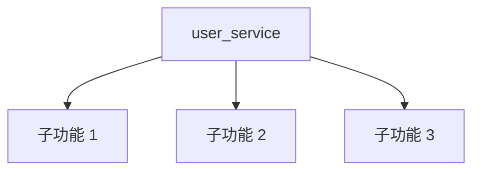

# 文档大纲生成 Skill

**功能**: 根据模块规模生成 1-4 层文档结构

**规模规则**：
- 小型模块（1-4 文件）→ 1 层文档
- 中型模块（5-20 文件）→ 2 层文档
- 大型模块（21-50 文件）→ 3 层文档
- 超大型模块（>50 文件）→ 4 层文档

---

## 核心生成函数

### generate_document_outline()

```bash
#!/usr/bin/env bash
# 文档大纲生成主函数
# 用法: generate_document_outline <module_name> <module_path> <file_count> <depth>
# 输出: Markdown 格式的文档大纲

generate_document_outline() {
    local module_name=$1
    local module_path=$2
    local file_count=$3
    local depth=${4:-1}  # 默认 1 层

    echo "# ${module_name} 模块文档"
    echo ""
    echo "## 概述"
    echo ""
    echo "## 核心"
    echo ""

    # 根据深度生成不同层级
    case $depth in
        1)
            generate_small_module_outline "$module_name" "$module_path"
            ;;
        2)
            generate_medium_module_outline "$module_name" "$module_path"
            ;;
        3)
            generate_large_module_outline "$module_name" "$module_path"
            ;;
        4)
            generate_xlarge_module_outline "$module_name" "$module_path"
            ;;
        *)
            generate_small_module_outline "$module_name" "$module_path"
            ;;
    esac
}
```

---

## 1. 小型模块大纲（1 层）

```bash
generate_small_module_outline() {
    local module_name=$1
    local module_path=$2

    cat <<EOF
**模块类型**: 小型模块（1-4 文件）

## 概述

${module_name} 模块的主要功能说明...

## 核心

### 主要功能

- 功能 1
- 功能 2

### 使用示例

\`\`\`python
# 示例代码
\`\`\`

## 参考

- 相关文件链接
EOF
}
```

---

## 2. 中型模块大纲（2 层）

```bash
generate_medium_module_outline() {
    local module_name=$1
    local module_path=$2

    cat <<EOF
**模块类型**: 中型模块（5-20 文件）

## 概述

${module_name} 模块的主要功能说明...

## 核心

### 主要功能

- 功能 1
- 功能 2
- 功能 3

### 架构

\`\`\`mermaid
graph TD
    A[${module_name}] --> B[子功能 1]
    A --> C[子功能 2]
    A --> D[子功能 3]
\`\`\`

### 关键组件

#### 组件 1

说明...

#### 组件 2

说明...

### 使用示例

\`\`\`python
# 示例代码
\`\`\`

## 参考

- 相关文件链接
EOF
}
```

---

## 3. 大型模块大纲（3 层）

```bash
generate_large_module_outline() {
    local module_name=$1
    local module_path=$2

    cat <<EOF
**模块类型**: 大型模块（21-50 文件）

## 概述

${module_name} 模块的主要功能说明...

## 核心

### 主要功能

- 功能 1
- 功能 2
- 功能 3
- 功能 4

### 架构

\`\`\`mermaid
graph TD
    A[${module_name}] --> B[子模块 1]
    A --> C[子模块 2]
    A --> D[子模块 3]

    B --> B1[功能 1.1]
    B --> B2[功能 1.2]
    C --> C1[功能 2.1]
    C --> C2[功能 2.2]
    D --> D1[功能 3.1]
    D --> D2[功能 3.2]
\`\`\`

### 关键组件

#### 组件 1

说明...

##### 子组件 1.1

详细说明...

##### 子组件 1.2

详细说明...

#### 组件 2

说明...

### 工作流程

1. 步骤 1
2. 步骤 2
3. 步骤 3

### 使用示例

\`\`\`python
# 示例代码
\`\`\`

## 高级主题

### 配置选项

### 扩展点

### 性能优化

## 参考

- 相关文件链接
EOF
}
```

---

## 4. 超大型模块大纲（4 层）

```bash
generate_xlarge_module_outline() {
    local module_name=$1
    local module_path=$2

    cat <<EOF
**模块类型**: 超大型模块（>50 文件）

## 概述

${module_name} 模块的主要功能说明...

**规模**: 大型模块，包含多个子模块和复杂的依赖关系

## 核心

### 主要功能

- 功能 1
- 功能 2
- 功能 3
- 功能 4
- 功能 5

### 架构

\`\`\`mermaid
graph TD
    A[${module_name}] --> B[子模块 1]
    A --> C[子模块 2]
    A --> D[子模块 3]
    A --> E[子模块 4]

    B --> B1[组件 1.1]
    B --> B2[组件 1.2]
    C --> C1[组件 2.1]
    C --> C2[组件 2.2]
    D --> D1[组件 3.1]
    D --> D2[组件 3.2]
    E --> E1[组件 4.1]
    E --> E2[组件 4.2]

    B1 --> B1A[功能 1.1.1]
    B1 --> B1B[功能 1.1.2]
    B2 --> B2A[功能 1.2.1]
    B2 --> B2B[功能 1.2.2]
\`\`\`

### 关键组件

#### 组件 1

说明...

##### 子组件 1.1

详细说明...

###### 微组件 1.1.1

超详细说明...

###### 微组件 1.1.2

超详细说明...

##### 子组件 1.2

详细说明...

#### 组件 2

说明...

##### 子组件 2.1

详细说明...

### 工作流程

1. 步骤 1
2. 步骤 2
3. 步骤 3
4. 步骤 4

### 使用示例

\`\`\`python
# 示例代码
\`\`\`

## 高级主题

### 配置选项

### 扩展点

### 性能优化

### 安全考虑

## 最佳实践

### 常见模式

### 错误处理

### 测试策略

## 参考

- 相关文件链接
EOF
}
```

---

## 模块文件列表生成

```bash
# 为模块生成相关文件列表（用于 `<cite>` 引用）
generate_module_file_list() {
    local module_path=$1
    local module_name=$2

    echo "### 相关文件" >> "$output_file"
    echo "" >> "$output_file"

    # 查找所有源代码文件
    while IFS= read -r -d '' file; do
        local relative_path=$(realpath --relative-to="$(dirname "$module_path")" "$file")
        local filename=$(basename "$file")
        echo "- \`[$filename]($relative_path)\`" >> "$output_file"
    done < <(find "$module_path" -type f \
        \( -name "*.py" -o -name "*.js" -o -name "*.ts" \) \
        ! -path "*/test/*" \
        ! -path "*/__pycache__/*" \
        -print0 | sort -z)

    echo "" >> "$output_file"
}
```

---

## 使用示例

```bash
# 为模块生成文档大纲
module_name="user_service"
module_path="/path/to/project/src/services/user"
file_count=8
depth=2  # 中型模块

outline=$(generate_document_outline "$module_name" "$module_path" "$file_count" "$depth")

echo "$outline"
```

**输出示例**（中型模块）：

```markdown
# user_service 模块文档

## 概述

user_service 模块的主要功能说明...

## 核心

### 主要功能

- 功能 1
- 功能 2
- 功能 3

### 架构



### 关键组件

#### 组件 1

说明...

#### 组件 2

说明...

### 使用示例

```python
# 示例代码
```

## 参考

- 相关文件链接
```

---

**版本**: 1.0.0
**最后更新**: 2026-01-04
