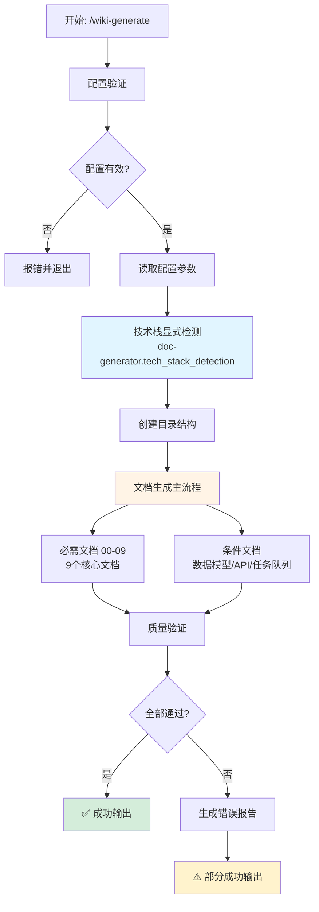
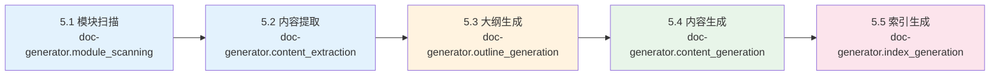

# Wiki 文档生成命令（v3.0）

## 任务描述

根据 `.claude/wiki-config.json` 配置文件自动分析代码库并生成项目 Wiki 文档。采用配置驱动、技术栈显式检测、完全覆盖策略。

## 核心特性

- **配置驱动**：读取 `.claude/wiki-config.json` 决定生成行为
- **技术栈显式检测**：基于检测到的框架/库生成条件文档
- **完全覆盖策略**：每次重新生成整个文档，不保留手动修改
- **部分成功机制**：保留成功生成的文档，跳过失败的，生成错误报告
- **中文文件名**：生成文档使用中文文件名（如 `快速开始.md`）
- **分层目录结构**：按照参考项目标准组织文档
- **Skill 集成**：使用 doc-generator skills 完成各个生成步骤
- **可视化流程**：使用 Mermaid 图表展示生成流程和架构

## 整体流程图



## 参数说明

- `--full`: 完整生成所有文档（根据配置生成所有文档）

## 执行步骤

### 1. 配置验证

首先读取并验证配置文件：

```bash
CONFIG_FILE=".claude/wiki-config.json"

# 检查配置文件是否存在
if [ ! -f "$CONFIG_FILE" ]; then
    echo "❌ 配置文件不存在: $CONFIG_FILE"
    echo "💡 建议：运行 wiki-generator --init 创建配置文件"
    exit 1
fi

# 验证配置文件
wiki-generator --validate
if [ $? -ne 0 ]; then
    echo "❌ 配置文件验证失败"
    exit 1
fi
```

### 2. 读取配置

解析配置文件获取生成参数：

```bash
# 读取语言配置
LANGUAGE=$(jq -r '.language' "$CONFIG_FILE")  # "zh" | "en" | "both"
OUTPUT_DIR=$(jq -r '.output_dir' "$CONFIG_FILE")  # "docs"
STRUCTURE_TEMPLATE=$(jq -r '.structure_template' "$CONFIG_FILE")  # "reference" | "simple" | "custom"
INCLUDE_SOURCES=$(jq -r '.include_sources' "$CONFIG_FILE")  # true | false
GENERATE_TOC=$(jq -r '.generate_toc' "$CONFIG_FILE")  # true | false
```

### 3. 技术栈显式检测

调用 **doc-generator.tech_stack_detection** skill：

基于代码库中的依赖和导入，显式检测技术栈：

```bash
# 检测数据库 ORM
DETECTED_TECH_STACK=()

if grep -rq "from sqlalchemy" src/ 2>/dev/null || \
   grep -rq "import sqlalchemy" src/ 2>/dev/null || \
   [ -f "requirements.txt" ] && grep -q "SQLAlchemy" requirements.txt; then
    DETECTED_TECH_STACK+=("datamodel")
fi

# 检测 Web 框架
if grep -rq "from fastapi" src/ 2>/dev/null || \
   grep -rq "import fastapi" src/ 2>/dev/null || \
   [ -f "requirements.txt" ] && grep -q "fastapi" requirements.txt; then
    DETECTED_TECH_STACK+=("api")
fi

# 检测任务队列
if grep -rq "from celery" src/ 2>/dev/null || \
   grep -rq "import celery" src/ 2>/dev/null || \
   [ -f "requirements.txt" ] && grep -q "celery" requirements.txt; then
    DETECTED_TECH_STACK+=("taskqueue")
fi

# 检测测试框架
if grep -rq "import pytest" src/ 2>/dev/null || \
   grep -rq "import unittest" src/ 2>/dev/null || \
   [ -f "requirements.txt" ] && (grep -q "pytest" requirements.txt || grep -q "unittest" requirements.txt); then
    DETECTED_TECH_STACK+=("testing")
fi

# 检测容器化
if [ -f "Dockerfile" ] || [ -f "docker-compose.yml" ] || [ -f "docker-compose.yaml" ]; then
    DETECTED_TECH_STACK+=("deployment")
fi
```

**技术栈映射规则**：
- `datamodel` → 生成 `数据模型/` 目录文档
- `api` → 生成 `API 文档/` 目录文档
- `taskqueue` → 生成 `任务队列/` 目录文档
- `testing` → 生成 `测试策略.md`
- `deployment` → 生成 `部署指南.md`

**Skill 输出示例**：
```json
{
  "detected_stack": ["datamodel", "api", "taskqueue", "testing", "deployment"]
}
```

### 4. 创建目录结构

根据配置的语言创建分层目录：

```bash
# 创建输出目录
mkdir -p "$OUTPUT_DIR"

# 根据语言配置创建目录结构
if [ "$LANGUAGE" = "zh" ] || [ "$LANGUAGE" = "both" ]; then
    mkdir -p "$OUTPUT_DIR/zh/content"
fi

if [ "$LANGUAGE" = "en" ] || [ "$LANGUAGE" = "both" ]; then
    mkdir -p "$OUTPUT_DIR/en/content"
fi
```

**目录结构**（reference 模板）：
```
docs/
└── {lang}/              # 语言目录 (zh/en)
    └── content/         # 内容目录
        ├── 00-快速开始.md
        ├── 01-项目概述.md
        ├── 02-技术栈与依赖.md
        ├── 03-系统架构设计.md
        ├── 数据模型/          # 条件文档（检测到 SQLAlchemy）
        │   └── 数据模型.md
        ├── API 文档/          # 条件文档（检测到 FastAPI）
        │   └── API 接口.md
        ├── 04-核心功能.md
        ├── 05-开发指南.md
        ├── 06-部署指南.md
        ├── 07-测试策略.md
        ├── 08-故障排除.md
        └── 09-安全考虑.md
```

### 5. 文档生成

文档生成通过调用一系列 doc-generator skills 完成：



#### 5.1 必需文档列表

以下文档是必需的，必须生成：

| 序号 | 文档名 | 模板文件 | 说明 |
|------|--------|----------|------|
| 00 | 快速开始 | quickstart.md.template | 5 分钟入门指南 |
| 01 | 项目概述 | overview.md.template | 项目介绍和架构 |
| 02 | 技术栈与依赖 | techstack.md.template | 技术选型说明 |
| 03 | 系统架构设计 | architecture.md.template | 架构图和设计 |
| 04 | 核心功能 | corefeatures.md.template | 核心业务流程 |
| 05 | 开发指南 | development.md.template | 开发相关 |
| 06 | 部署指南 | deployment.md.template | 部署相关 |
| 07 | 测试策略 | testing.md.template | 测试相关 |
| 08 | 故障排除 | troubleshooting.md.template | 问题解决 |
| 09 | 安全考虑 | security.md.template | 安全相关 |

#### 5.2 条件文档列表

以下文档根据技术栈检测生成：

| 技术栈 | 文档名 | 模板文件 |
|--------|--------|----------|
| SQLAlchemy/Django ORM | 数据模型/数据模型 | datamodel.md.template |
| FastAPI/Flask/Django REST | API 文档/API 接口 | api.md.template |
| Celery/RQ | 任务队列/任务队列 | taskqueue.md.template |

#### 5.3 模块扫描

调用 **doc-generator.module_scanning** skill：

- 扫描项目根目录和子目录
- 识别模块边界和组件
- 返回模块列表和文件数

**输出示例**：
```json
{
  "modules": [
    {"name": "core", "path": "src/core", "file_count": 15},
    {"name": "api", "path": "src/api", "file_count": 8}
  ]
}
```

#### 5.4 内容提取

调用 **doc-generator.content_extraction** skill：

- 从源代码提取 API 签名
- 提取类定义和继承关系
- 提取文档字符串和注释

**输出示例**：
```json
{
  "classes": [
    {"name": "UserService", "methods": ["create", "update", "delete"]}
  ],
  "functions": [
    {"name": "authenticate", "signature": "def authenticate(username, password)"}
  ]
}
```

#### 5.5 大纲生成

调用 **doc-generator.outline_generation** skill：

- 根据模块规模确定文档层级（1-4 层）
- 生成每个文档的章节结构
- 返回 Markdown 大纲

**规模规则**：
- 小型模块（1-4 文件）→ 1 层文档
- 中型模块（5-20 文件）→ 2 层文档
- 大型模块（21-50 文件）→ 3 层文档
- 超大型模块（>50 文件）→ 4 层文档

#### 5.6 内容生成

调用 **doc-generator.content_generation** skill：

对每个文档：

1. **读取模板**：从 `.claude-plugin/templates/wiki-generate/{lang}/{template}` 读取
2. **提取变量**：从代码库中提取变量值（项目名、版本号等）
3. **填充变量**：使用提取的值替换模板中的 `{variable}` 占位符
4. **生成 Mermaid 图表**：根据文档类型生成对应的图表
5. **添加必需元素**：
   - `<cite>` 块：引用的源文件列表
   - 目录索引：根据标题生成
   - Section sources：每个章节末尾标注来源
6. **写入文件**：使用中文文件名写入到输出目录

**示例生成流程**（快速开始.md）：

```bash
# 1. 读取模板
TEMPLATE_FILE=".claude-plugin/templates/wiki-generate/zh/quickstart.md.template"

# 2. 提取变量
PROJECT_NAME=$(jq -r '.project_name' package.json 2>/dev/null || basename "$(pwd)")
VERSION=$(jq -r '.version' package.json 2>/dev/null || echo "1.0.0")

# 3. 读取模板内容
TEMPLATE_CONTENT=$(cat "$TEMPLATE_FILE")

# 4. 替换变量（示例）
CONTENT="${TEMPLATE_CONTENT//\{project_name\}/$PROJECT_NAME}"
CONTENT="${CONTENT//\{version\}/$VERSION}"

# 5. 添加 <cite> 块
CITE_BLOCK="<cite>
**本文档中引用的文件**
- [README.md](file://README.md)
- [package.json](file://package.json)
</cite>

"

# 6. 添加 Section sources
SECTION_SOURCES="
**Section sources**
- [README.md](file://README.md#L1-L50)
- [src/main.py](file://src/main.py#L10-L30)
"

# 7. 组合最终内容
FINAL_CONTENT="$CITE_BLOCK

$CONTENT

$SECTION_SOURCES"

# 8. 写入文件（使用中文文件名）
echo "$FINAL_CONTENT" > "$OUTPUT_DIR/zh/content/00-快速开始.md"
```

#### 5.7 索引生成

调用 **doc-generator.index_generation** skill：

- 为每个文档生成目录索引
- 生成交叉引用链接
- 更新主索引文件

### 6. 部分成功错误处理

采用部分成功策略：保留成功生成的文档，跳过失败的，生成错误报告。

```bash
# 错误报告文件
ERROR_REPORT="$OUTPUT_DIR/generation-errors.md"
ERROR_COUNT=0
SUCCESS_COUNT=0

# 为每个文档生成
for doc in "${DOCUMENTS[@]}"; do
    if generate_document "$doc"; then
        SUCCESS_COUNT=$((SUCCESS_COUNT + 1))
        echo "✅ 成功生成: $doc"
    else
        ERROR_COUNT=$((ERROR_COUNT + 1))
        echo "❌ 生成失败: $doc" >> "$ERROR_REPORT"
        echo "   原因: $(get_error_message)" >> "$ERROR_REPORT"
        echo "   建议: $(get_fix_suggestion)" >> "$ERROR_REPORT"
        echo "" >> "$ERROR_REPORT"
    fi
done

# 生成错误报告摘要
if [ $ERROR_COUNT -gt 0 ]; then
    echo "# 文档生成错误报告

**生成时间**: $(date)
**成功**: $SUCCESS_COUNT 个文档
**失败**: $ERROR_COUNT 个文档

" | cat - "$ERROR_REPORT" > "$ERROR_REPORT.tmp"
    mv "$ERROR_REPORT.tmp" "$ERROR_REPORT"

    echo "⚠️  部分文档生成失败，详见错误报告: $ERROR_REPORT"
else
    echo "✅ 所有文档生成成功"
    rm -f "$ERROR_REPORT"
fi
```

### 7. 质量验证

对生成的文档进行基础自动化验证：

#### 7.1 Markdown 格式验证

```bash
# 验证清单
VALIDATION_PASSED=0
VALIDATION_FAILED=0

for doc_file in "$OUTPUT_DIR"/{zh,en}/content/*.md; do
    # 检查必需元素
    if ! grep -q "<cite>" "$doc_file"; then
        echo "❌ 缺少 <cite> 块: $doc_file"
        VALIDATION_FAILED=$((VALIDATION_FAILED + 1))
    fi

    if ! grep -q "## 目录" "$doc_file"; then
        echo "❌ 缺少目录索引: $doc_file"
        VALIDATION_FAILED=$((VALIDATION_FAILED + 1))
    fi

    if ! grep -q "Section sources" "$doc_file"; then
        echo "❌ 缺少 Section sources: $doc_file"
        VALIDATION_FAILED=$((VALIDATION_FAILED + 1))
    fi

    # 检查 Markdown 格式
    if ! python3 -m markdown "$doc_file" > /dev/null 2>&1; then
        echo "❌ Markdown 格式错误: $doc_file"
        VALIDATION_FAILED=$((VALIDATION_FAILED + 1))
    fi

    VALIDATION_PASSED=$((VALIDATION_PASSED + 1))
done

echo "✅ 质量验证完成: $VALIDATION_PASSED 通过, $VALIDATION_FAILED 失败"
```

#### 7.2 Mermaid 图表验证

```bash
# 检查 Mermaid 图表语法
for doc_file in "$OUTPUT_DIR"/{zh,en}/content/*.md; do
    # 检查是否包含 Mermaid 代码块
    if grep -q '```mermaid' "$doc_file"; then
        # 提取所有 Mermaid 代码块
        mermaid_blocks=$(sed -n '/^```mermaid$/,/^```$/p' "$doc_file")

        # 验证语法（使用 mermaid-cli 或其他验证工具）
        if [ -n "$mermaid_blocks" ]; then
            # 基础语法检查
            if ! echo "$mermaid_blocks" | grep -qE '^(flowchart|graph|sequenceDiagram|erDiagram|classDiagram|stateDiagram|gantt|pie|gitGraph)'; then
                echo "❌ Mermaid 图表类型错误: $doc_file"
                VALIDATION_FAILED=$((VALIDATION_FAILED + 1))
            fi

            # 检查节点 ID 唯一性（简化检查）
            node_ids=$(echo "$mermaid_blocks" | grep -oE '\b[A-Z][a-zA-Z0-9_]*\b' | sort | uniq -d)
            if [ -n "$node_ids" ]; then
                echo "⚠️  Mermaid 节点 ID 可能重复: $doc_file"
                echo "   重复的 ID: $node_ids"
            fi

            # 检查箭头语法
            if echo "$mermaid_blocks" | grep -qE '-->|-->|\.\.|->'; then
                :  # 箭头语法正确
            else
                echo "⚠️  Mermaid 箭头语法可能有问题: $doc_file"
            fi
        fi
    fi
done
```

**验证标准**：
- ✅ Mermaid 代码块格式正确（` ```mermaid ` 开头，` ``` ` 结尾）
- ✅ 图表类型有效（flowchart, graph, sequenceDiagram, erDiagram, classDiagram, stateDiagram, gantt, pie, gitGraph）
- ✅ 节点 ID 唯一
- ✅ 箭头语法正确（`-->`, `->`, `..>`, `.->` 等）
- ✅ 支持中文标签和文本

**Mermaid 图表类型映射**：

| 文档类型 | 推荐图表类型 | 说明 |
|---------|-------------|------|
| architecture.md | `flowchart TD/LR` | 系统架构流程图 |
| datamodel.md | `erDiagram` | 实体关系图 |
| api.md | `sequenceDiagram` | API 调用时序图 |
| deployment.md | `flowchart TD` | 部署流程图 |
| testing.md | `flowchart LR` | 测试流程图 |
| development.md | `flowchart TD` | 开发工作流 |
| corefeatures.md | `flowchart TD` | 功能流程图 |
| troubleshooting.md | `flowchart TD` | 问题诊断流程图 |
| security.md | `flowchart TD` | 安全验证流程图 |

## 输出

### 成功输出

```
✅ 文档生成成功
📂 输出目录: docs/
📄 生成文档: 15 个
✅ 质量验证: 15/15 通过
⏱️ 耗时: 25.3 秒
```

### 错误输出

```
⚠️  部分文档生成失败
📄 成功: 12 个文档
❌ 失败: 3 个文档
📋 错误报告: docs/generation-errors.md

💡 建议：
- 检查错误报告了解失败原因
- 修复问题后重新运行命令
```

## 质量标准

### 文档质量
- ✅ 每个文档包含 `<cite>` 块
- ✅ 每个文档包含目录索引
- ✅ 每个文档包含 Section sources
- ✅ Markdown 格式正确
- ✅ 链接格式正确
- ✅ Mermaid 图表语法正确

### Mermaid 图表质量
- ✅ 图表语法正确且可渲染
- ✅ 节点命名清晰易懂
- ✅ 图表类型符合场景（参考上方映射表）
- ✅ 支持中文标签和文本
- ✅ 节点 ID 唯一不重复
- ✅ 箭头语法正确

### Skill 调用质量
- ✅ 所有 skills 按正确顺序调用（模块扫描 → 内容提取 → 大纲生成 → 内容生成 → 索引生成）
- ✅ Skill 输出正确传递到下一步
- ✅ 错误处理覆盖所有 skill 调用失败情况
- ✅ Skill 调用与现有模板系统兼容

### 性能目标
- 小型项目（< 100 文件）：< 15 秒
- 中型项目（100-500 文件）：< 30 秒
- 大型项目（> 500 文件）：< 90 秒

## 注意事项

1. **代码优先原则**：本项目专注于命令实现，不为自身生成文档（除非用户明确要求）
2. **中文优先**：所有用户交互使用简体中文
3. **完全覆盖**：每次重新生成整个文档，不保留手动修改
4. **配置驱动**：所有行为由配置文件控制
5. **技术栈显式检测**：基于明确的规则检测技术栈，不依赖 AI 推测
6. **Skill 协作**：通过 handoffs 机制实现 doc-generator skills 间的协作
7. **可视化优先**：优先使用 Mermaid 图表展示复杂流程和架构

## 示例使用

```bash
# 生成完整文档
/wiki-generate --full

# 验证配置后生成
wiki-generator --validate && /wiki-generate --full

# 查看生成的文档
ls docs/zh/content/
```

## 技术栈检测规则完整列表

| 检测规则 | 触发条件 | 生成文档 |
|---------|---------|---------|
| SQLAlchemy | `from sqlalchemy` 或 `import sqlalchemy` | 数据模型/数据模型.md |
| Django ORM | `from django.db` | 数据模型/数据模型.md |
| FastAPI | `from fastapi` 或 `import fastapi` | API 文档/API 接口.md |
| Flask | `from flask` | API 文档/API 接口.md |
| Django REST | `from rest_framework` | API 文档/API 接口.md |
| Celery | `from celery` 或 `import celery` | 任务队列/任务队列.md |
| RQ | `import rq` | 任务队列/任务队列.md |
| pytest | `import pytest` | 测试策略.md |
| unittest | `import unittest` | 测试策略.md |
| Dockerfile | 文件存在 | 部署指南.md |
| docker-compose.yml | 文件存在 | 部署指南.md |

---

**版本**: 3.0.0
**最后更新**: 2026-01-05
**更新内容**:
- 添加 Mermaid 流程图可视化文档生成流程
- 集成 doc-generator skills（6 个 skills）通过 handoffs
- 重构文档生成步骤为 skill 调用流程
- 添加 Mermaid 图表验证步骤
- 新增图表类型映射表
**项目宪章**: 遵循所有 8 条核心原则
