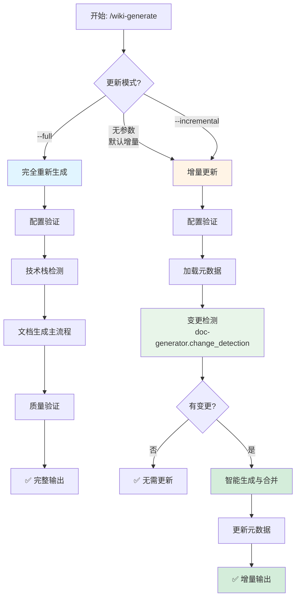
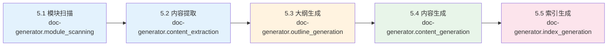

# Wiki 文档生成命令

## 任务描述

根据 `{output_dir}/wiki-config.json` 配置文件自动分析代码库并生成项目 Wiki 文档。支持增量更新和智能合并功能。

配置文件位于输出目录中（默认为 `docs/wiki-config.json`），首次运行时自动创建。

## 核心特性

- **配置驱动**：读取 `{output_dir}/wiki-config.json` 决定生成行为
- **增量更新**：智能检测代码变更，只更新受影响的文档
- **手动编辑保护**：智能合并保留用户手动编辑的内容
- **技术栈显式检测**：基于检测到的框架/库生成条件文档
- **部分成功机制**：保留成功生成的文档，跳过失败的，生成错误报告
- **中文文件名**：生成文档使用中文文件名（如 `快速开始.md`）
- **分层目录结构**：按照参考项目标准组织文档
- **Skill 集成**：使用 doc-generator skills 完成各个生成步骤
- **可视化流程**：使用 Mermaid 图表展示生成流程和架构

## 整体流程图



## 参数说明

- `--full`: 完整生成所有文档（忽略增量模式，重新生成所有文档）
- `--incremental`: 显式启用增量更新模式（默认行为）

## 执行步骤

### 1. 配置验证

首先读取并验证配置文件：

```bash
# 1. 导入配置解析库
source plugins/libs/config_resolver.sh

# 2. 查找或初始化配置文件
CONFIG_FILE=$(find_config_file)

if [ -z "$CONFIG_FILE" ] || [ ! -f "$CONFIG_FILE" ]; then
    echo "📝 未找到配置文件，正在初始化..."

    # 交互式询问 output_dir（提供默认值 docs）
    read -p "请输入文档输出目录 [docs]: " user_output_dir
    output_dir=${user_output_dir:-"docs"}

    echo "✅ 使用输出目录: $output_dir"

    # 初始化配置文件
    CONFIG_FILE=$(init_config_file "$output_dir")
    export WIKI_CONFIG="$CONFIG_FILE"
else
    export WIKI_CONFIG="$CONFIG_FILE"
fi

# 3. 验证配置文件
if ! validate_config "$CONFIG_FILE"; then
    echo "❌ 配置文件验证失败"
    exit 1
fi

echo "✅ 配置文件: $CONFIG_FILE"
```

### 2. 读取配置

解析配置文件获取生成参数：

```bash
# 读取语言配置
LANGUAGE=$(jq -r '.language' "$CONFIG_FILE")  # "zh" | "en" | "both"
OUTPUT_DIR=$(jq -r '.output_dir' "$CONFIG_FILE")  # "docs"
STRUCTURE_TEMPLATE=$(jq -r '.structure_template' "$CONFIG_FILE")  # "reference" | "simple" | "custom"
INCLUDE_SOURCES=$(jq -r '.include_sources' "$CONFIG_FILE")  # true | false
GENERATE_TOC=$(jq -r '.generate_toc' "$CONFIG_FILE")  # true | false
```

#### 2.1 读取增量更新配置

```bash
# 读取更新模式配置
UPDATE_MODE=$(jq -r '.update_mode.strategy // "incremental"' "$CONFIG_FILE")  # "full" | "incremental"
DETECT_CHANGES=$(jq -r '.update_mode.detect_changes // true' "$CONFIG_FILE")  # true | false
PRESERVE_MANUAL_EDITS=$(jq -r '.update_mode.preserve_manual_edits // true' "$CONFIG_FILE")  # true | false
MERGE_CONFLICTS=$(jq -r '.update_mode.merge_conflicts // "skip"' "$CONFIG_FILE")  # "skip" | "overwrite" | "ask"

# 读取变更检测配置
CHANGE_METHOD=$(jq -r '.change_detection.method // "both"' "$CONFIG_FILE")  # "git" | "hash" | "both"
EXCLUDE_PATTERNS=$(jq -r '.change_detection.exclude_patterns[] // ["tests/**", "*.test.*", "mocks/**"]' "$CONFIG_FILE")

# 读取智能合并配置
SMART_MERGE_ENABLED=$(jq -r '.smart_merge.enabled // true' "$CONFIG_FILE")  # true | false
SIMILARITY_THRESHOLD=$(jq -r '.smart_merge.similarity_threshold // 0.8' "$CONFIG_FILE")  # 0.0-1.0

# 读取元数据追踪配置
METADATA_ENABLED=$(jq -r '.metadata_tracking.enabled // true' "$CONFIG_FILE")  # true | false
METADATA_FILE=$(jq -r '.metadata_tracking.metadata_file // "{output_dir}/.wiki-metadata/metadata.json"' "$CONFIG_FILE")
```

#### 2.2 配置迁移函数

检查配置版本并自动迁移：

```bash
#!/usr/bin/env bash
# 配置迁移函数（内联 Python）
# 用法: migrate_config <config_file>

migrate_config() {
    local config_file=$1

    # 使用内联 Python 检查和迁移配置
    python3 <<PYTHON_EOF
import json
from pathlib import Path

config_path = Path("$config_file")

if not config_path.exists():
    print(f"❌ 配置文件不存在: {config_path}")
    exit(1)

with open(config_path, 'r', encoding='utf-8') as f:
    config = json.load(f)

# 检查版本
version = config.get('version', '2.0.0')

# 添加默认配置
if version < '1.0.2':
    print("🔄 配置迁移: v${version} → v1.0.2")

    config['version'] = '1.0.2'

    if 'update_mode' not in config:
        config['update_mode'] = {
            'strategy': 'incremental',
            'detect_changes': True,
            'preserve_manual_edits': True,
            'merge_conflicts': 'skip'
        }
        print("  ✅ 添加 update_mode 配置")

    if 'change_detection' not in config:
        config['change_detection'] = {
            'method': 'both',
            'base_commit': '',
            'exclude_patterns': ['tests/**', '*.test.*', 'mocks/**']
        }
        print("  ✅ 添加 change_detection 配置")

    if 'smart_merge' not in config:
        config['smart_merge'] = {
            'enabled': True,
            'region_markers': {
                'start': '<!-- WIKI-GEN-START: {name} -->',
                'end': '<!-- WIKI-GEN-END: {name} -->'
            },
            'manual_edit_markers': ['<!-- MANUAL-EDIT -->', '<!-- KEEP -->']
        }
        print("  ✅ 添加 smart_merge 配置")

    if 'metadata_tracking' not in config:
        config['metadata_tracking'] = {
            'enabled': True,
            'metadata_file': '{output_dir}/.wiki-metadata/metadata.json',
            'track_file_hashes': True,
            'track_dependencies': True
        }
        print("  ✅ 添加 metadata_tracking 配置")

    # 保存迁移后的配置
    with open(config_path, 'w', encoding='utf-8') as f:
        json.dump(config, f, indent=2, ensure_ascii=False)

    print(f"✅ 配置已迁移到 v{config['version']}")
else:
    print(f"✅ 配置版本已是最新: v{version}")
PYTHON_EOF
}

# 执行配置迁移
migrate_config "$CONFIG_FILE"
```

### 2.3 检查更新模式

```bash
# 检查命令行参数
UPDATE_MODE_ARG=""
if [[ " $@ " =~ " --full " ]]; then
    UPDATE_MODE_ARG="full"
    echo "🔄 模式: 完全重新生成"
elif [[ " $@ " =~ " --incremental " ]]; then
    UPDATE_MODE_ARG="incremental"
    echo "🚀 模式: 增量更新"
else
    # 使用配置文件中的设置
    UPDATE_MODE_ARG="$UPDATE_MODE"
    if [ "$UPDATE_MODE_ARG" = "incremental" ]; then
        echo "🚀 模式: 增量更新（默认）"
    else
        echo "🔄 模式: 完全重新生成"
    fi
fi
```

### 3. 技术栈显式检测

调用 **doc-generator.tech_stack_detection** skill：

基于代码库中的依赖和导入，显式检测技术栈：

```bash
# 检测数据库 ORM
DETECTED_TECH_STACK=()

if grep -rq "from sqlalchemy" src/ 2>/dev/null || \
   grep -rq "import sqlalchemy" src/ 2>/dev/null || \
   [ -f "requirements.txt" ] && grep -q "SQLAlchemy" requirements.txt; then
    DETECTED_TECH_STACK+=("datamodel")
fi

# 检测 Web 框架
if grep -rq "from fastapi" src/ 2>/dev/null || \
   grep -rq "import fastapi" src/ 2>/dev/null || \
   [ -f "requirements.txt" ] && grep -q "fastapi" requirements.txt; then
    DETECTED_TECH_STACK+=("api")
fi

# 检测任务队列
if grep -rq "from celery" src/ 2>/dev/null || \
   grep -rq "import celery" src/ 2>/dev/null || \
   [ -f "requirements.txt" ] && grep -q "celery" requirements.txt; then
    DETECTED_TECH_STACK+=("taskqueue")
fi

# 检测测试框架
if grep -rq "import pytest" src/ 2>/dev/null || \
   grep -rq "import unittest" src/ 2>/dev/null || \
   [ -f "requirements.txt" ] && (grep -q "pytest" requirements.txt || grep -q "unittest" requirements.txt); then
    DETECTED_TECH_STACK+=("testing")
fi

# 检测容器化
if [ -f "Dockerfile" ] || [ -f "docker-compose.yml" ] || [ -f "docker-compose.yaml" ]; then
    DETECTED_TECH_STACK+=("deployment")
fi
```

**技术栈映射规则**：
- `datamodel` → 生成 `数据模型/` 目录文档
- `api` → 生成 `API文档/` 目录文档
- `taskqueue` → 生成 `任务队列/` 目录文档
- `testing` → 生成 `测试策略.md`
- `deployment` → 生成 `部署指南.md`

**Skill 输出示例**：
```json
{
  "detected_stack": ["datamodel", "api", "taskqueue", "testing", "deployment"]
}
```

### 4. 创建目录结构

根据配置的语言创建分层目录：

```bash
# 创建输出目录
mkdir -p "$OUTPUT_DIR"

# 根据语言配置创建目录结构
if [ "$LANGUAGE" = "zh" ] || [ "$LANGUAGE" = "both" ]; then
    mkdir -p "$OUTPUT_DIR/zh/content"
fi

if [ "$LANGUAGE" = "en" ] || [ "$LANGUAGE" = "both" ]; then
    mkdir -p "$OUTPUT_DIR/en/content"
fi
```

**目录结构**（reference 模板）：
```
docs/
└── {lang}/              # 语言目录 (zh/en)
    └── content/         # 内容目录
        ├── 00-快速开始.md
        ├── 01-项目概述.md
        ├── 02-技术栈与依赖.md
        ├── 03-系统架构设计.md
        ├── 数据模型/          # 条件文档（检测到 SQLAlchemy）
        │   └── 数据模型.md
        ├── API文档/          # 条件文档（检测到 FastAPI）
        │   └── API接口.md
        ├── 04-核心功能.md
        ├── 05-开发指南.md
        ├── 06-部署指南.md
        ├── 07-测试策略.md
        ├── 08-故障排除.md
        └── 09-安全考虑.md
```

### 5. 文档生成

文档生成通过调用一系列 doc-generator skills 完成：



#### 5.1 必需文档列表

以下文档是必需的，必须生成：

**注意**：所有模板文件位于 `plugins/templates/wiki-generate/{lang}/` 目录，其中 `{lang}` 为 `zh`（中文）或 `en`（英文）。

| 序号 | 文档名 | 模板文件 | 说明 |
|------|--------|----------|------|
| 00 | 快速开始 | quickstart.md.template | 5 分钟入门指南 |
| 01 | 项目概述 | overview.md.template | 项目介绍和架构 |
| 02 | 技术栈与依赖 | techstack.md.template | 技术选型说明 |
| 03 | 系统架构设计 | architecture.md.template | 架构图和设计 |
| 04 | 核心功能 | corefeatures.md.template | 核心业务流程 |
| 05 | 开发指南 | development.md.template | 开发相关 |
| 06 | 部署指南 | deployment.md.template | 部署相关 |
| 07 | 测试策略 | testing.md.template | 测试相关 |
| 08 | 故障排除 | troubleshooting.md.template | 问题解决 |
| 09 | 安全考虑 | security.md.template | 安全相关 |

#### 5.2 条件文档列表

以下文档根据技术栈检测生成：

**注意**：所有模板文件位于 `plugins/templates/wiki-generate/{lang}/` 目录。

| 技术栈 | 文档名 | 模板文件 |
|--------|--------|----------|
| SQLAlchemy/Django ORM | 数据模型/数据模型 | datamodel.md.template |
| FastAPI/Flask/Django REST | API文档/API接口 | api-reference.md.template 或 api-endpoint.md.template |
| Celery/RQ | 任务队列/任务队列 | taskqueue.md.template |

#### 5.3 模块扫描

调用 **doc-generator.module_scanning** skill：

- 扫描项目根目录和子目录
- 识别模块边界和组件
- 返回模块列表和文件数

**输出示例**：
```json
{
  "modules": [
    {"name": "core", "path": "src/core", "file_count": 15},
    {"name": "api", "path": "src/api", "file_count": 8}
  ]
}
```

#### 5.4 内容提取

调用 **doc-generator.content_extraction** skill：

- 从源代码提取 API 签名
- 提取类定义和继承关系
- 提取文档字符串和注释

**输出示例**：
```json
{
  "classes": [
    {"name": "UserService", "methods": ["create", "update", "delete"]}
  ],
  "functions": [
    {"name": "authenticate", "signature": "def authenticate(username, password)"}
  ]
}
```

#### 5.5 大纲生成

调用 **doc-generator.outline_generation** skill：

- 根据模块规模确定文档层级（1-4 层）
- 生成每个文档的章节结构
- 返回 Markdown 大纲

**规模规则**：
- 小型模块（1-4 文件）→ 1 层文档
- 中型模块（5-20 文件）→ 2 层文档
- 大型模块（21-50 文件）→ 3 层文档
- 超大型模块（>50 文件）→ 4 层文档

#### 5.6 内容生成

调用 **doc-generator.content_generation** skill：

对每个文档：

1. **读取模板**：从 `.claude-plugin/templates/wiki-generate/{lang}/{template}` 读取
2. **提取变量**：从代码库中提取变量值（项目名、版本号等）
3. **填充变量**：使用提取的值替换模板中的 `{variable}` 占位符
4. **生成 Mermaid 图表**：根据文档类型生成对应的图表
5. **添加必需元素**：
   - `<cite>` 块：引用的源文件列表
   - 目录索引：根据标题生成
   - Section sources：每个章节末尾标注来源
6. **写入文件**：使用中文文件名写入到输出目录

**示例生成流程**（快速开始.md）：

```bash
# 1. 读取模板
TEMPLATE_FILE=".claude-plugin/templates/wiki-generate/zh/quickstart.md.template"

# 2. 提取变量
PROJECT_NAME=$(jq -r '.project_name' package.json 2>/dev/null || basename "$(pwd)")
VERSION=$(jq -r '.version' package.json 2>/dev/null || echo "1.0.0")

# 3. 读取模板内容
TEMPLATE_CONTENT=$(cat "$TEMPLATE_FILE")

# 4. 替换变量（示例）
CONTENT="${TEMPLATE_CONTENT//\{project_name\}/$PROJECT_NAME}"
CONTENT="${CONTENT//\{version\}/$VERSION}"

# 5. 添加 <cite> 块
CITE_BLOCK="<cite>
**本文档中引用的文件**
- [README.md](file://README.md)
- [package.json](file://package.json)
</cite>

"

# 6. 添加 Section sources
SECTION_SOURCES="
**Section sources**
- [README.md](file://README.md#L1-L50)
- [src/main.py](file://src/main.py#L10-L30)
"

# 7. 组合最终内容
FINAL_CONTENT="$CITE_BLOCK

$CONTENT

$SECTION_SOURCES"

# 8. 写入文件（使用中文文件名）
echo "$FINAL_CONTENT" > "$OUTPUT_DIR/zh/content/00-快速开始.md"
```

#### 5.7 数据模型文档生成特殊规则

数据模型文档（`数据模型/数据模型.md`）有特殊的提取规则，以避免包含测试代码中的数据模型：

**AI 提取约束**：

扫描范围：
- `src/`, `lib/`, `app/`, `core/` 等源代码目录
- 明确排除：`tests/`, `test/`, `__pycache__`, `mocks/`, `fixtures/`

排除规则：
- 文件名包含 "test", "mock", "fixture", "fake" 的文件
- `tests/` 目录下的所有文件
- 测试专用的模型类（如 TestModel, FakeModel, MockModel）

模型识别：
- SQLAlchemy 模型（`from sqlalchemy import ...`）
- Django 模型（`from django.db import models`）
- Pydantic 模型（`from pydantic import BaseModel`）
- 其他生产环境的 ORM 模型（如 Tortoise ORM, Peewee, SQLAlchemy 等）

**与测试策略文档的区别**：
- **数据模型文档**：仅包含生产代码的数据模型，不包含测试代码中的模型
- **测试策略文档**：描述测试代码结构、测试工具、fixtures 和测试数据的使用

**实现方式**：
在 `datamodel.md.template` 模板中包含明确的 AI 指令注释，指导 AI 在填充模板变量时应用上述过滤规则。

#### 5.8 索引生成

调用 **doc-generator.index_generation** skill：

- 为每个文档生成目录索引
- 生成交叉引用链接
- 更新主索引文件

### 6. 部分成功错误处理

采用部分成功策略：保留成功生成的文档，跳过失败的，生成错误报告。

```bash
# 错误报告文件
ERROR_REPORT="$OUTPUT_DIR/generation-errors.md"
ERROR_COUNT=0
SUCCESS_COUNT=0

# 为每个文档生成
for doc in "${DOCUMENTS[@]}"; do
    if generate_document "$doc"; then
        SUCCESS_COUNT=$((SUCCESS_COUNT + 1))
        echo "✅ 成功生成: $doc"
    else
        ERROR_COUNT=$((ERROR_COUNT + 1))
        echo "❌ 生成失败: $doc" >> "$ERROR_REPORT"
        echo "   原因: $(get_error_message)" >> "$ERROR_REPORT"
        echo "   建议: $(get_fix_suggestion)" >> "$ERROR_REPORT"
        echo "" >> "$ERROR_REPORT"
    fi
done

# 生成错误报告摘要
if [ $ERROR_COUNT -gt 0 ]; then
    echo "# 文档生成错误报告

**生成时间**: $(date)
**成功**: $SUCCESS_COUNT 个文档
**失败**: $ERROR_COUNT 个文档

" | cat - "$ERROR_REPORT" > "$ERROR_REPORT.tmp"
    mv "$ERROR_REPORT.tmp" "$ERROR_REPORT"

    echo "⚠️  部分文档生成失败，详见错误报告: $ERROR_REPORT"
else
    echo "✅ 所有文档生成成功"
    rm -f "$ERROR_REPORT"
fi
```

### 7. 质量验证

对生成的文档进行基础自动化验证：

#### 7.1 Markdown 格式验证

```bash
# 验证清单
VALIDATION_PASSED=0
VALIDATION_FAILED=0

for doc_file in "$OUTPUT_DIR"/{zh,en}/content/*.md; do
    # 检查必需元素
    if ! grep -q "<cite>" "$doc_file"; then
        echo "❌ 缺少 <cite> 块: $doc_file"
        VALIDATION_FAILED=$((VALIDATION_FAILED + 1))
    fi

    if ! grep -q "## 目录" "$doc_file"; then
        echo "❌ 缺少目录索引: $doc_file"
        VALIDATION_FAILED=$((VALIDATION_FAILED + 1))
    fi

    if ! grep -q "Section sources" "$doc_file"; then
        echo "❌ 缺少 Section sources: $doc_file"
        VALIDATION_FAILED=$((VALIDATION_FAILED + 1))
    fi

    # 检查 Markdown 格式
    if ! python3 -m markdown "$doc_file" > /dev/null 2>&1; then
        echo "❌ Markdown 格式错误: $doc_file"
        VALIDATION_FAILED=$((VALIDATION_FAILED + 1))
    fi

    VALIDATION_PASSED=$((VALIDATION_PASSED + 1))
done

echo "✅ 质量验证完成: $VALIDATION_PASSED 通过, $VALIDATION_FAILED 失败"
```

#### 7.2 Mermaid 图表验证

```bash
# 检查 Mermaid 图表语法
for doc_file in "$OUTPUT_DIR"/{zh,en}/content/*.md; do
    # 检查是否包含 Mermaid 代码块
    if grep -q '```mermaid' "$doc_file"; then
        # 提取所有 Mermaid 代码块
        mermaid_blocks=$(sed -n '/^```mermaid$/,/^```$/p' "$doc_file")

        # 验证语法（使用 mermaid-cli 或其他验证工具）
        if [ -n "$mermaid_blocks" ]; then
            # 基础语法检查
            if ! echo "$mermaid_blocks" | grep -qE '^(flowchart|graph|sequenceDiagram|erDiagram|classDiagram|stateDiagram|gantt|pie|gitGraph)'; then
                echo "❌ Mermaid 图表类型错误: $doc_file"
                VALIDATION_FAILED=$((VALIDATION_FAILED + 1))
            fi

            # 检查节点 ID 唯一性（简化检查）
            node_ids=$(echo "$mermaid_blocks" | grep -oE '\b[A-Z][a-zA-Z0-9_]*\b' | sort | uniq -d)
            if [ -n "$node_ids" ]; then
                echo "⚠️  Mermaid 节点 ID 可能重复: $doc_file"
                echo "   重复的 ID: $node_ids"
            fi

            # 检查箭头语法
            if echo "$mermaid_blocks" | grep -qE '-->|-->|\.\.|->'; then
                :  # 箭头语法正确
            else
                echo "⚠️  Mermaid 箭头语法可能有问题: $doc_file"
            fi
        fi
    fi
done
```

**验证标准**：
- ✅ Mermaid 代码块格式正确（` ```mermaid ` 开头，` ``` ` 结尾）
- ✅ 图表类型有效（flowchart, graph, sequenceDiagram, erDiagram, classDiagram, stateDiagram, gantt, pie, gitGraph）
- ✅ 节点 ID 唯一
- ✅ 箭头语法正确（`-->`, `->`, `..>`, `.->` 等）
- ✅ 支持中文标签和文本

**Mermaid 图表类型映射**：

| 文档类型 | 推荐图表类型 | 说明 |
|---------|-------------|------|
| architecture.md | `flowchart TD/LR` | 系统架构流程图 |
| datamodel.md | `erDiagram` | 实体关系图 |
| api.md | `sequenceDiagram` | API 调用时序图 |
| deployment.md | `flowchart TD` | 部署流程图 |
| testing.md | `flowchart LR` | 测试流程图 |
| development.md | `flowchart TD` | 开发工作流 |
| corefeatures.md | `flowchart TD` | 功能流程图 |
| troubleshooting.md | `flowchart TD` | 问题诊断流程图 |
| security.md | `flowchart TD` | 安全验证流程图 |

## 输出

### 成功输出

```
✅ 文档生成成功
📂 输出目录: docs/
📄 生成文档: 15 个
✅ 质量验证: 15/15 通过
⏱️ 耗时: 25.3 秒
```

### 错误输出

```
⚠️  部分文档生成失败
📄 成功: 12 个文档
❌ 失败: 3 个文档
📋 错误报告: docs/generation-errors.md

💡 建议：
- 检查错误报告了解失败原因
- 修复问题后重新运行命令
```

## 质量标准

### 文档质量
- ✅ 每个文档包含 `<cite>` 块
- ✅ 每个文档包含目录索引
- ✅ 每个文档包含 Section sources
- ✅ Markdown 格式正确
- ✅ 链接格式正确
- ✅ Mermaid 图表语法正确

### Mermaid 图表质量
- ✅ 图表语法正确且可渲染
- ✅ 节点命名清晰易懂
- ✅ 图表类型符合场景（参考上方映射表）
- ✅ 支持中文标签和文本
- ✅ 节点 ID 唯一不重复
- ✅ 箭头语法正确

### Skill 调用质量
- ✅ 所有 skills 按正确顺序调用（模块扫描 → 内容提取 → 大纲生成 → 内容生成 → 索引生成）
- ✅ Skill 输出正确传递到下一步
- ✅ 错误处理覆盖所有 skill 调用失败情况
- ✅ Skill 调用与现有模板系统兼容

### 性能目标
- 小型项目（< 100 文件）：< 15 秒
- 中型项目（100-500 文件）：< 30 秒
- 大型项目（> 500 文件）：< 90 秒

## 注意事项

1. **代码优先原则**：本项目专注于命令实现，不为自身生成文档（除非用户明确要求）
2. **中文优先**：所有用户交互使用简体中文
3. **完全覆盖**：每次重新生成整个文档，不保留手动修改
4. **配置驱动**：所有行为由配置文件控制
5. **技术栈显式检测**：基于明确的规则检测技术栈，不依赖 AI 推测
6. **Skill 协作**：通过 handoffs 机制实现 doc-generator skills 间的协作
7. **可视化优先**：优先使用 Mermaid 图表展示复杂流程和架构

## 示例使用

```bash
# 默认：增量更新（智能检测变更）
/wiki-generate

# 完整重新生成所有文档
/wiki-generate --full

# 显式增量更新
/wiki-generate --incremental

# 验证配置后生成
wiki-generator --validate && /wiki-generate

# 查看生成的文档
ls docs/zh/content/
```

---

## 增量更新流程

### 增量更新完整流程

当使用增量模式时（默认或 `--incremental`），执行以下流程：

```bash
#!/usr/bin/env bash
# 增量更新主流程

# 1. 加载元数据追踪库
source plugins/libs/metadata_tracker.sh

# 2. 初始化元数据
init_metadata

# 3. 获取当前 Git commit
CURRENT_COMMIT=$(git rev-parse HEAD)
LAST_COMMIT=$(get_last_commit)

# 4. 变更检测
if [ "$DETECT_CHANGES" = "true" ] && [ "$UPDATE_MODE_ARG" != "full" ]; then
    echo "🔍 检测代码变更..."

    # 调用 change_detection skill
    changes_json=$(python3 - <<PYTHON_EOF
import json
import subprocess

# 这里调用 doc-generator.change_detection skill
# 返回 JSON: {changed_files, affected_documents, ...}
changes = {
    "base_commit": "$LAST_COMMIT",
    "current_commit": "$CURRENT_COMMIT",
    "changed_files": ["src/models/user.py", "src/api/users.py"],
    "affected_documents": ["datamodel", "api"],
    "is_initial": False
}

print(json.dumps(changes, indent=2))
PYTHON_EOF
)

    # 解析变更检测结果
    AFFECTED_DOCS=$(echo "$changes_json" | jq -r '.affected_documents[]')
    CHANGED_FILES=$(echo "$changes_json" | jq -r '.changed_files[]')
    IS_INITIAL=$(echo "$changes_json" | jq -r '.is_initial')

    if [ "$IS_INITIAL" = "true" ]; then
        echo "📝 首次生成，执行完整生成流程"
        UPDATE_MODE_ARG="full"
    elif [ -z "$AFFECTED_DOCS" ] || [ "$AFFECTED_DOCS" = "null" ]; then
        echo "✅ 无代码变更，无需更新文档"
        exit 0
    else
        echo "📝 检测到变更，影响文档: $AFFECTED_DOCS"
    fi
fi

# 5. 智能生成与合并
if [ "$UPDATE_MODE_ARG" != "full" ] && [ -n "$AFFECTED_DOCS" ]; then
    echo "🚀 开始增量更新..."

    # 对每个受影响的文档
    for doc_name in $AFFECTED_DOCS; do
        echo "📄 处理文档: $doc_name"

        # 检查是否需要更新
        update_status=$(needs_update "$doc_name")

        if [[ "$update_status" == UPDATE_NEEDED* ]] || [ "$update_status" = "NEW_DOCUMENT" ]; then
            echo "  ✋ 需要更新: $update_status"

            # 生成新内容（调用 content_generation skill）
            new_content=$(generate_document_content "$doc_name")

            # 检查现有文档是否存在
            existing_doc="$OUTPUT_DIR/${doc_name}.md"

            if [ -f "$existing_doc" ] && [ "$PRESERVE_MANUAL_EDITS" = "true" ]; then
                # 智能合并
                echo "  🔄 智能合并..."
                merged_content=$(smart_merge "$existing_doc" "$new_content")
                echo "$merged_content" > "$existing_doc"
                echo "  ✅ 合并完成"
            else
                # 直接创建新文档
                echo "  📝 创建新文档..."
                echo "$new_content" > "$existing_doc"
                echo "  ✅ 创建完成"
            fi

            # 记录文档元数据
            source_files=$(get_document_sources "$doc_name")
            record_document "$doc_name" "$source_files" "$CURRENT_COMMIT"

        elif [ "$update_status" = "NO_UPDATE" ]; then
            echo "  ⏭️  跳过（无变更）"
        else
            echo "  ⚠️  未知状态: $update_status"
        fi
    done

    # 6. 更新索引（增量模式）
    echo "📋 更新索引..."
    # 调用 index_generation skill（增量模式）
    # 只更新受影响的文档索引

    # 7. 更新全局元数据
    update_global_metadata "$CURRENT_COMMIT"

    echo "✅ 增量更新完成！"
else
    # 完整生成流程
    echo "🔄 执行完整生成..."
fi
```

### 增量更新详细步骤

#### 步骤 1: 加载元数据

```bash
# 加载元数据追踪库
source plugins/libs/metadata_tracker.sh

# 初始化元数据（如果不存在）
init_metadata

# 查看现有文档
list_documents
```

#### 步骤 2: 变更检测

调用 **doc-generator.change_detection** skill：

```python
# 变更检测伪代码
def detect_changes(last_commit, current_commit):
    # 1. Git diff 分析
    changed_files = git_diff(last_commit, current_commit)

    # 2. 过滤源文件
    source_files = filter_source_files(changed_files)

    # 3. 计算哈希值
    file_hashes = calculate_batch_hashes(source_files)

    # 4. 映射到文档
    affected_docs = map_to_documents(source_files)

    return {
        "changed_files": source_files,
        "affected_documents": affected_docs,
        "file_hashes": file_hashes
    }
```

#### 步骤 3: 智能生成

对每个受影响的文档：

1. **检查更新需求**：使用 `needs_update` 函数
2. **生成新内容**：调用 content_generation skill
3. **智能合并**：
   - 如果文档存在且启用手动编辑保护：调用 smart_merge
   - 否则直接覆盖

#### 步骤 4: 记录元数据

```bash
# 记录每个生成的文档
source_files='["README.md", "src/models/user.py"]'
record_document "datamodel" "$source_files" "$CURRENT_COMMIT"
```

#### 步骤 5: 更新全局元数据

```bash
# 更新全局生成信息
update_global_metadata "$CURRENT_COMMIT"
```

### 增量更新输出示例

```
🚀 模式: 增量更新（默认）
🔍 检测代码变更...
📝 检测到变更，影响文档: datamodel api

📄 处理文档: datamodel
  ✋ 需要更新: UPDATE_NEEDED (src/models/user.py)
  🔄 智能合并...
📊 合并报告:
  - 总区域数: 5
  - 保留区域: 1 (metadata)
  - 更新区域: 4
  ✅ 合并完成

📄 处理文档: api
  ✋ 需要更新: UPDATE_NEEDED (src/api/users.py)
  📝 创建新文档...
  ✅ 创建完成

📋 更新索引...
✅ 增量更新完成！
⏱️  耗时: 8.2 秒（比完整生成快 67%）
```

### 配置示例

#### 启用增量更新（默认）

```json
{
  "update_mode": {
    "strategy": "incremental",
    "detect_changes": true,
    "preserve_manual_edits": true,
    "merge_conflicts": "skip"
  }
}
```

#### 禁用增量更新（完全重新生成）

```json
{
  "update_mode": {
    "strategy": "full"
  }
}
```

或使用命令行参数：
```bash
/wiki-generate --full
```

## 技术栈检测规则完整列表

| 检测规则 | 触发条件 | 生成文档 |
|---------|---------|---------|
| SQLAlchemy | `from sqlalchemy` 或 `import sqlalchemy` | 数据模型/数据模型.md |
| Django ORM | `from django.db` | 数据模型/数据模型.md |
| FastAPI | `from fastapi` 或 `import fastapi` | API文档/API接口.md |
| Flask | `from flask` | API文档/API接口.md |
| Django REST | `from rest_framework` | API文档/API接口.md |
| Celery | `from celery` 或 `import celery` | 任务队列/任务队列.md |
| RQ | `import rq` | 任务队列/任务队列.md |
| pytest | `import pytest` | 测试策略.md |
| unittest | `import unittest` | 测试策略.md |
| Dockerfile | 文件存在 | 部署指南.md |
| docker-compose.yml | 文件存在 | 部署指南.md |

---

**最后更新**: 2026-01-07
**项目宪章**: 遵循所有 8 条核心原则
