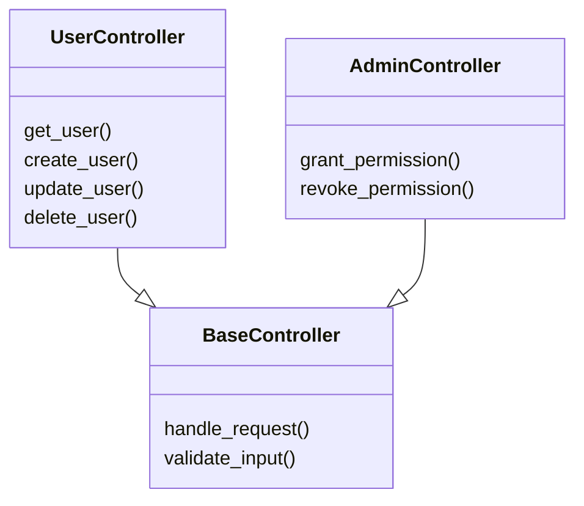

# 信息提取 Skill

**功能**: 从 README、配置文件、代码注释自动提取项目信息

**提取策略**: 分层降级（README → 配置文件 → Docstring → 通用模板）

**性能目标**: 信息提取时间 < 10 秒

---

## 核心提取函数

### extract_project_info()

```bash
#!/usr/bin/env bash
# 项目信息提取主函数
# 用法: extract_project_info <project_dir>
# 输出: JSON 格式的项目信息

extract_project_info() {
    local project_dir=$1

    # 1. README.md 提取
    local readme_info=$(extract_from_readme "$project_dir")

    # 2. 配置文件提取
    local config_info=$(extract_from_config "$project_dir")

    # 3. 代码 Docstring 提取
    local docstring_info=$(extract_from_docstrings "$project_dir")

    # 4. 代码注释提取
    local comment_info=$(extract_from_comments "$project_dir")

    # 5. 分层降级合并（README 优先级最高）
    local merged_info=$(merge_project_info "$readme_info" "$config_info" "$docstring_info" "$comment_info")

    echo "$merged_info"
}
```

---

## 1. README.md 提取

```bash
extract_from_readme() {
    local project_dir=$1
    local readme_file="$project_dir/README.md"

    if [ ! -f "$readme_file" ]; then
        # 尝试其他常见 README 文件名
        for alt_name in "README" "readme.md" "README.txt"; do
            if [ -f "$project_dir/$alt_name" ]; then
                readme_file="$project_dir/$alt_name"
                break
            fi
        done
    fi

    if [ ! -f "$readme_file" ]; then
        echo "{}"
        return
    fi

    echo "📖 提取 README.md 信息..." >&2

    # 使用内联 Python 片段解析 Markdown
    python3 - <<PYTHON_EOF
import re
import json

readme_path = "$readme_file"

try:
    with open(readme_path, 'r', encoding='utf-8') as f:
        content = f.read()

    info = {}

    # 提取项目名称（第一个 # 标题）
    title_match = re.search(r'^#\s+(.+)$', content, re.MULTILINE)
    if title_match:
        info['name'] = title_match.group(1).strip()

    # 提取项目描述（标题后的第一段）
    desc_match = re.search(r'^#\s+.+?\n\n(.+?)(?:\n\n|$)', content, re.DOTALL)
    if desc_match:
        info['description'] = desc_match.group(1).strip()

    # 提取核心功能列表（第一个无序列表）
    features = []
    in_feature_list = False
    for line in content.split('\n'):
        stripped = line.strip()
        if stripped.startswith('-') or stripped.startswith('*'):
            feature_text = stripped[1:].strip()
            if feature_text and not feature_text.startswith('#'):
                features.append(feature_text)
                in_feature_list = True
        elif in_feature_list and not stripped:
            break

    if features:
        info['features'] = features[:10]  # 最多 10 个特性

    # 提取安装命令（查找 \`\`\`bash 或 \`\`\`shell 代码块）
    install_match = re.search(r'```\w*\n(.+?)```', content, re.DOTALL)
    if install_match:
        install_commands = [line.strip() for line in install_match.group(1).split('\n')
                           if line.strip() and not line.strip().startswith('#')]
        if install_commands:
            info['install_commands'] = install_commands[:5]

    print(json.dumps(info, ensure_ascii=False, indent=2))

except Exception as e:
    print(json.dumps({}, ensure_ascii=False))
PYTHON_EOF
}
```

---

## 2. 配置文件提取

```bash
extract_from_config() {
    local project_dir=$1
    local info="{}"

    # 1. pyproject.toml
    if [ -f "$project_dir/pyproject.toml" ]; then
        info=$(merge_json "$info" "$(extract_from_pyproject "$project_dir")")
    fi

    # 2. package.json
    if [ -f "$project_dir/package.json" ]; then
        info=$(merge_json "$info" "$(extract_from_package_json "$project_dir")")
    fi

    # 3. setup.py
    if [ -f "$project_dir/setup.py" ]; then
        info=$(merge_json "$info" "$(extract_from_setup_py "$project_dir")")
    fi

    echo "$info"
}

# pyproject.toml 提取
extract_from_pyproject() {
    local project_dir=$1

    python3 - <<PYTHON_EOF
import json
import sys

try:
    import tomli  # Python 3.11+ 内置
except ImportError:
    try:
        import tomllib as tomli
    except ImportError:
        print(json.dumps({}, ensure_ascii=False))
        sys.exit(0)

toml_path = "$project_dir/pyproject.toml"

try:
    with open(toml_path, 'rb') as f:
        data = tomli.load(f)

    project = data.get('project', {})
    info = {}

    if 'name' in project:
        info['name'] = project['name']
    if 'version' in project:
        info['version'] = project['version']
    if 'description' in project:
        info['description'] = project['description']
    if 'dependencies' in project:
        info['dependencies'] = project['dependencies']

    print(json.dumps(info, ensure_ascii=False, indent=2))

except Exception as e:
    print(json.dumps({}, ensure_ascii=False))
PYTHON_EOF
}

# package.json 提取
extract_from_package_json() {
    local project_dir=$1

    if command -v jq &> /dev/null; then
        jq '{name, version, description, dependencies: .dependencies // .peerDependencies // {}}' \
           "$project_dir/package.json" 2>/dev/null || echo "{}"
    else
        # 降级：使用 grep
        echo "{}"
    fi
}

# setup.py 提取
extract_from_setup_py() {
    local project_dir=$1

    python3 - <<PYTHON_EOF
import re
import json
import ast

setup_path = "$project_dir/setup.py"

try:
    with open(setup_path, 'r', encoding='utf-8') as f:
        content = f.read()

    info = {}

    # 提取 name 和 description（使用正则表达式）
    name_match = re.search(r'name\s*=\s*["\'](.+?)["\']', content)
    if name_match:
        info['name'] = name_match.group(1)

    desc_match = re.search(r'description\s*=\s*["\'](.+?)["\']', content)
    if desc_match:
        info['description'] = desc_match.group(1)

    print(json.dumps(info, ensure_ascii=False, indent=2))

except Exception as e:
    print(json.dumps({}, ensure_ascii=False))
PYTHON_EOF
}
```

---

## 3. 代码 Docstring 提取

```bash
extract_from_docstrings() {
    local project_dir=$1
    local src_dir="$project_dir/src"

    if [ ! -d "$src_dir" ]; then
        if [ -d "$project_dir/app" ]; then
            src_dir="$project_dir/app"
        else
            src_dir="$project_dir"
        fi
    fi

    echo "📝 提取代码 Docstring..." >&2

    # 使用 Python 提取主模块的 Docstring
    python3 - <<PYTHON_EOF
import re
import json
import os
from pathlib import Path

src_dir = "$src_dir"

info = {}

# 扫描主 __init__.py 或主要模块
init_files = list(Path(src_dir).rglob("__init__.py"))

if not init_files:
    print(json.dumps({}, ensure_ascii=False))
else

    # 取第一个 __init__.py（通常是主模块）
    main_init = init_files[0]

    try:
        with open(main_init, 'r', encoding='utf-8') as f:
            content = f.read()

        # 提取模块 Docstring（文件开头的三引号字符串）
        docstring_match = re.search(r'^"""(.*?)"""', content, re.DOTALL)
        if docstring_match:
            docstring = docstring_match.group(1).strip()
            info['module_docstring'] = docstring[:500]  # 限制长度

        # 提取类和函数的 Docstring
        class_docs = []
        func_docs = []

        # 类 Docstring
        for class_match in re.finditer(r'class\s+(\w+).*?:\s*\n\s+"""(.*?)"""', content, re.DOTALL):
            class_name = class_match.group(1)
            class_desc = class_match.group(2).strip()
            class_docs.append(f"{class_name}: {class_desc}")

        # 函数 Docstring
        for func_match in re.finditer(r'def\s+(\w+).*?:\s*\n\s+"""(.*?)"""', content, re.DOTALL):
            func_name = func_match.group(1)
            func_desc = func_match.group(2).strip()
            func_docs.append(f"{func_name}: {func_desc}")

        if class_docs:
            info['class_docstrings'] = class_docs[:10]
        if func_docs:
            info['function_docstrings'] = func_docs[:20]

        print(json.dumps(info, ensure_ascii=False, indent=2))

    except Exception as e:
        print(json.dumps({}, ensure_ascii=False))
PYTHON_EOF
}
```

---

## 4. 代码注释提取

```bash
extract_from_comments() {
    local project_dir=$1
    local src_dir="$project_dir/src"

    if [ ! -d "$src_dir" ]; then
        src_dir="$project_dir"
    fi

    echo "💬 提取代码注释..." >&2

    # 使用 Python 提取关键逻辑的行内注释
    python3 - <<PYTHON_EOF
import re
import json
from pathlib import Path

src_dir = "$src_dir"

info = {}

# 扫描所有 Python 文件（排除测试）
py_files = []
for py_file in Path(src_dir).rglob("*.py"):
    if "test" not in str(py_file):
        py_files.append(py_file)

# 限制文件数量（避免性能问题）
max_files = 50
comments = []

for py_file in py_files[:max_files]:
    try:
        with open(py_file, 'r', encoding='utf-8') as f:
            lines = f.readlines()

        for i, line in enumerate(lines, 1):
            stripped = line.strip()
            # 提取行内注释（# 开头）
            if stripped.startswith("#") and len(stripped) > 2:
                comment_text = stripped[1:].strip()
                # 过滤简单的注释
                if len(comment_text) > 10 and not comment_text.startswith("TODO"):
                    comments.append(f"{py_file.name}:{i}: {comment_text}")

    except Exception:
        continue

if comments:
    info['comments'] = comments[:100]  # 最多 100 条注释

print(json.dumps(info, ensure_ascii=False, indent=2))
PYTHON_EOF
}
```

---

## 5. 分层降级合并

```bash
# 合并多个信息源（README 优先级最高）
merge_project_info() {
    local readme_info=$1
    local config_info=$2
    local docstring_info=$3
    local comment_info=$4

    # 使用 jq 合并 JSON（优先级：README > 配置 > Docstring > 注释）
    if command -v jq &> /dev/null; then
        jq -s '
            reduce .[] as $item ({}; . * $item) |
            .readme_extracted = ($readme_info != {}) |
            .config_extracted = ($config_info != {}) |
            .docstring_extracted = ($docstring_info != {}) |
            .comments_extracted = ($comment_info != {})
        ' \
        --argjson readme_info "$readme_info" \
        --argjson config_info "$config_info" \
        --argjson docstring_info "$docstring_info" \
        --argjson comment_info "$comment_info" \
        <<< "{}"
    else
        # 降级：简单合并（只保留 README 和配置）
        merge_json "$readme_info" "$config_info"
    fi
}

# 简单的 JSON 合并函数
merge_json() {
    local json1=$1
    local json2=$2

    if [ -z "$json1" ] || [ "$json1" = "{}" ]; then
        echo "$json2"
    elif [ -z "$json2" ] || [ "$json2" = "{}" ]; then
        echo "$json1"
    else
        # 合并两个 JSON（第二个覆盖第一个）
        echo "{$json1, $json2}" | sed 's/}{/, /g' | sed 's/{ //g' | sed 's/ }//g'
    fi
}
```

---

## 使用示例

```bash
# 提取项目信息
project_dir="/path/to/project"
info=$(extract_project_info "$project_dir")

echo "项目信息:"
echo "$info" | jq '.'
```

**输出示例**：

```json
{
  "name": "My Awesome Project",
  "description": "一个用于自动生成文档的工具",
  "version": "1.0.0",
  "features": [
    "自动检测技术栈",
    "智能识别业务模块",
    "自适应文档生成"
  ],
  "install_commands": [
    "pip install my-awesome-project"
  ],
  "dependencies": [
    "fastapi>=0.100.0",
    "sqlalchemy>=2.0.0"
  ],
  "readme_extracted": true,
  "config_extracted": true,
  "docstring_extracted": true,
  "comments_extracted": false
}
```

---

## 降级策略

**优先级顺序**：

1. **README.md** → 包含项目名称、描述、功能列表、安装命令
2. **配置文件** → 包含版本、依赖、元数据
3. **代码 Docstring** → 包含模块说明、类和函数文档
4. **代码注释** → 包含关键逻辑说明
5. **通用模板** → 使用占位符（`{{PROJECT_NAME}}`、`{{DESCRIPTION}}` 等）

**降级逻辑**：

```bash
# 如果 README 不存在，使用配置文件信息
if [ ! -f "$project_dir/README.md" ]; then
    echo "⚠️ 未找到 README.md，使用配置文件信息" >&2
fi

# 如果配置文件也不存在，使用 Docstring
if [ ! -f "$project_dir/pyproject.toml" ] && [ ! -f "$project_dir/package.json" ]; then
    echo "⚠️ 未找到配置文件，使用代码 Docstring" >&2
fi

# 如果都没有，使用通用模板
if [ -z "$project_name" ]; then
    project_name="{{PROJECT_NAME}}"
    description="{{DESCRIPTION}}"
fi
```

---

## 6. API 签名提取

### extract_api_signatures()

```bash
#!/usr/bin/env bash
# API 签名提取主函数
# 用法: extract_api_signatures <project_dir>
# 输出: JSON 格式的 API 端点信息
# 支持: FastAPI, Flask, Django REST Framework

extract_api_signatures() {
    local project_dir=$1

    echo "🔌 提取 API 签名..." >&2

    # 1. FastAPI 提取
    local fastapi_apis=$(extract_fastapi_apis "$project_dir")

    # 2. Flask 提取
    local flask_apis=$(extract_flask_apis "$project_dir")

    # 3. Django REST 提取
    local django_apis=$(extract_django_apis "$project_dir")

    # 合并所有 API 签名
    if command -v jq &> /dev/null; then
        jq -s '{fastapi: .[0], flask: .[1], django: .[2] | add}' \
            <<< "$fastapi_apis $flask_apis $django_apis"
    else
        echo "{\"fastapi\": $fastapi_apis, \"flask\": $flask_apis, \"django\": $django_apis}"
    fi
}

# FastAPI 端点提取
extract_fastapi_apis() {
    local project_dir=$1

    python3 - <<PYTHON_EOF
import re
import json
import ast
from pathlib import Path

project_dir = Path("$project_dir")
apis = []

# 扫描所有 Python 文件
for py_file in project_dir.rglob("*.py"):
    if "test" in str(py_file) or "__pycache__" in str(py_file):
        continue

    try:
        with open(py_file, 'r', encoding='utf-8') as f:
            content = f.read()

        # 解析 AST
        tree = ast.parse(content)

        for node in ast.walk(tree):
            # 查找函数定义
            if isinstance(node, ast.FunctionDef):
                # 检查是否为 FastAPI 路由装饰器
                for decorator in node.decorator_list:
                    decorator_str = ast.unparse(decorator) if hasattr(ast, 'unparse') else str(decorator)

                    # 匹配 @app.get, @router.post 等
                    route_match = re.search(r'\.(get|post|put|delete|patch)\(["\']([^"\']+)["\']', decorator_str)
                    if route_match:
                        method = route_match.group(1).upper()
                        path = route_match.group(2)

                        api_info = {
                            "method": method,
                            "path": path,
                            "function": node.name,
                            "file": str(py_file.relative_to(project_dir)),
                            "line": node.lineno
                        }

                        # 提取参数
                        args = [arg.arg for arg in node.args.args]
                        if args:
                            api_info["parameters"] = args

                        # 提取返回类型
                        if node.returns:
                            return_type = ast.unparse(node.returns) if hasattr(ast, 'unparse') else str(node.returns)
                            api_info["return_type"] = return_type

                        apis.append(api_info)

    except Exception:
        continue

print(json.dumps(apis, ensure_ascii=False, indent=2))
PYTHON_EOF
}

# Flask 端点提取
extract_flask_apis() {
    local project_dir=$1

    python3 - <<PYTHON_EOF
import re
import json
import ast
from pathlib import Path

project_dir = Path("$project_dir")
apis = []

for py_file in project_dir.rglob("*.py"):
    if "test" in str(py_file):
        continue

    try:
        with open(py_file, 'r', encoding='utf-8') as f:
            content = f.read()

        tree = ast.parse(content)

        for node in ast.walk(tree):
            if isinstance(node, ast.FunctionDef):
                for decorator in node.decorator_list:
                    decorator_str = ast.unparse(decorator) if hasattr(ast, 'unparse') else str(decorator)

                    # 匹配 @app.route, @bp.route
                    route_match = re.search(r'\.route\(["\']([^"\']+)["\'].*?methods=\[([^\]]+)\]', decorator_str)
                    if route_match:
                        path = route_match.group(1)
                        methods_str = route_match.group(2)
                        methods = re.findall(r'["\']([A-Z]+)["\']', methods_str)

                        for method in methods:
                            api_info = {
                                "method": method,
                                "path": path,
                                "function": node.name,
                                "file": str(py_file.relative_to(project_dir)),
                                "line": node.lineno
                            }
                            apis.append(api_info)

    except Exception:
        continue

print(json.dumps(apis, ensure_ascii=False, indent=2))
PYTHON_EOF
}

# Django REST 端点提取
extract_django_apis() {
    local project_dir=$1

    python3 - <<PYTHON_EOF
import re
import json
from pathlib import Path

project_dir = Path("$project_dir")
apis = []

# 查找 urls.py 文件
for urls_file in project_dir.rglob("urls.py"):
    try:
        with open(urls_file, 'r', encoding='utf-8') as f:
            content = f.read()

        # 匹配 path() 或 url() 模式
        # path('api/users/', views.UserList.as_view(), name='user-list')
        pattern = r'(?:path|url)\(["\']([^"\']+)["\'].*?,\s*(\w+)\.as_view\(\)'
        matches = re.findall(pattern, content)

        for path, view_class in matches:
            api_info = {
                "method": "GET/POST",  # 视图集通常支持多个方法
                "path": path,
                "view_class": view_class,
                "file": str(urls_file.relative_to(project_dir))
            }
            apis.append(api_info)

    except Exception:
        continue

print(json.dumps(apis, ensure_ascii=False, indent=2))
PYTHON_EOF
}
```

**输出示例**：

```json
{
  "fastapi": [
    {
      "method": "GET",
      "path": "/api/users",
      "function": "list_users",
      "file": "src/api/users.py",
      "line": 15,
      "parameters": ["skip", "limit"],
      "return_type": "List[User]"
    },
    {
      "method": "POST",
      "path": "/api/users",
      "function": "create_user",
      "file": "src/api/users.py",
      "line": 25,
      "parameters": ["user"],
      "return_type": "User"
    }
  ],
  "flask": [],
  "django": []
}
```

---

## 7. 类继承关系提取

### extract_class_hierarchy()

```bash
#!/usr/bin/env bash
# 类继承关系提取
# 用法: extract_class_hierarchy <project_dir>
# 输出: Mermaid classDiagram 格式

extract_class_hierarchy() {
    local project_dir=$1

    echo "🏗️ 提取类继承关系..." >&2

    python3 - <<PYTHON_EOF
import re
import ast
from pathlib import Path
from collections import defaultdict

project_dir = Path("$project_dir")

# 收集类信息
classes = {}
inheritance = []

for py_file in project_dir.rglob("*.py"):
    if "test" in str(py_file) or "__pycache__" in str(py_file):
        continue

    try:
        with open(py_file, 'r', encoding='utf-8') as f:
            content = f.read()

        tree = ast.parse(content)

        for node in ast.walk(tree):
            if isinstance(node, ast.ClassDef):
                class_name = node.name

                # 提取基类
                bases = []
                for base in node.bases:
                    if isinstance(base, ast.Name):
                        bases.append(base.id)
                    elif isinstance(base, ast.Attribute):
                        bases.append(ast.unparse(base) if hasattr(ast, 'unparse') else str(base))

                # 提取方法
                methods = []
                for item in node.body:
                    if isinstance(item, ast.FunctionDef):
                        methods.append(item.name)

                # 提取属性（类变量）
                attributes = []
                for item in node.body:
                    if isinstance(item, ast.Assign):
                        for target in item.targets:
                            if isinstance(target, ast.Name):
                                attributes.append(target.id)

                classes[class_name] = {
                    "file": str(py_file.relative_to(project_dir)),
                    "methods": methods,
                    "attributes": attributes
                }

                # 记录继承关系
                for base in bases:
                    inheritance.append((class_name, base))

    except Exception:
        continue

# 生成 Mermaid classDiagram
print("```mermaid")
print("classDiagram")

# 输出类定义
for class_name, info in classes.items():
    methods_str = "\\n    ".join(info["methods"][:5])  # 最多显示 5 个方法
    if methods_str:
        print(f"    class {class_name} {{")
        print(f"        {methods_str}")
        print("    }")
    else:
        print(f"    class {class_name}")

# 输出继承关系
for child, parent in inheritance:
    print(f"    {child} --|> {parent}")

print("```")
PYTHON_EOF
}
```

**输出示例**：



---

## 8. 配置文件解析

### extract_configurations()

```bash
#!/usr/bin/env bash
# 配置文件提取
# 用法: extract_configurations <project_dir>
# 输出: JSON 格式的配置信息

extract_configurations() {
    local project_dir=$1

    echo "⚙️ 提取配置信息..." >&2

    local configs="{}"

    # 1. .env 文件
    if [ -f "$project_dir/.env" ]; then
        configs=$(merge_json "$configs" "$(parse_env_file "$project_dir/.env")")
    fi

    # 2. config.yaml / config.yml
    for yaml_file in "$project_dir"/config.{yml,yaml}; do
        if [ -f "$yaml_file" ]; then
            configs=$(merge_json "$configs" "$(parse_yaml_file "$yaml_file")")
            break
        fi
    done

    # 3. settings.py (Django)
    if [ -f "$project_dir/settings.py" ] || [ -f "$project_dir/config/settings.py" ]; then
        configs=$(merge_json "$configs" "$(parse_settings_py "$project_dir")")
    fi

    echo "$configs"
}

# .env 文件解析
parse_env_file() {
    local env_file=$1

    python3 - <<PYTHON_EOF
import re
import json

env_path = "$env_file"

try:
    with open(env_path, 'r', encoding='utf-8') as f:
        lines = f.readlines()

    config = {}
    for line in lines:
        line = line.strip()
        # 跳过注释和空行
        if not line or line.startswith('#'):
            continue

        # 匹配 KEY=VALUE 或 KEY="VALUE"
        match = re.match(r'^([A-Z_][A-Z0-9_]*)=(.*)$', line)
        if match:
            key = match.group(1)
            value = match.group(2).strip('"\'')  # 去除引号
            config[key] = value

    print(json.dumps(config, ensure_ascii=False, indent=2))

except Exception:
    print(json.dumps({}, ensure_ascii=False))
PYTHON_EOF
}

# YAML 文件解析
parse_yaml_file() {
    local yaml_file=$1

    if command -v python3 &> /dev/null; then
        python3 - <<PYTHON_EOF
import json
import sys

try:
    import yaml
except ImportError:
    print(json.dumps({}, ensure_ascii=False))
    sys.exit(0)

yaml_path = "$yaml_file"

try:
    with open(yaml_path, 'r', encoding='utf-8') as f:
        data = yaml.safe_load(f)

    print(json.dumps(data, ensure_ascii=False, indent=2))

except Exception:
    print(json.dumps({}, ensure_ascii=False))
PYTHON_EOF
    else
        echo "{}"
    fi
}

# Django settings.py 解析
parse_settings_py() {
    local project_dir=$1

    local settings_file
    if [ -f "$project_dir/settings.py" ]; then
        settings_file="$project_dir/settings.py"
    elif [ -f "$project_dir/config/settings.py" ]; then
        settings_file="$project_dir/config/settings.py"
    else
        echo "{}"
        return
    fi

    python3 - <<PYTHON_EOF
import re
import json
import ast

settings_path = "$settings_file"

try:
    with open(settings_path, 'r', encoding='utf-8') as f:
        content = f.read()

    tree = ast.parse(content)

    config = {}

    # 提取大写配置项
    for node in ast.walk(tree):
        if isinstance(node, ast.Assign):
            for target in node.targets:
                if isinstance(target, ast.Name):
                    name = target.id
                    # Django 设置通常是大写的
                    if name.isupper() and len(name) >= 4:
                        try:
                            value = ast.literal_eval(node.value)
                            if isinstance(value, (str, int, bool, list, dict)):
                                config[name] = value
                        except Exception:
                            # 对于无法求值的表达式，尝试字符串形式
                            config[name] = ast.unparse(node.value) if hasattr(ast, 'unparse') else str(node.value)

    print(json.dumps(config, ensure_ascii=False, indent=2))

except Exception:
    print(json.dumps({}, ensure_ascii=False))
PYTHON_EOF
}
```

**输出示例**：

```json
{
  "database": {
    "host": "localhost",
    "port": 5432,
    "name": "myapp"
  },
  "redis": {
    "url": "redis://localhost:6379"
  },
  "debug": true,
  "allowed_hosts": ["localhost", "127.0.0.1"]
}
```

---

**版本**: 2.0.0
**最后更新**: 2026-01-05
**变更日志**:
- v2.0.0: 添加 API 签名提取、类继承关系提取、配置文件解析功能
- v1.0.0: 初始版本，支持 README、配置文件、Docstring、注释提取
