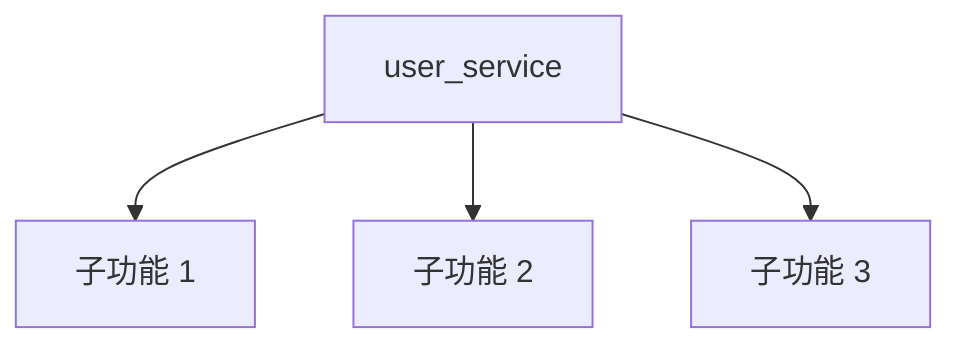

# 文档大纲生成 Skill

**功能**: 根据模块规模生成 1-4 层文档结构

**规模规则**：
- 小型模块（1-4 文件）→ 1 层文档
- 中型模块（5-20 文件）→ 2 层文档
- 大型模块（21-50 文件）→ 3 层文档
- 超大型模块（>50 文件）→ 4 层文档

---

## 核心生成函数

### generate_document_outline()

```bash
#!/usr/bin/env bash
# 文档大纲生成主函数
# 用法: generate_document_outline <module_name> <module_path> <file_count> <depth>
# 输出: Markdown 格式的文档大纲

generate_document_outline() {
    local module_name=$1
    local module_path=$2
    local file_count=$3
    local depth=${4:-1}  # 默认 1 层

    echo "# ${module_name} 模块文档"
    echo ""
    echo "## 概述"
    echo ""
    echo "## 核心"
    echo ""

    # 根据深度生成不同层级
    case $depth in
        1)
            generate_small_module_outline "$module_name" "$module_path"
            ;;
        2)
            generate_medium_module_outline "$module_name" "$module_path"
            ;;
        3)
            generate_large_module_outline "$module_name" "$module_path"
            ;;
        4)
            generate_xlarge_module_outline "$module_name" "$module_path"
            ;;
        *)
            generate_small_module_outline "$module_name" "$module_path"
            ;;
    esac
}
```

---

## 1. 小型模块大纲（1 层）

```bash
generate_small_module_outline() {
    local module_name=$1
    local module_path=$2

    cat <<EOF
**模块类型**: 小型模块（1-4 文件）

## 概述

${module_name} 模块的主要功能说明...

## 核心

### 主要功能

- 功能 1
- 功能 2

### 使用示例

\`\`\`python
# 示例代码
\`\`\`

## 参考

- 相关文件链接
EOF
}
```

---

## 2. 中型模块大纲（2 层）

```bash
generate_medium_module_outline() {
    local module_name=$1
    local module_path=$2

    cat <<EOF
**模块类型**: 中型模块（5-20 文件）

## 概述

${module_name} 模块的主要功能说明...

## 核心

### 主要功能

- 功能 1
- 功能 2
- 功能 3

### 架构

\`\`\`mermaid
graph TD
    A[${module_name}] --> B[子功能 1]
    A --> C[子功能 2]
    A --> D[子功能 3]
\`\`\`

### 关键组件

#### 组件 1

说明...

#### 组件 2

说明...

### 使用示例

\`\`\`python
# 示例代码
\`\`\`

## 参考

- 相关文件链接
EOF
}
```

---

## 3. 大型模块大纲（3 层）

```bash
generate_large_module_outline() {
    local module_name=$1
    local module_path=$2

    cat <<EOF
**模块类型**: 大型模块（21-50 文件）

## 概述

${module_name} 模块的主要功能说明...

## 核心

### 主要功能

- 功能 1
- 功能 2
- 功能 3
- 功能 4

### 架构

\`\`\`mermaid
graph TD
    A[${module_name}] --> B[子模块 1]
    A --> C[子模块 2]
    A --> D[子模块 3]

    B --> B1[功能 1.1]
    B --> B2[功能 1.2]
    C --> C1[功能 2.1]
    C --> C2[功能 2.2]
    D --> D1[功能 3.1]
    D --> D2[功能 3.2]
\`\`\`

### 关键组件

#### 组件 1

说明...

##### 子组件 1.1

详细说明...

##### 子组件 1.2

详细说明...

#### 组件 2

说明...

### 工作流程

1. 步骤 1
2. 步骤 2
3. 步骤 3

### 使用示例

\`\`\`python
# 示例代码
\`\`\`

## 高级主题

### 配置选项

### 扩展点

### 性能优化

## 参考

- 相关文件链接
EOF
}
```

---

## 4. 超大型模块大纲（4 层）

```bash
generate_xlarge_module_outline() {
    local module_name=$1
    local module_path=$2

    cat <<EOF
**模块类型**: 超大型模块（>50 文件）

## 概述

${module_name} 模块的主要功能说明...

**规模**: 大型模块，包含多个子模块和复杂的依赖关系

## 核心

### 主要功能

- 功能 1
- 功能 2
- 功能 3
- 功能 4
- 功能 5

### 架构

\`\`\`mermaid
graph TD
    A[${module_name}] --> B[子模块 1]
    A --> C[子模块 2]
    A --> D[子模块 3]
    A --> E[子模块 4]

    B --> B1[组件 1.1]
    B --> B2[组件 1.2]
    C --> C1[组件 2.1]
    C --> C2[组件 2.2]
    D --> D1[组件 3.1]
    D --> D2[组件 3.2]
    E --> E1[组件 4.1]
    E --> E2[组件 4.2]

    B1 --> B1A[功能 1.1.1]
    B1 --> B1B[功能 1.1.2]
    B2 --> B2A[功能 1.2.1]
    B2 --> B2B[功能 1.2.2]
\`\`\`

### 关键组件

#### 组件 1

说明...

##### 子组件 1.1

详细说明...

###### 微组件 1.1.1

超详细说明...

###### 微组件 1.1.2

超详细说明...

##### 子组件 1.2

详细说明...

#### 组件 2

说明...

##### 子组件 2.1

详细说明...

### 工作流程

1. 步骤 1
2. 步骤 2
3. 步骤 3
4. 步骤 4

### 使用示例

\`\`\`python
# 示例代码
\`\`\`

## 高级主题

### 配置选项

### 扩展点

### 性能优化

### 安全考虑

## 最佳实践

### 常见模式

### 错误处理

### 测试策略

## 参考

- 相关文件链接
EOF
}
```

---

## 模块文件列表生成

```bash
# 为模块生成相关文件列表（用于 `<cite>` 引用）
generate_module_file_list() {
    local module_path=$1
    local module_name=$2

    echo "### 相关文件" >> "$output_file"
    echo "" >> "$output_file"

    # 查找所有源代码文件
    while IFS= read -r -d '' file; do
        local relative_path=$(realpath --relative-to="$(dirname "$module_path")" "$file")
        local filename=$(basename "$file")
        echo "- \`[$filename]($relative_path)\`" >> "$output_file"
    done < <(find "$module_path" -type f \
        \( -name "*.py" -o -name "*.js" -o -name "*.ts" \) \
        ! -path "*/test/*" \
        ! -path "*/__pycache__/*" \
        -print0 | sort -z)

    echo "" >> "$output_file"
}
```

---

## 使用示例

```bash
# 为模块生成文档大纲
module_name="user_service"
module_path="/path/to/project/src/services/user"
file_count=8
depth=2  # 中型模块

outline=$(generate_document_outline "$module_name" "$module_path" "$file_count" "$depth")

echo "$outline"
```

**输出示例**（中型模块）：

```markdown
# user_service 模块文档

## 概述

user_service 模块的主要功能说明...

## 核心

### 主要功能

- 功能 1
- 功能 2
- 功能 3

### 架构



### 关键组件

#### 组件 1

说明...

#### 组件 2

说明...

### 使用示例

```python
# 示例代码
```

## 参考

- 相关文件链接
```

---

## Mermaid 图表类型选择

### select_diagram_type()

```bash
#!/usr/bin/env bash
# 根据文档类型和技术栈选择合适的 Mermaid 图表
# 用法: select_diagram_type <doc_type> <tech_stack>
# 输出: Mermaid 图表类型

select_diagram_type() {
    local doc_type=$1
    local tech_stack=$2

    # 文档类型映射表
    case $doc_type in
        datamodel|data-model|data_model)
            # 数据模型文档 → ER 图
            if [[ "$tech_stack" =~ (sqlalchemy|django|sql|database|db) ]]; then
                echo "erDiagram"
            else
                echo "classDiagram"
            fi
            ;;

        api|rest-api|rest_api|graphql)
            # API 文档 → 序列图
            echo "sequenceDiagram"
            ;;

        architecture|arch|设计)
            # 架构文档 → 流程图
            if [[ "$tech_stack" =~ (microservice|kubernetes|k8s|distributed) ]]; then
                echo "graph TB"  # 复杂架构用自顶向下
            else
                echo "flowchart TD"
            fi
            ;;

        deployment|deploy)
            # 部署文档 → 流程图（网络拓扑）
            echo "graph TB"
            ;;

        workflow|flow|process)
            # 工作流文档 → 流程图
            echo "flowchart LR"  # 左右流向更清晰
            ;;

        class|class-diagram|类图)
            # 类关系文档 → 类图
            echo "classDiagram"
            ;;

        state|state-machine|状态机)
            # 状态机文档 → 状态图
            echo "stateDiagram-v2"
            ;;

        *)
            # 默认使用流程图
            echo "flowchart LR"
            ;;
    esac
}
```

### generate_diagram_template()

```bash
#!/usr/bin/env bash
# 生成 Mermaid 图表模板
# 用法: generate_diagram_template <diagram_type> <title>
# 输出: Mermaid 图表模板

generate_diagram_template() {
    local diagram_type=$1
    local title=$2

    case $diagram_type in
        erDiagram)
            cat <<EOF
\`\`\`mermaid
erDiagram
    %% 实体关系图
    %% 提示: 使用 ||--o{ 表示一对多关系

    ENTITY1 ||--o{ ENTITY2 : "关系描述"
    ENTITY1 {
        number id PK
        string name
        timestamp created_at
    }
    ENTITY2 {
        number id PK
        number entity1_id FK
        string value
    }
\`\`\`
EOF
            ;;

        classDiagram)
            cat <<EOF
\`\`\`mermaid
classDiagram
    %% 类图
    %% 提示: 使用 <|-- 表示继承，使用 --> 表示关联

    class ClassName {
        +method1()
        +method2()
        -property1
        -property2
    }
\`\`\`
EOF
            ;;

        sequenceDiagram)
            cat <<EOF
\`\`\`mermaid
sequenceDiagram
    %% 序列图
    %% 提示: 使用 participant 定义参与者

    actor User as 用户
    participant System as 系统
    participant Database as 数据库

    User->>System: 发起请求
    System->>Database: 查询数据
    Database-->>System: 返回结果
    System-->>User: 响应
\`\`\`
EOF
            ;;

        stateDiagram-v2)
            cat <<EOF
\`\`\`mermaid
stateDiagram-v2
    %% 状态图
    [*] --> State1
    State1 --> State2: 事件
    State2 --> [*]
\`\`\`
EOF
            ;;

        flowchart*)
            cat <<EOF
\`\`\`mermaid
${diagram_type}
    %% 流程图
    %% 提示: 使用 --> 表示流向，使用 subgraph 定义子图

    A[开始] --> B[处理]
    B --> C{判断}
    C -->|条件1| D[结果1]
    C -->|条件2| E[结果2]
    D --> F[结束]
    E --> F
\`\`\`
EOF
            ;;

        *)
            cat <<EOF
\`\`\`mermaid
${diagram_type}
    %% Mermaid 图表
\`\`\`
EOF
            ;;
    esac
}
```

---

## 优化章节结构

### optimize_section_structure()

```bash
#!/usr/bin/env bash
# 根据内容量和复杂度优化章节结构
# 用法: optimize_section_structure <content_type> <complexity>
# 输出: 推荐的章节层次结构

optimize_section_structure() {
    local content_type=$1
    local complexity=${2:-medium}  # low, medium, high

    case $content_type in
        overview|概览)
            cat <<EOF
## 项目概述

### 项目简介

{project_description}

### 核心功能

- {feature_1}
- {feature_2}
- {feature_3}

### 技术栈

| 类别 | 技术 |
|------|------|
| 后端 | {backend_tech} |
| 前端 | {frontend_tech} |
| 数据库 | {database_tech} |

### 快速开始

\`\`\`bash
{quickstart_command}
\`\`\`

**Section sources**
- [源文件](file://README.md#L1-L50)
EOF
            ;;

        module|模块)
            if [ "$complexity" = "low" ]; then
                # 简单模块：2 层结构
                cat <<EOF
## {module_name} 模块

### 模块概述

{module_description}

### 主要功能

- {function_1}
- {function_2}

### 使用示例

\`\`\`python title="examples/{module_name}_example.py"
{code_example}
\`\`\`

**Section sources**
- [源文件](file://src/{module_name}.py#L1-L100)
EOF
            elif [ "$complexity" = "medium" ]; then
                # 中等模块：3 层结构
                cat <<EOF
## {module_name} 模块

### 模块概述

{module_description}

### 架构设计

\`\`\`mermaid
flowchart TD
    A[{module_name}] --> B[组件 1]
    A --> C[组件 2]
    A --> D[组件 3]
\`\`\`

**Section sources**
- [设计文档](file://docs/design/{module_name}.md)

### 核心组件

#### 组件 1

{component_1_description}

**主要方法**:
- \`method1()\`: {method1_description}
- \`method2()\`: {method2_description}

#### 组件 2

{component_2_description}

### 使用示例

\`\`\`python title="examples/{module_name}_example.py"
{code_example}
\`\`\`

**Section sources**
- [源文件](file://src/{module_name}/__init__.py#L1-L200)
EOF
            else
                # 复杂模块：4 层结构
                cat <<EOF
## {module_name} 模块

### 模块概述

{module_description}

**模块规模**: {file_count} 个文件

### 架构设计

\`\`\`mermaid
flowchart TD
    A[{module_name}] --> B[子模块 1]
    A --> C[子模块 2]
    A --> D[子模块 3]

    B --> B1[组件 1.1]
    B --> B2[组件 1.2]
    C --> C1[组件 2.1]
    D --> D1[组件 3.1]
\`\`\`

**Section sources**
- [架构图](file://docs/architecture/{module_name}.png)

### 核心组件

#### 子模块 1

{submodule_1_description}

##### 组件 1.1

{component_1_1_description}

**主要方法**:
- \`method1()\`: {description}
- \`method2()\`: {description}

**实现细节**:
\`\`\`python title="src/{module_name}/submodule1/component1_1.py"
{implementation_code}
\`\`\`

##### 组件 1.2

{component_1_2_description}

#### 子模块 2

{submodule_2_description}

### 工作流程

1. **步骤 1**: {step1_description}
2. **步骤 2**: {step2_description}
3. **步骤 3**: {step3_description}

\`\`\`mermaid
flowchart LR
    A[步骤1] --> B[步骤2]
    B --> C[步骤3]
\`\`\`

### 高级特性

#### 配置选项

| 配置项 | 类型 | 默认值 | 描述 |
|--------|------|--------|------|
| {config_1} | {type_1} | {default_1} | {desc_1} |
| {config_2} | {type_2} | {default_2} | {desc_2} |

#### 扩展点

{extension_points}

### 性能优化

{performance_tips}

### 使用示例

\`\`\`python title="examples/{module_name}_advanced.py"
{advanced_example}
\`\`\`

**Section sources**
- [源文件](file://src/{module_name}/__init__.py#L1-L500)
EOF
            fi
            ;;

        api)
            cat <<EOF
## {api_name} API

### API 概述

{api_description}

**认证方式**: {auth_method}
**Base URL**: \`{base_url}\`

### 端点列表

| 方法 | 路径 | 描述 |
|------|------|------|
| GET | \`/api/users\` | 获取用户列表 |
| POST | \`/api/users\` | 创建用户 |
| GET | \`/api/users/{{id}}\` | 获取用户详情 |
| PUT | \`/api/users/{{id}}\` | 更新用户 |
| DELETE | \`/api/users/{{id}}\` | 删除用户 |

### 请求示例

\`\`\`bash title="终端"
curl -X GET "{base_url}/api/users" \\
  -H "Authorization: Bearer {token}"
\`\`\`

### 响应示例

\`\`\`json title="响应"
{
  "success": true,
  "data": [...]
}
\`\`\`

**Section sources**
- [API 定义](file://src/api/{api_name}.py#L1-L100)
EOF
            ;;

        *)
            cat <<EOF
## {title}

{content}

**Section sources**
- [源文件](file://...)
EOF
            ;;
    esac
}
```

---

## 动态章节生成

### generate_dynamic_sections()

```bash
#!/usr/bin/env bash
# 根据文件类型和内容动态生成章节
# 用法: generate_dynamic_sections <module_path> <tech_stack>
# 输出: Markdown 格式的动态章节

generate_dynamic_sections() {
    local module_path=$1
    local tech_stack=$2

    # 1. 检测是否有测试文件
    if find "$module_path" -name "*test*.py" -o -name "test_*.py" | grep -q .; then
        cat <<EOF

## 测试

### 测试策略

{test_strategy}

### 运行测试

\`\`\`bash title="终端"
pytest {module_name}/
\`\`\`

**Section sources**
- [测试文件](file://tests/{module_name}/test_*.py)
EOF
    fi

    # 2. 检测是否有配置文件
    if [ -f "$module_path/config.py" ] || [ -f "$module_path/settings.py" ]; then
        cat <<EOF

## 配置

### 配置选项

| 配置项 | 类型 | 默认值 | 描述 |
|--------|------|--------|------|
{config_table}

**Section sources**
- [配置文件](file://src/{module_name}/config.py)
EOF
    fi

    # 3. 检测是否有性能关键代码
    if grep -r "async def\|concurrent\|threading" "$module_path" 2>/dev/null | grep -q .; then
        cat <<EOF

## 性能考虑

### 并发处理

{concurrency_description}

### 优化建议

{optimization_tips}

**Section sources**
- [性能相关代码](file://src/{module_name}/*async*.py)
EOF
    fi

    # 4. 检测数据库相关
    if [[ "$tech_stack" =~ (sqlalchemy|django|prisma|mongodb) ]]; then
        cat <<EOF

## 数据模型

\`\`\`mermaid
erDiagram
    {entity_relations}
\`\`\`

**Section sources**
- [数据模型](file://src/{module_name}/models.py)
EOF
    fi
}
```

---

**版本**: 2.0.0
**最后更新**: 2026-01-05
**变更日志**:
- v2.0.0: 添加 Mermaid 图表类型选择、优化章节结构、动态章节生成
- v1.0.0: 初始版本，支持按模块规模生成 1-4 层文档结构
