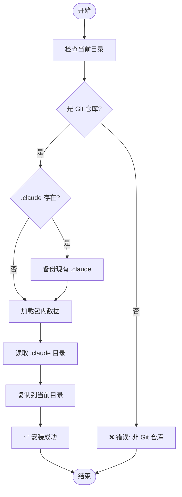

# 接口契约：CLI 命令行工具

**类型**: 命令行接口 (CLI)
**版本**: 1.0.0
**创建日期**: 2025-01-04

---

## 1. 概述

定义 `wiki-generator` 命令行工具的完整接口契约，包括命令调用、参数、返回值和错误处理。

---

## 2. 命令行工具规范

### 2.1 命令注册

**入口点**: `pyproject.toml` → `[project.scripts]`

```toml
[project.scripts]
wiki-generator = "wiki_generator.cli:cli"
```

**调用方式**：
```bash
# 直接调用（安装后）
wiki-generator

# 作为模块调用
python -m wiki_generator

# 使用 uvx 运行
uvx wiki-generator
```

---

### 2.2 命令签名

**主函数**: `wiki_generator/cli.py`

```python
@click.command()
@click.version_option(version="1.0.0")
def cli() -> None:
    """Wiki Generator 安装工具 - 安装 wiki-generate 命令和模板到 Claude Code 项目"""
    pass
```

**契约要求**：
- ✅ 使用 `click` 库（依赖：`click>=8.0.0`）
- ✅ 函数名必须是 `cli`
- ✅ 必须包含 `@click.command()` 装饰器
- ✅ 必须包含 `@click.version_option()` 装饰器
- ✅ 返回类型必须是 `None`
- ✅ 返回码：
  - `0` = 成功
  - `1` = 错误

---

## 3. 命令行参数

### 3.1 当前版本（修复后）

**主命令**：`wiki-generator`

**行为**：无参数执行，将包内 `.claude/` 目录复制到当前工作目录

**参数**：无

**选项**：

| 选项 | 短选项 | 类型 | 默认值 | 描述 |
|------|--------|------|--------|------|
| `--version` | `-V` | flag | - | 显示版本信息 |
| `--help` | `-h` | flag | - | 显示帮助信息 |
| `--verbose` | `-v` | flag | `false` | 显示详细输出 |
| `--dry-run` | - | flag | `false` | 模拟运行，不实际复制文件 |

**示例**：
```bash
# 基本用法
wiki-generator

# 显示版本
wiki-generator --version
# 输出: wiki-generator version 1.0.0

# 显示帮助
wiki-generator --help

# 详细模式
wiki-generator --verbose

# 模拟运行
wiki-generator --dry-run
```

---

### 3.2 版本选项

**契约**：
```python
@click.version_option(
    version="1.0.0",
    prog_name="wiki-generator",
    message="%(prog)s version %(version)s"
)
```

**输出格式**：
```
wiki-generator version 1.0.0
```

**验证规则**：
- ✅ 版本号必须与 `pyproject.toml` 一致
- ✅ 输出格式必须包含程序名和版本号
- ✅ 必须使用 `--version` 和 `-V` 选项

---

### 3.3 帮助选项

**契约**：
```python
@click.command(
    help="Wiki Generator 安装工具 - 安装 wiki-generate 命令和模板到 Claude Code 项目"
)
```

**自动生成输出**：
```
Usage: wiki-generator [OPTIONS]

  Wiki Generator 安装工具 - 安装 wiki-generate 命令和模板到 Claude Code 项目

Options:
  -V, --version  Show version and exit.
  -v, --verbose  显示详细输出
  --dry-run      模拟运行，不实际复制文件
  -h, --help     Show this message and exit.
```

---

## 4. 命令行为

### 4.1 主要流程

**步骤**：



**伪代码**：
```python
def cli():
    # 1. 检查环境
    if not is_git_repository():
        click.echo("❌ 错误: 当前目录不是 Git 仓库", err=True)
        raise SystemExit(1)

    # 2. 加载包内数据
    claude_dir = get_package_claude_dir()
    if not claude_dir.exists():
        click.echo("❌ 错误: 包内 .claude 目录不存在", err=True)
        raise SystemExit(1)

    # 3. 备份现有目录（如果存在）
    if Path(".claude").exists():
        backup_dir = backup_existing_claude()

    # 4. 复制文件
    copy_directory(claude_dir, Path.cwd() / ".claude")

    # 5. 显示成功消息
    click.echo("✅ Wiki Generator 命令已安装")
    click.echo(f"📁 安装位置: {Path.cwd() / '.claude'}")
    if backup_dir:
        click.echo(f"💾 备份位置: {backup_dir}")
```

---

### 4.2 环境检查

**检查项**：

| 检查项 | 描述 | 失败行为 |
|--------|------|----------|
| Git 仓库 | 当前目录必须是 Git 仓库 | 错误退出，返回码 1 |
| 写权限 | 必须有写入当前目录的权限 | 错误退出，返回码 1 |
| 磁盘空间 | 至少需要 1MB 可用空间 | 错误退出，返回码 1 |

**验证函数**：
```python
def is_git_repository() -> bool:
    """检查当前目录是否是 Git 仓库"""
    return Path(".git").exists()

def has_write_permission() -> bool:
    """检查是否有写入权限"""
    return os.access(Path.cwd(), os.W_OK)

def check_disk_space(required_mb: int) -> bool:
    """检查磁盘空间"""
    stat = os.statvfs(Path.cwd())
    available = stat.f_bavail * stat.f_frsize
    return available >= required_mb * 1024 * 1024
```

---

### 4.3 包数据访问

**契约**：
```python
def get_package_claude_dir() -> Path:
    """获取包内 .claude 目录路径"""
    try:
        # Python 3.9+
        from importlib.resources import files
        return Path(str(files('wiki_generator') / '.claude'))
    except ImportError:
        # Python 3.8
        from pkg_resources import resource_filename
        return Path(resource_filename('wiki_generator', '.claude'))
```

**验证规则**：
- ✅ 必须兼容 Python 3.8+
- ✅ 必须使用 `try/except` 处理导入错误
- ✅ 返回值必须是 `Path` 对象
- ✅ 路径必须以 `.claude` 结尾

---

### 4.4 文件复制

**契约**：
```python
def copy_directory(source: Path, target: Path, verbose: bool = False) -> None:
    """复制目录及其内容"""
    if verbose:
        click.echo(f"📂 复制: {source} -> {target}")

    # 创建目标目录
    target.mkdir(parents=True, exist_ok=True)

    # 复制所有文件和子目录
    for item in source.iterdir():
        if item.is_file():
            shutil.copy2(item, target / item.name)
            if verbose:
                click.echo(f"  📄 {item.name}")
        elif item.is_dir():
            copy_directory(item, target / item.name, verbose)

    # 复制 .gitkeep 文件（如果有）
    gitkeep = source / ".gitkeep"
    if gitkeep.exists():
        shutil.copy2(gitkeep, target / ".gitkeep")
```

**验证规则**：
- ✅ 必须保留文件权限
- ✅ 必须递归复制子目录
- ✅ 必须保留目录结构
- ✅ 可选：显示详细输出

---

## 5. 输出格式

### 5.1 成功输出

**标准输出** (stdout)：
```
✅ Wiki Generator 命令已安装

📁 安装位置: /path/to/project/.claude
📋 已安装文件:
   - .claude/commands/wiki-generate.md
   - .claude/templates/api.md.template
   - .claude/templates/architecture.md.template
   - .claude/templates/development.md.template
   - .claude/templates/index.md.template
   - .claude/templates/module.md.template
   - .claude/templates/overview.md.template
   - .claude/templates/wiki-config.json.template
   - .claude/wiki-config.json
   - .claude/README.md
   - .claude/BEST-PRACTICES.md

💡 下一步: 使用 /wiki-generate 命令生成文档
```

**返回码**：`0`

---

### 5.2 错误输出

**错误情况 1**：非 Git 仓库
```
❌ 错误: 当前目录不是 Git 仓库
💡 请在 Git 仓库根目录中运行此命令
```
**返回码**：`1`

**错误情况 2**：包内 .claude 目录不存在
```
❌ 错误: 包内 .claude 目录不存在
💡 请重新安装 wiki-generator 包
```
**返回码**：`1`

**错误情况 3**：无写权限
```
❌ 错误: 没有写入当前目录的权限
💡 请检查目录权限或使用 sudo
```
**返回码**：`1`

---

### 5.3 详细模式输出

**`--verbose` 模式**：
```
🔍 检查环境...
✓ Git 仓库: /path/to/project/.git
✓ 写权限: 是
✓ 磁盘空间: 15.2 GB 可用

📂 加载包内数据...
✓ 包内 .claude 目录: /path/to/package/.claude

📋 文件清单:
  commands/wiki-generate.md (7.1 KB)
  templates/api.md.template (640 B)
  templates/architecture.md.template (467 B)
  templates/development.md.template (789 B)
  templates/index.md.template (955 B)
  templates/module.md.template (588 B)
  templates/overview.md.template (497 B)
  templates/wiki-config.json.template (377 B)
  wiki-config.json (414 B)
  README.md (6.4 KB)
  BEST-PRACTICES.md (15.2 KB)

📂 复制文件...
  📄 commands/wiki-generate.md
  📄 templates/api.md.template
  📄 templates/architecture.md.template
  ...

✅ Wiki Generator 命令已安装
📁 安装位置: /path/to/project/.claude
```

---

## 6. 返回码规范

| 返回码 | 含义 | 使用场景 |
|--------|------|----------|
| `0` | 成功 | 命令正常执行完成 |
| `1` | 一般错误 | 环境检查失败、文件复制失败等 |
| `2` | 参数错误 | 无效的命令行参数（当前无参数） |

---

## 7. 错误处理契约

### 7.1 异常处理

**必须捕获的异常**：

| 异常类型 | 处理方式 | 用户消息 |
|----------|----------|----------|
| `FileNotFoundError` | 错误退出 | 包内文件不存在 |
| `PermissionError` | 错误退出 | 无写权限 |
| `OSError` | 错误退出 | 磁盘空间不足等 I/O 错误 |
| `Exception` | 错误退出 | 未预期的错误 |

**处理模式**：
```python
try:
    # 主要逻辑
    copy_directory(source, target)
except FileNotFoundError as e:
    click.echo(f"❌ 错误: 文件不存在 - {e}", err=True)
    raise SystemExit(1)
except PermissionError as e:
    click.echo(f"❌ 错误: 权限不足 - {e}", err=True)
    raise SystemExit(1)
except OSError as e:
    click.echo(f"❌ 错误: 系统错误 - {e}", err=True)
    raise SystemExit(1)
except Exception as e:
    click.echo(f"❌ 错误: 未预期的错误 - {e}", err=True)
    raise SystemExit(1)
```

---

### 7.2 用户友好的错误消息

**格式**：
```
❌ 错误: <简短描述>
💡 建议: <可操作的解决方案>
```

**示例**：
```
❌ 错误: 无法创建 .claude 目录
💡 请检查目录权限或手动创建后重试
```

---

## 8. 测试契约

### 8.1 单元测试

**测试文件**：`tests/test_cli.py`

**必须测试的场景**：

| 测试用例 | 描述 | 预期结果 |
|----------|------|----------|
| `test_cli_version` | 测试 `--version` 选项 | 输出版本号，返回码 0 |
| `test_cli_help` | 测试 `--help` 选项 | 输出帮助信息，返回码 0 |
| `test_cli_no_git_repo` | 测试非 Git 仓库环境 | 错误消息，返回码 1 |
| `test_cli_success` | 测试成功安装 | 成功消息，返回码 0 |
| `test_cli_dry_run` | 测试 `--dry-run` 模式 | 不实际复制文件 |
| `test_cli_verbose` | 测试 `--verbose` 模式 | 显示详细输出 |

**测试示例**：
```python
from click.testing import CliRunner
from wiki_generator.cli import cli

def test_cli_version():
    """测试版本选项"""
    runner = CliRunner()
    result = runner.invoke(cli, ['--version'])
    assert result.exit_code == 0
    assert 'wiki-generator version 1.0.0' in result.output

def test_cli_no_git_repo(tmp_path):
    """测试非 Git 仓库环境"""
    runner = CliRunner()
    with runner.isolated_filesystem(temp_dir=tmp_path):
        result = runner.invoke(cli)
        assert result.exit_code == 1
        assert '当前目录不是 Git 仓库' in result.output
```

---

### 8.2 集成测试

**测试文件**：`tests/test_integration.py`

**必须测试的场景**：

| 测试用例 | 描述 | 预期结果 |
|----------|------|----------|
| `test_full_installation` | 完整安装流程 | 所有文件正确复制 |
| `test_upgrade_existing` | 升级现有安装 | 保留用户配置 |
| `test_data_file_access` | 包数据文件访问 | 可从包内读取文件 |

---

## 9. 性能要求

| 指标 | 要求 | 测量方式 |
|------|------|----------|
| 启动时间 | < 1 秒 | `time wiki-generator --version` |
| 执行时间 | < 5 秒 | `time wiki-generator`（< 100 个文件） |
| 内存占用 | < 50 MB | `/usr/bin/time -v wiki-generator` |

---

## 10. 国际化 (i18n)

**当前版本**：仅支持简体中文

**未来扩展**：
- 使用 `gettext` 进行本地化
- 支持英文、日文等多语言

---

## 11. 总结

✅ **命令完整性**：定义了完整的 CLI 接口
✅ **错误处理**：所有错误情况都有明确的处理方式
✅ **用户体验**：友好的输出格式和错误消息
✅ **测试覆盖**：提供了完整的测试用例

---

**契约版本**: 1.0.0
**最后更新**: 2025-01-04
