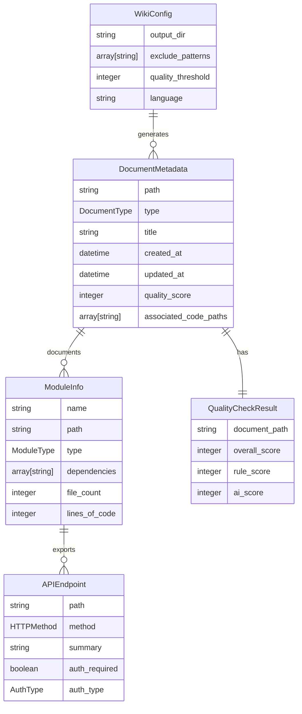
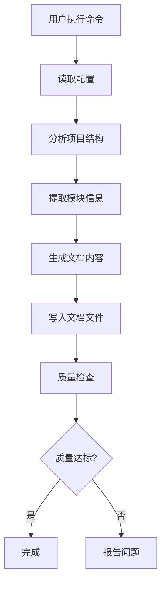
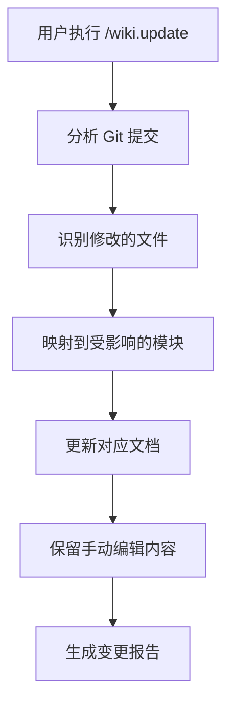
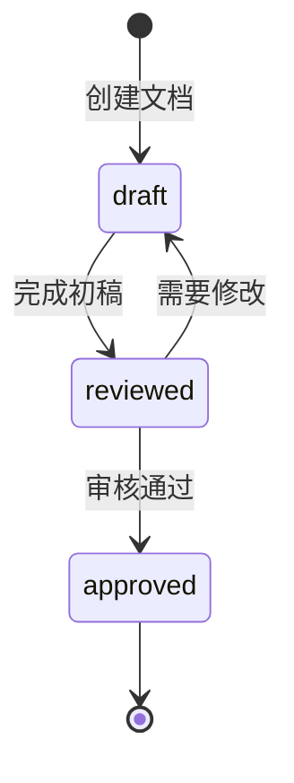

# 数据模型设计

**功能编号**: 001
**文档版本**: 1.0.0
**创建日期**: 2025-01-03
**状态**: 完成

---

## 概述

本文档定义了 Wiki 生成命令系统的核心数据模型。

---

## 核心实体

### 实体 1：文档元数据 (DocumentMetadata)

**描述**: 描述生成文档的元信息

```yaml
DocumentMetadata:
  type: object
  description: 文档元数据
  fields:
    path:
      type: string
      description: 文档相对路径
      example: "docs/00-Overview.md"

    document_type:
      type: enum
      values:
        - overview
        - architecture
        - module
        - api
        - development
        - index
        - changelog
      description: 文档类型

    title:
      type: string
      description: 文档标题
      example: "项目概览"

    created_at:
      type: datetime
      description: 创建时间
      example: "2025-01-03T10:00:00Z"

    updated_at:
      type: datetime
      description: 最后更新时间
      example: "2025-01-03T15:30:00Z"

    quality_score:
      type: integer
      range: 0-100
      description: 质量分数
      example: 85

    associated_code_paths:
      type: array[string]
      description: 关联的代码路径
      example: ["src/", "lib/"]

    status:
      type: enum
      values:
        - draft
        - reviewed
        - approved
      description: 文档状态
```

---

### 实体 2：模块信息 (ModuleInfo)

**描述**: 描述代码模块的信息

```yaml
ModuleInfo:
  type: object
  description: 模块信息
  fields:
    name:
      type: string
      description: 模块名称
      example: "auth"

    path:
      type: string
      description: 模块路径
      example: "src/auth"

    module_type:
      type: enum
      values:
        - frontend
        - backend
        - shared
        - util
      description: 模块类型

    dependencies:
      type: array[string]
      description: 依赖的模块列表
      example: ["utils", "database"]

    exported_apis:
      type: array[APIEndpoint]
      description: 导出的 API 列表

    documentation_status:
      type: enum
      values:
        - documented
        - needs_update
        - missing
      description: 文档状态

    file_count:
      type: integer
      description: 包含的文件数量
      example: 15

    lines_of_code:
      type: integer
      description: 代码行数（估算）
      example: 1200
```

---

### 实体 3：API 端点 (APIEndpoint)

**描述**: 描述 API 端点信息

```yaml
APIEndpoint:
  type: object
  description: API 端点信息
  fields:
    path:
      type: string
      description: 端点路径
      example: "/api/users/:id"

    method:
      type: enum
      values:
        - GET
        - POST
        - PUT
        - DELETE
        - PATCH
      description: HTTP 方法

    summary:
      type: string
      description: 端点简要描述
      example: "获取用户信息"

    parameters:
      type: array[Parameter]
      description: 请求参数

    request_body:
      type: object
      description: 请求体格式
      example: '{"name": "string", "email": "string"}'

    response_format:
      type: object
      description: 响应格式
      example: '{"id": "number", "name": "string"}'

    auth_required:
      type: boolean
      description: 是否需要认证
      example: true

    auth_type:
      type: enum
      values:
        - none
        - api_key
        - bearer_token
        - session
      description: 认证类型

    example_call:
      type: string
      description: 示例调用
      example: "curl -X GET http://api.example.com/users/123"
```

---

### 实体 4：参数 (Parameter)

**描述**: 描述函数或 API 参数

```yaml
Parameter:
  type: object
  description: 参数信息
  fields:
    name:
      type: string
      description: 参数名称
      example: "userId"

    type:
      type: enum
      values:
        - string
        - number
        - boolean
        - object
        - array
      description: 参数类型

    location:
      type: enum
      values:
        - query
        - path
        - header
        - body
      description: 参数位置

    required:
      type: boolean
      description: 是否必需
      example: true

    description:
      type: string
      description: 参数描述
      example: "用户 ID"

    example_value:
      type: any
      description: 示例值
      example: 123
```

---

### 实体 5：质量检查结果 (QualityCheckResult)

**描述**: 描述文档质量检查结果

```yaml
QualityCheckResult:
  type: object
  description: 质量检查结果
  fields:
    document_path:
      type: string
      description: 文档路径
      example: "docs/modules/auth.md"

    overall_score:
      type: integer
      range: 0-100
      description: 总分
      example: 85

    rule_score:
      type: integer
      range: 0-60
      description: 规则引擎得分
      example: 55

    ai_score:
      type: integer
      range: 0-40
      description: AI 评估得分
      example: 30

    passed_checks:
      type: array[string]
      description: 通过的检查项
      example: ["结构完整", "包含代码示例"]

    failed_checks:
      type: array[string]
      description: 未通过的检查项
      example: ["部分链接失效"]

    warnings:
      type: array[string]
      description: 警告信息
      example: ["建议添加更多使用示例"]

    improvement_suggestions:
      type: array[string]
      description: 改进建议
      example: ["修复失效链接", "添加部署章节"]
```

---

### 实体 6：配置 (WikiConfig)

**描述**: Wiki 生成器配置

```yaml
WikiConfig:
  type: object
  description: Wiki 配置
  fields:
    output_dir:
      type: string
      description: 输出目录
      default: "docs"
      example: "docs"

    exclude_patterns:
      type: array[string]
      description: 排除模式
      default: ["node_modules", "dist", "build", ".git"]
      example: ["node_modules", "dist"]

    template_dir:
      type: string
      description: 模板目录
      default: ".claude/templates"
      example: ".claude/templates"

    quality_threshold:
      type: integer
      range: 0-100
      description: 质量阈值
      default: 80
      example: 80

    diagrams:
      type: object
      description: 图表配置
      fields:
        enabled:
          type: boolean
          default: true
          description: 是否启用图表

        detail_level:
          type: enum
          values:
            - low
            - medium
            - high
          default: medium
          description: 详细级别

    modules:
      type: object
      description: 模块配置
      fields:
        auto_detect:
          type: boolean
          default: true
          description: 是否自动检测

        patterns:
          type: array[string]
          description: 模块匹配模式
          default: ["src/*", "lib/*", "app/*"]
          example: ["src/*", "lib/*"]

    language:
      type: string
      description: 默认语言
      default: "zh-CN"
      example: "zh-CN"

    project_type:
      type: string
      description: 项目类型
      example: "nodejs"
```

---

## 实体关系图



---

## 数据流

### 文档生成流程



### 增量更新流程



---

## 验证规则

### 文档元数据验证

```yaml
DocumentMetadata.validation:
  - path: 必填，格式为 docs/**/*.md
  - document_type: 必填，值为预定义类型之一
  - title: 必填，长度 1-100 字符
  - created_at: 必填，有效日期时间
  - updated_at: 必填，不早于 created_at
  - quality_score: 必填，范围 0-100
  - associated_code_paths: 可选，数组元素为有效路径
```

### 模块信息验证

```yaml
ModuleInfo.validation:
  - name: 必填，有效模块名
  - path: 必填，存在的目录路径
  - module_type: 必填，值为预定义类型之一
  - dependencies: 可选，数组元素为有效模块名
  - file_count: 可选，正整数
  - lines_of_code: 可选，正整数
```

### API 端点验证

```yaml
APIEndpoint.validation:
  - path: 必填，以 / 开头
  - method: 必填，有效的 HTTP 方法
  - summary: 可选，长度 1-200 字符
  - auth_required: 必填
  - auth_type: 如果 auth_required=true，必填
```

---

## 状态转换

### 文档状态



### 文档状态说明

| 状态 | 描述 | 触发条件 |
|------|------|----------|
| draft | 初稿状态 | 文档首次生成 |
| reviewed | 已审查 | 通过质量检查（≥80 分） |
| approved | 已批准 | 人工审查通过 |

---

## 扩展性考虑

### 添加新的文档类型

1. 在 `DocumentMetadata.document_type` 枚举中添加新类型
2. 为新类型定义特定的模板
3. 更新质量检查规则

### 添加新的项目类型

1. 在项目识别规则中添加新类型
2. 定义类型特定的配置项
3. 更新文档生成策略

### 添加新的质量检查项

1. 在规则引擎或 AI 评估中添加新检查
2. 更新分数权重分配
3. 更新质量报告格式

---

**数据模型状态**: ✅ 完成
**下一步**: 实现命令文件
**最后更新**: 2025-01-03
