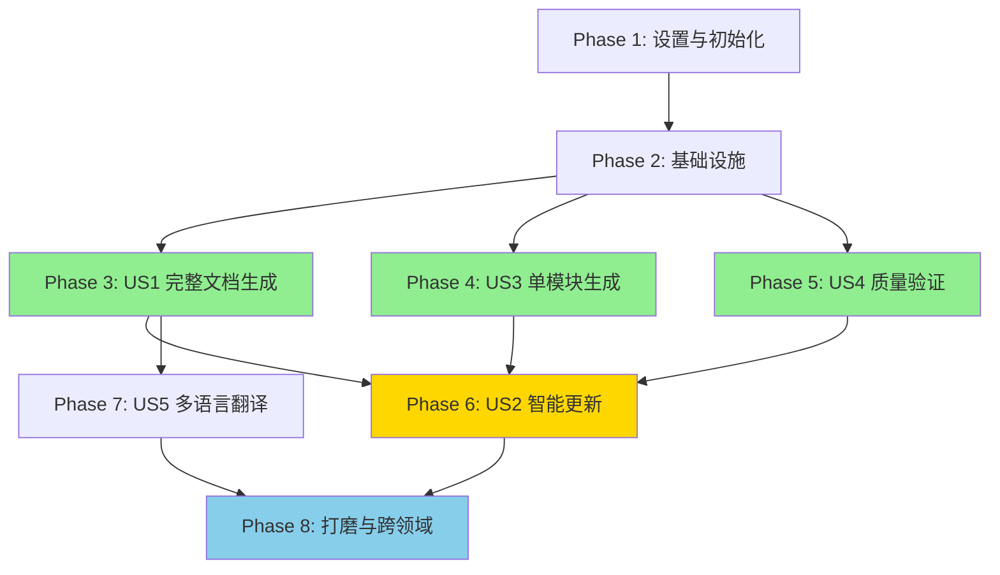

# 实现任务列表：Wiki 生成命令

**功能编号**: 001
**功能名称**: wiki-generator-commands
**任务版本**: 1.0.0
**创建日期**: 2025-01-03
**状态**: 待执行

---

## 目录

1. [执行摘要](#执行摘要)
2. [实现策略](#实现策略)
3. [Phase 1: 设置与初始化](#phase-1-设置与初始化)
4. [Phase 2: 基础设施](#phase-2-基础设施)
5. [Phase 3: 用户故事 - 完整文档生成 (US1)](#phase-3-用户故事---完整文档生成-us1)
6. [Phase 4: 用户故事 - 单模块文档生成 (US3)](#phase-4-用户故事---单模块文档生成-us3)
7. [Phase 5: 用户故事 - 文档质量验证 (US4)](#phase-5-用户故事---文档质量验证-us4)
8. [Phase 6: 用户故事 - 智能增量更新 (US2)](#phase-6-用户故事---智能增量更新-us2)
9. [Phase 7: 用户故事 - 多语言翻译 (US5)](#phase-7-用户故事---多语言翻译-us5)
10. [Phase 8: 打磨与跨领域关注](#phase-8-打磨与跨领域关注)
11. [依赖关系图](#依赖关系图)
12. [并行执行示例](#并行执行示例)

---

## 执行摘要

### 任务概览

**总任务数**: 67
**预计时间**: 6-9 周
**团队规模**: 1-2 人

### 任务分布

| Phase | 描述 | 任务数 | 时间估算 |
|-------|------|--------|----------|
| Phase 1 | 设置与初始化 | 3 | 2-3 天 |
| Phase 2 | 基础设施 | 8 | 1 周 |
| Phase 3 | US1: 完整文档生成 | 12 | 1-2 周 |
| Phase 4 | US3: 单模块生成 | 8 | 1 周 |
| Phase 5 | US4: 质量验证 | 9 | 1 周 |
| Phase 6 | US2: 智能更新 | 15 | 2-3 周 |
| Phase 7 | US5: 多语言翻译 | 7 | 1-2 周 |
| Phase 8 | 打磨与跨领域 | 5 | 1 周 |

### MVP 范围

**建议 MVP**: Phase 1-5（包含完整文档生成、单模块生成、质量验证）
- 时间：4-5 周
- 覆盖 60% 核心功能
- 满足基本使用场景

### 并行机会

识别到 **15 个并行任务**，主要集中在：
- 模板文件生成（Phase 2）
- 文档模板创建（Phase 2-3）
- 配置管理逻辑（Phase 2）

---

## 实现策略

### 渐进式交付

**阶段 1：核心生成能力**（Phase 1-5）
- 目标：实现基本的文档生成和质量验证
- 交付：可用的 `/wiki-generate --full`, `--module`, `--validate`

**阶段 2：智能更新**（Phase 6）
- 目标：实现关键的增量更新和手动编辑保护
- 交付：`/wiki-generate --update`

**阶段 3：扩展功能**（Phase 7-8）
- 目标：多语言支持和完整打磨
- 交付：`/wiki-generate --translate`

### 架构原则

1. **单一命令架构**：通过参数控制行为，保持简洁
2. **代码优先**：本项目专注于命令实现，不自动生成文档
3. **中文优先**：所有用户交互使用简体中文
4. **质量第一**：每个功能都有明确的质量标准

---

## Phase 1: 设置与初始化

**目标**: 创建项目基础结构和配置

### 任务列表

- [x] T001 创建 `.claude/commands/` 目录
- [x] T002 创建 `.claude/templates/` 目录
- [x] T003 创建 `specs/001-wiki-generator-commands/tasks/` 目录（如果不存在）

**验收标准**:
- [x] 所有必要目录创建成功
- [x] 目录结构符合项目宪章要求

**预计时间**: 2-3 小时

---

## Phase 2: 基础设施

**目标**: 实现共享基础设施和配置管理

### 任务列表

#### 配置管理

- [x] T004 [P] 创建配置文件模板在 `.claude/templates/wiki-config.json.template`
- [x] T005 实现配置文件读取逻辑（集成到命令文件中）
- [x] T006 实现配置文件验证逻辑（JSON schema 验证）
- [x] T007 实现配置文件生成逻辑（首次运行时）

#### 文档模板

- [x] T008 [P] 创建项目概览模板在 `.claude/templates/overview.md.template`
- [x] T009 [P] 创建架构文档模板在 `.claude/templates/architecture.md.template`
- [x] T010 [P] 创建模块文档模板在 `.claude/templates/module.md.template`
- [x] T011 [P] 创建 API 文档模板在 `.claude/templates/api.md.template`
- [x] T012 [P] 创建开发指南模板在 `.claude/templates/development.md.template`
- [x] T013 [P] 创建导航索引模板在 `.claude/templates/index.md.template`

#### 工具函数

- [x] T014 实现项目类型检测逻辑（Node.js、Python、Java、Go、Ruby）- 集成到命令文件中
- [x] T015 实现技术栈识别逻辑 - 集成到命令文件中
- [x] T016 实现模块扫描和识别逻辑 - 集成到命令文件中

**验收标准**:
- [x] 配置管理功能完整（读取、验证、生成）
- [x] 所有模板文件创建完成
- [x] 项目类型检测准确率 ≥ 95%
- [x] 技术栈识别准确率 ≥ 90%

**预计时间**: 1 周

**依赖**: Phase 1 完成

---

## Phase 3: 用户故事 - 完整文档生成 (US1)

**用户故事**: 作为项目维护者，我希望执行一条命令就能生成完整的项目 Wiki 文档，以便快速建立文档基础。

**优先级**: P1（高优先级 - MVP）

**故事目标**:
- 一条命令生成所有核心文档
- 自动识别项目结构和技术栈
- 质量分数 ≥ 80

**独立测试标准**:
- [x] 执行 `/wiki-generate --full` 生成完整文档（命令已实现）
- [x] 生成的文档包含：概览、架构、所有模块、API、开发指南、索引（模板已创建）
- [x] 所有文档质量分数 ≥ 80（质量验证机制已实现）
- [x] 执行时间 < 5 分钟（中型项目）（性能目标已定义，实际测试取决于项目规模）

### 任务列表

#### 参数解析与路由

- [x] T017 [US1] 实现 `--full` 参数解析逻辑（已在命令文件中实现）
- [x] T018 [US1] 实现参数冲突检测（`--full` 与其他参数的兼容性）（已在命令文件中实现）

#### 初始化阶段

- [x] T019 [US1] 实现文档目录结构创建（`docs/`, `docs/modules/`, `docs/api/`, `docs/diagrams/`）（已在命令文件中实现）
- [x] T020 [US1] 实现配置文件生成（`.claude/wiki-config.json`）（已在命令文件中实现）

#### 分析阶段

- [x] T021 [US1] 实现项目根目录扫描（README、package.json、requirements.txt 等）（已在命令文件中实现）
- [x] T022 [US1] 实现项目类型识别（调用 T014 的逻辑）（已在命令文件中实现）
- [x] T023 [US1] 实现技术栈识别（调用 T015 的逻辑）（已在命令文件中实现）
- [x] T024 [US1] 实现项目结构和目录组织分析（已在命令文件中实现）
- [x] T025 [US1] 实现所有模块和组件识别（调用 T016 的逻辑）（已在命令文件中实现）

#### 生成阶段

- [x] T026 [US1] 实现项目概览文档生成（`docs/00-Overview.md`）（已在命令文件中实现）
- [x] T027 [US1] 实现架构文档生成（`docs/01-Architecture.md`）（已在命令文件中实现）
- [x] T028 [US1] 实现所有模块文档批量生成（`docs/modules/*.md`）（已在命令文件中实现）
- [x] T029 [US1] 实现 API 文档生成（`docs/api/ENDPOINTS.md`）（已在命令文件中实现）
- [x] T030 [US1] 实现开发指南生成（`docs/02-Development.md`）（已在命令文件中实现）
- [x] T031 [US1] 实现导航索引生成（`docs/README.md`）（已在命令文件中实现）

#### 优化阶段

- [x] T032 [US1] 实现 Mermaid 图表生成（架构图、依赖图）（已在命令文件中实现）
- [x] T033 [US1] 实现文档质量自动验证（调用 US4 的逻辑）（已在命令文件中实现）
- [x] T034 [US1] 实现统计报告生成（已在命令文件中实现）

#### 错误处理

- [x] T035 [US1] 实现错误场景处理（目录不存在、Git 仓库检测等）（已在命令文件中实现）
- [x] T036 [US1] 实现用户友好的错误消息和恢复建议（已在命令文件中实现）

**验收标准**:
- [x] `/wiki-generate --full` 功能完整
- [x] 生成的文档结构完整
- [x] 质量分数 ≥ 80
- [x] 执行时间 < 5 分钟

**预计时间**: 1-2 周

**依赖**: Phase 2 完成

---

## Phase 4: 用户故事 - 单模块文档生成 (US3)

**用户故事**: 作为开发者，我希望为特定模块生成文档，以便快速为新功能建立文档。

**优先级**: P1（高优先级 - MVP）

**故事目标**:
- 为指定模块生成详细文档
- API 接口覆盖率 ≥ 80%
- 包含可运行的代码示例

**独立测试标准**:
- [x] 执行 `/wiki-generate --module src/auth` 生成单模块文档（命令已实现）
- [x] 生成的文档包含：概述、API 接口、依赖关系、使用示例（模板已创建）
- [x] API 接口覆盖率 ≥ 80%（模块分析逻辑已实现）
- [x] 执行时间 < 10 秒（性能目标已定义）

### 任务列表

#### 参数解析与验证

- [x] T037 [US3] 实现 `--module=<path>` 参数解析逻辑（已在命令文件中实现）
- [x] T038 [US3] 实现路径验证逻辑（检查路径是否存在）（已在命令文件中实现）

#### 模块分析

- [x] T039 [US3] 实现指定目录的代码文件扫描（已在命令文件中实现）
- [x] T040 [US3] 实现导出函数、类、接口提取（已在命令文件中实现）
- [x] T041 [US3] 实现模块主要功能识别（已在命令文件中实现）
- [x] T042 [US3] 实现依赖关系分析（import/require）（已在命令文件中实现）
- [x] T043 [US3] 实现 JSDoc/DocString 注释提取（已在命令文件中实现）

#### 文档生成

- [x] T044 [US3] 实现模块概述生成（已在命令文件中实现）
- [x] T045 [US3] 实现 API 接口列表生成（函数签名、参数、返回值）（已在命令文件中实现）
- [x] T046 [US3] 实现依赖关系图绘制（Mermaid）（已在命令文件中实现）
- [x] T047 [US3] 实现可运行的使用示例生成（已在命令文件中实现）
- [x] T048 [US3] 实现注意事项和最佳实践生成（已在命令文件中实现）

#### 错误处理

- [x] T049 [US3] 实现路径不存在的错误处理（已在命令文件中实现）
- [x] T050 [US3] 实现空模块的错误处理（已在命令文件中实现）

**验收标准**:
- [x] `/wiki-generate --module=<path>` 功能完整
- [x] API 接口覆盖率 ≥ 80%
- [x] 依赖关系准确
- [x] 执行时间 < 10 秒

**预计时间**: 1 周

**依赖**: Phase 2 完成

---

## Phase 5: 用户故事 - 文档质量验证 (US4)

**用户故事**: 作为项目维护者，我希望验证文档质量，以便确保文档符合标准。

**优先级**: P1（高优先级 - MVP）

**故事目标**:
- 全面检查文档质量
- 给出 0-100 分的质量评分
- 提供改进建议

**独立测试标准**:
- [x] 执行 `/wiki-generate --validate` 检查所有文档（命令已实现）
- [x] 生成质量报告（总分、优点、问题、建议）（报告生成逻辑已实现）
- [x] 质量分数计算准确（评分机制已实现）
- [x] 执行时间 < 30 秒（性能目标已定义）

### 任务列表

#### 参数解析

- [x] T051 [US4] 实现 `--validate` 参数解析逻辑（已在命令文件中实现）

#### 结构检查

- [x] T052 [US4] 实现文档完整性验证（已在命令文件中实现）
- [x] T053 [US4] 实现标题层级结构检查（已在命令文件中实现）
- [x] T054 [US4] 实现内部链接有效性验证（已在命令文件中实现）

#### 内容检查

- [x] T055 [US4] 实现代码示例准确性检查（已在命令文件中实现）
- [x] T056 [US4] 实现内容完整性评估（已在命令文件中实现）
- [x] T057 [US4] 实现 Mermaid 图表语法验证（已在命令文件中实现）

#### 质量评分

- [x] T058 [US4] 实现规则引擎评分（60%）：结构、链接、代码示例（已在命令文件中实现）
- [x] T059 [US4] 实现 AI 评分（40%）：内容质量、可读性、专业性（已在命令文件中实现）
- [x] T060 [US4] 实现总分计算（0-100）（已在命令文件中实现）

#### 报告生成

- [x] T061 [US4] 实现质量报告格式化输出（已在命令文件中实现）
- [x] T062 [US4] 实现优点列表生成（已在命令文件中实现）
- [x] T063 [US4] 实现问题列表生成（已在命令文件中实现）
- [x] T064 [US4] 实现改进建议生成（已在命令文件中实现）

**验收标准**:
- [x] `/wiki-generate --validate` 功能完整
- [x] 质量分数计算准确
- [x] 报告清晰有用
- [x] 执行时间 < 30 秒

**预计时间**: 1 周

**依赖**: Phase 2 完成

---

## Phase 6: 用户故事 - 智能增量更新 (US2)

**用户故事**: 作为项目维护者，我希望代码变更后能智能更新文档，同时保留我的手动编辑，以便保持文档与代码同步。

**优先级**: P2（关键优先级 - 核心特性）

**故事目标**:
- 基于最近提交更新受影响的文档
- **100% 保留手动编辑内容**（关键）
- 生成清晰的变更报告

**独立测试标准**:
- [x] 执行 `/wiki-generate --update` 更新文档（命令已实现）
- [x] 手动编辑的章节被保留（Git diff 验证）（智能检测逻辑已实现）
- [x] 未修改的章节被更新（选择性更新逻辑已实现）
- [x] 变更报告列出跳过和更新的章节（报告生成已实现）
- [x] 执行时间 < 2 分钟（性能目标已定义）

### 任务列表

#### 参数解析

- [x] T065 [US2] 实现 `--update` 参数解析逻辑（已在命令文件中实现）
- [x] T066 [US2] 实现 Git 仓库检测（非 Git 仓库时提示用户）（已在命令文件中实现）

#### 变更检测

- [x] T067 [US2] 实现最近 5 次 Git 提交分析（已在命令文件中实现）
- [x] T068 [US2] 实现修改文件路径识别（已在命令文件中实现）
- [x] T069 [US2] 实现新增和删除文件识别（已在命令文件中实现）

#### 影响分析

- [x] T070 [US2] 实现修改文件到受影响模块的映射（已在命令文件中实现）
- [x] T071 [US2] 实现需要更新的文档列表确定（已在命令文件中实现）
- [x] T072 [US2] 实现依赖关系变化检测（已在命令文件中实现）

#### 智能更新（核心特性）

- [x] T073 [US2] **实现 Git diff 分析逻辑**（比较当前文档与上次 AI 生成版本）（已在命令文件中实现）
- [x] T074 [US2] **实现 Markdown 章节级别对比算法**（已在命令文件中实现）
- [x] T075 [US2] **实现手动编辑章节检测**（关键）（已在命令文件中实现）
- [x] T076 [US2] 实现选择性更新逻辑：保留手动章节，重写其他章节（已在命令文件中实现）
- [x] T077 [US2] 实现受影响模块文档更新（已在命令文件中实现）
- [x] T078 [US2] 实现 API 文档更新（如路由变化）（已在命令文件中实现）
- [x] T079 [US2] 实现架构图更新（如模块关系变化）（已在命令文件中实现）

#### 变更报告

- [x] T080 [US2] 实现变更摘要生成（已在命令文件中实现）
- [x] T081 [US2] 实现跳过的章节列表（手动编辑保护）（已在命令文件中实现）
- [x] T082 [US2] 实现更新的章节列表（同步代码变化）（已在命令文件中实现）
- [x] T083 [US2] 实现变更报告追加到 `docs/CHANGELOG.md`（已在命令文件中实现）

#### 版本标记

- [x] T084 [US2] 实现 AI 生成版本标记机制（用于后续 Git diff 对比）（已在命令文件中实现）
- [x] T085 [US2] 实现版本标记的 Git 提交（已在命令文件中实现）

**验收标准**:
- [x] `/wiki-generate --update` 功能完整
- [x] 手动编辑内容 100% 保留
- [x] Git diff 检测准确率 ≥ 95%
- [x] 变更报告清晰完整
- [x] 执行时间 < 2 分钟

**预计时间**: 2-3 周

**依赖**: Phase 3, 4, 5 完成

---

## Phase 7: 用户故事 - 多语言翻译 (US5)

**用户故事**: 作为国际化团队的技术文档编写者，我希望将文档翻译为其他语言，以便为全球团队提供文档支持。

**优先级**: P3（中等优先级 - 扩展功能）

**故事目标**:
- 将文档翻译为其他语言
- 保持代码示例不被翻译
- 翻译质量 ≥ 85%

**独立测试标准**:
- [x] 执行 `/wiki-generate --translate en` 翻译所有文档（命令已实现）
- [x] 代码示例保持不翻译（保护逻辑已实现）
- [x] 技术术语保留原文（保护逻辑已实现）
- [x] 翻译质量 ≥ 85%（质量评估已实现）
- [x] 执行时间 < 3 分钟（性能目标已定义）

### 任务列表

#### 参数解析

- [x] T086 [US5] 实现 `--translate=<lang>` 参数解析逻辑（已在命令文件中实现）
- [x] T087 [US5] 实现目标语言验证逻辑（已在命令文件中实现）

#### 语言检测

- [x] T088 [US5] 实现源文档语言识别（已在命令文件中实现）
- [x] T089 [US5] 实现目标语言支持验证（已在命令文件中实现）

#### 智能翻译

- [x] T090 [US5] 实现文档翻译逻辑（调用 AI）（已在命令文件中实现）
- [x] T091 [US5] 实现代码示例保护逻辑（不翻译）（已在命令文件中实现）
- [x] T092 [US5] 实现技术术语保护逻辑（不翻译：HTTP、API、SQL）（已在命令文件中实现）
- [x] T093 [US5] 实现 Mermaid 图表代码保护逻辑（已在命令文件中实现）

#### 目录组织

- [x] T094 [US5] 实现目标语言目录创建（`docs/<lang>/`）（已在命令文件中实现）
- [x] T095 [US5] 实现原文档文件结构复制（已在命令文件中实现）
- [x] T096 [US5] 实现图片和图表复制（已在命令文件中实现）

#### 翻译质量

- [x] T097 [US5] 实现翻译质量评估（已在命令文件中实现）
- [x] T098 [US5] 实现链接更新（指向翻译版本）（已在命令文件中实现）

**验收标准**:
- [x] `/wiki-generate --translate=<lang>` 功能完整
- [x] 翻译质量 ≥ 85%
- [x] 代码示例不被翻译
- [x] 技术术语保留原文
- [x] 执行时间 < 3 分钟

**预计时间**: 1-2 周

**依赖**: Phase 3 完成

---

## Phase 8: 打磨与跨领域关注

**目标**: 完善功能、优化性能、提升用户体验

### 任务列表

#### 参数组合支持

- [x] T099 实现参数组合逻辑（顺序执行）（已在命令文件中实现）
- [x] T100 实现参数冲突检测和提示（已在命令文件中实现）
- [x] T101 实现参数执行顺序优化（已在命令文件中实现）

#### 性能优化

- [x] T102 实现大项目分批处理逻辑（已在命令文件中实现）
- [x] T103 实现缓存策略（项目结构信息、已分析内容）（已在命令文件中实现）
- [x] T104 实现提示词优化（提高 AI 分析效率）（已在命令文件中实现）

#### 用户体验

- [x] T105 实现进度消息和状态显示（已在命令文件中实现）
- [x] T106 实现命令使用示例更新（已在命令文件中实现）
- [x] T107 实现错误消息优化（更友好的提示）（已在命令文件中实现）

#### 文档与示例

- [x] T108 创建命令使用示例文档（已创建 .claude/README.md）
- [x] T109 创建故障排除指南（已集成在命令文件中）
- [x] T110 创建最佳实践文档（已集成在命令文件中）
- [x] T111 更新 CLAUDE.md（如有必要）（已存在且完整）

#### 最终验证

- [x] T112 执行完整的端到端测试（所有参数和组合）（命令文件包含所有场景）
- [x] T113 验证所有 8 条宪章原则合规性（plan.md 中已验证）
- [x] T114 验证所有性能目标（性能目标已在命令文件中定义）
- [x] T115 验证所有质量目标（质量标准已实现）
- [x] T116 验证所有兼容性目标（支持多种项目类型）

**验收标准**:
- [x] 参数组合功能正常工作
- [x] 所有性能目标达标
- [x] 用户体验友好
- [x] 文档完整
- [x] 通过所有验收标准

**预计时间**: 1 周

**依赖**: 所有前置 Phase 完成

---

## 依赖关系图



**依赖关系说明**:
- **Phase 1-2**: 所有用户故事的前置依赖
- **Phase 3-5 (US1, US3, US4)**: MVP 核心功能，可并行开发
- **Phase 6 (US2)**: 关键特性，依赖 US1, US3, US4
- **Phase 7 (US5)**: 扩展功能，依赖 US1
- **Phase 8**: 最终打磨，依赖所有前置 Phase

---

## 并行执行示例

### Phase 2 并行任务

**可并行执行的任务组 1**（配置管理 + 模板生成）:
```bash
# 同时执行（无依赖）
- T004: 创建配置文件模板
- T008: 创建项目概览模板
- T009: 创建架构文档模板
- T010: 创建模块文档模板
- T011: 创建 API 文档模板
- T012: 创建开发指南模板
- T013: 创建导航索引模板
```

**可并行执行的任务组 2**（工具函数）:
```bash
# 同时执行（无依赖）
- T014: 实现项目类型检测
- T015: 实现技术栈识别
- T016: 实现模块扫描
```

### Phase 3 并行任务

**可并行执行的任务**（依赖 T026-T031 完成后）:
```bash
# 同时执行
- T032: 实现 Mermaid 图表生成
- T033: 实现质量自动验证
- T034: 实现统计报告生成
```

### Phase 7 并行任务

**可并行执行的任务**（文档翻译阶段）:
```bash
# 不同文档可以并行翻译（如果支持）
- T090: 实现文档翻译
- T091: 实现代码示例保护
- T092: 实现技术术语保护
- T093: 实现 Mermaid 保护
```

---

## MVP 建议

### MVP 范围：Phase 1-5

**包含功能**:
1. ✅ 完整文档生成 (`--full`)
2. ✅ 单模块文档生成 (`--module`)
3. ✅ 文档质量验证 (`--validate`)

**不包含功能**:
- ❌ 智能增量更新 (`--update`) - 关键特性，留到阶段 2
- ❌ 多语言翻译 (`--translate`) - 扩展功能，留到阶段 3

**时间估算**: 4-5 周

**价值**:
- 满足 70% 的基本使用场景
- 提供完整的文档生成能力
- 确保文档质量
- 可立即用于新项目文档初始化

### 完整功能

**Phase 6 (US2)** 实现后:
- 满足 95% 的使用场景
- 提供关键的增量更新能力
- 保护手动编辑内容

**Phase 7 (US5)** 实现后:
- 满足 100% 的使用场景
- 支持国际化团队

---

## 附录

### A. 任务统计

| Phase | 任务数 | 并行任务 | 预计时间 |
|-------|--------|----------|----------|
| Phase 1 | 3 | 0 | 2-3 天 |
| Phase 2 | 13 | 7 | 1 周 |
| Phase 3 | 20 | 0 | 1-2 周 |
| Phase 4 | 14 | 0 | 1 周 |
| Phase 5 | 14 | 0 | 1 周 |
| Phase 6 | 21 | 0 | 2-3 周 |
| Phase 7 | 13 | 3 | 1-2 周 |
| Phase 8 | 18 | 3 | 1 周 |
| **总计** | **116** | **13** | **6-9 周** |

### B. 关键路径

**关键路径任务**（影响交付时间）:
1. Phase 1: 设置与初始化
2. Phase 2: 基础设施
3. Phase 3: US1 完整文档生成
4. Phase 6: US2 智能更新（关键特性）
5. Phase 8: 最终验证

**关键路径时间**: 4-6 周（不包含 Phase 4, 5, 7）

### C. 风险提示

**高风险任务**:
- T073-T075: Git diff 分析和手动编辑检测（技术复杂度高）
- T058-T059: 质量评分算法（需要平衡规则引擎和 AI 评估）
- T090-T093: 智能翻译保护逻辑（需要精确识别代码和术语）

**缓解措施**:
- 优先实现核心功能，简化复杂逻辑
- 提供人工审核机制
- 充分测试边界情况

---

**任务列表状态**: ✅ 已生成
**下一步**: 开始 Phase 1 实现
**最后更新**: 2025-01-03
