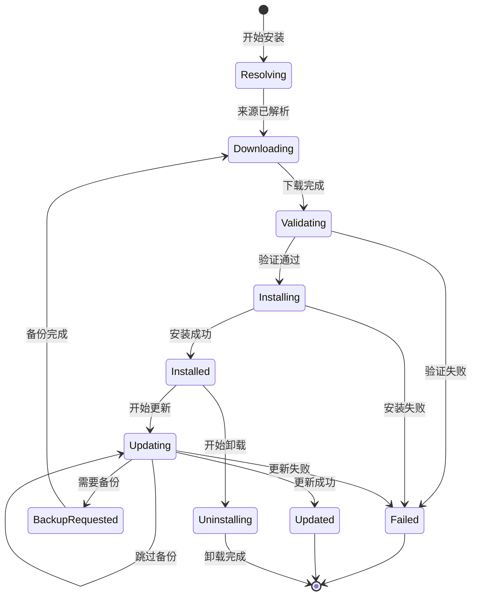

# 数据模型：Claude Code 命令安装器

**功能编号**: 001
**功能名称**: command-install
**模型版本**: 1.0.0
**创建日期**: 2025-01-03
**状态**: ✅ 完成

---

## 目录

1. [实体关系图](#实体关系图)
2. [核心实体定义](#核心实体定义)
3. [状态机定义](#状态机定义)
4. [验证规则](#验证规则)
5. [数据持久化](#数据持久化)

---

## 实体关系图

```mermaid
erDiagram
    InstalledCommand ||--o{ CommandFile : contains
    InstalledCommand ||--o{ Backup : has
    InstalledCommand }o--|| InstallSource : installed_from
    InstallSource ||--o{ InstalledCommand : installs
    InstalledCommand }o--o{ InstalledCommand : depends_on

    InstalledCommand {
        string name PK
        string version
        string source_type
        string source_url
        datetime installed_at
        datetime updated_at
        boolean auto_update_enabled
        string metadata JSON
    }

    CommandFile {
        string path PK
        string type
        integer size
        string checksum
        datetime created_at
        datetime modified_at
    }

    Backup {
        string backup_path PK
        string timestamp
        integer size
        string reason
    }

    InstallSource {
        string type PK
        string url
        string description
        datetime last_checked
        string latest_version
    }
```

---

## 核心实体定义

### 实体 1：InstalledCommand（已安装命令）

**描述**：已安装的命令及其元数据

```yaml
InstalledCommand:
  type: object
  primary_key: name

  fields:
    - name: name
      type: string
      required: true
      unique: true
      description: 命令名称（如：wiki-generate）
      validation:
        - pattern: '^[a-z][a-z0-9-]*$'
        - min_length: 2
        - max_length: 50

    - name: version
      type: string
      required: true
      description: 命令版本（遵循 SemVer）
      validation:
        - pattern: '^\d+\.\d+\.\d+(-[a-zA-Z0-9.]+)?$'
      example: "1.0.0"

    - name: source_type
      type: enum
      required: true
      values: [git, local, preset]
      description: 安装来源类型

    - name: source_url
      type: string
      required: false
      description: 来源 URL（git 和 preset 类型）
      validation:
        - format: uri
      example: "https://github.com/user/repo"

    - name: source_path
      type: string
      required: false
      description: 来源路径（local 类型）
      example: "/absolute/path/command.md"

    - name: installed_at
      type: datetime
      required: true
      description: 安装时间（ISO 8601）
      example: "2025-01-03T08:00:00Z"

    - name: updated_at
      type: datetime
      required: false
      description: 最后更新时间

    - name: files
      type: array[CommandFile]
      required: true
      description: 命令包含的所有文件
      min_items: 1

    - name: dependencies
      type: array[string]
      required: false
      description: 依赖的其他命令列表
      example: ["git-helper", "file-utils"]

    - name: metadata
      type: object
      required: false
      description: 额外的元数据
      properties:
        author: string
        description: string
        tags: array[string]
        license: string
        homepage: string

    - name: auto_update_enabled
      type: boolean
      required: false
      default: false
      description: 是否启用自动更新

  relationships:
    - name: files
      type: one-to-many
      target: CommandFile
      cascade: delete

    - name: backups
      type: one-to-many
      target: Backup
      cascade: delete

    - name: install_source
      type: many-to-one
      target: InstallSource
      required: true
```

**示例**：

```json
{
  "name": "wiki-generate",
  "version": "1.0.0",
  "source_type": "git",
  "source_url": "https://github.com/user/wiki-generator-repo",
  "installed_at": "2025-01-03T08:00:00Z",
  "updated_at": "2025-01-03T10:30:00Z",
  "files": [
    {
      "path": ".claude/commands/wiki-generate.md",
      "type": "command",
      "size": 10240,
      "checksum": "a3d5f9e2..."
    },
    {
      "path": ".claude/templates/wiki-config.json.template",
      "type": "template",
      "size": 512,
      "checksum": "b7e8a1f4..."
    }
  ],
  "dependencies": [],
  "metadata": {
    "author": "Repo Wiki Generator Team",
    "description": "Wiki 文档生成器",
    "tags": ["documentation", "wiki"],
    "license": "MIT",
    "homepage": "https://github.com/user/wiki-generator-repo"
  },
  "auto_update_enabled": false
}
```

---

### 实体 2：CommandFile（命令文件）

**描述**：命令包含的文件信息

```yaml
CommandFile:
  type: object
  primary_key: path

  fields:
    - name: path
      type: string
      required: true
      unique: true
      description: 文件相对路径（相对于项目根目录）
      example: ".claude/commands/wiki-generate.md"

    - name: type
      type: enum
      required: true
      values: [command, template, config, other]
      description: 文件类型

    - name: size
      type: integer
      required: true
      description: 文件大小（字节）
      validation:
        - min: 0

    - name: checksum
      type: string
      required: true
      description: SHA-256 校验和
      validation:
        - pattern: '^[a-f0-9]{64}$'

    - name: created_at
      type: datetime
      required: true
      description: 文件创建时间

    - name: modified_at
      type: datetime
      required: false
      description: 文件最后修改时间

  relationships:
    - name: command
      type: many-to-one
      target: InstalledCommand
      required: true
```

**示例**：

```json
{
  "path": ".claude/commands/wiki-generate.md",
  "type": "command",
  "size": 10240,
  "checksum": "a3d5f9e2b7e8a1f4c6d9e0a3b5c7d8e9f0a1b2c3d4e5f6a7b8c9d0e1f2a3b4c5",
  "created_at": "2025-01-03T08:00:00Z",
  "modified_at": "2025-01-03T10:30:00Z"
}
```

---

### 实体 3：Backup（备份）

**描述**：命令文件的备份信息

```yaml
Backup:
  type: object
  primary_key: backup_path

  fields:
    - name: backup_path
      type: string
      required: true
      unique: true
      description: 备份文件路径
      example: ".claude/backups/wiki-generate.md.20250103_103000.bak"

    - name: original_path
      type: string
      required: true
      description: 原始文件路径
      example: ".claude/commands/wiki-generate.md"

    - name: timestamp
      type: datetime
      required: true
      description: 备份创建时间
      example: "2025-01-03T10:30:00Z"

    - name: size
      type: integer
      required: true
      description: 备份文件大小（字节）

    - name: checksum
      type: string
      required: true
      description: SHA-256 校验和

    - name: reason
      type: enum
      required: true
      values: [update, uninstall, manual, rollback]
      description: 备份原因

  relationships:
    - name: command
      type: many-to-one
      target: InstalledCommand
      required: true
```

**示例**：

```json
{
  "backup_path": ".claude/backups/wiki-generate.md.20250103_103000.bak",
  "original_path": ".claude/commands/wiki-generate.md",
  "timestamp": "2025-01-03T10:30:00Z",
  "size": 10240,
  "checksum": "a3d5f9e2b7e8a1f4c6d9e0a3b5c7d8e9f0a1b2c3d4e5f6a7b8c9d0e1f2a3b4c5",
  "reason": "update"
}
```

---

### 实体 4：InstallSource（安装来源）

**描述**：命令的安装来源信息

```yaml
InstallSource:
  type: object
  primary_key: type + url

  fields:
    - name: type
      type: enum
      required: true
      values: [git, local, preset]
      description: 来源类型

    - name: url
      type: string
      required: false
      description: 来源 URL（git 和 preset）
      example: "https://github.com/user/repo"

    - name: path
      type: string
      required: false
      description: 来源路径（local）
      example: "/absolute/path/command.md"

    - name: description
      type: string
      required: false
      description: 来源描述
      example: "Wiki 文档生成器官方仓库"

    - name: last_checked
      type: datetime
      required: false
      description: 最后检查更新时间

    - name: latest_version
      type: string
      required: false
      description: 可用的最新版本
      validation:
        - pattern: '^\d+\.\d+\.\d+(-[a-zA-Z0-9.]+)?$'

    - name: metadata
      type: object
      required: false
      description: 额外元数据
      properties:
        preset_name: string
        preset_version: string
        repository_info: object
```

**示例（Git 来源）**：

```json
{
  "type": "git",
  "url": "https://github.com/user/wiki-generator-repo",
  "description": "Wiki 文档生成器官方仓库",
  "last_checked": "2025-01-03T10:00:00Z",
  "latest_version": "1.2.0",
  "metadata": {
    "repository_info": {
      "stars": 128,
      "default_branch": "main",
      "license": "MIT"
    }
  }
}
```

**示例（预设来源）**：

```json
{
  "type": "preset",
  "url": "https://github.com/official/wiki-generator",
  "description": "官方 Wiki 生成器",
  "last_checked": "2025-01-03T10:00:00Z",
  "latest_version": "1.0.0",
  "metadata": {
    "preset_name": "wiki-generator",
    "preset_version": "1.0.0"
  }
}
```

---

## 状态机定义

### 命令安装状态机



### 状态定义

| 状态 | 描述 | 可转换到的状态 |
|------|------|---------------|
| **Resolving** | 正在解析命令来源 | Downloading, Failed |
| **Downloading** | 正在下载/克隆命令 | Validating, Failed |
| **Validating** | 正在验证文件 | Installing, Failed |
| **Installing** | 正在安装文件 | Installed, Failed |
| **Installed** | 命令已安装 | Updating, Uninstalling |
| **Updating** | 正在更新命令 | BackupRequested, Updating, Updated, Failed |
| **Updated** | 命令已更新 | Installed |
| **Uninstalling** | 正在卸载命令 | [*] |
| **Failed** | 操作失败 | [*] |

---

## 验证规则

### 命令名称验证

```python
import re

def validate_command_name(name: str) -> tuple[bool, str]:
    """验证命令名称"""
    # 1. 长度检查
    if len(name) < 2:
        return False, "命令名称至少 2 个字符"
    if len(name) > 50:
        return False, "命令名称最多 50 个字符"

    # 2. 格式检查（小写字母、数字、连字符）
    if not re.match(r'^[a-z][a-z0-9-]*$', name):
        return False, "命令名称只能包含小写字母、数字和连字符，且必须以字母开头"

    # 3. 保留名称检查
    reserved_names = {'install', 'list', 'update', 'uninstall', 'info', 'help', 'version'}
    if name in reserved_names:
        return False, f"'{name}' 是保留命令名称"

    return True, "命令名称有效"
```

### 版本号验证

```python
def validate_version(version: str) -> tuple[bool, str]:
    """验证 SemVer 版本号"""
    # SemVer 格式：MAJOR.MINOR.PATCH(-PRERELEASE)(+BUILD)
    pattern = r'^\d+\.\d+\.\d+(-[a-zA-Z0-9.]+)?(\+[a-zA-Z0-9.]+)?$'
    if not re.match(pattern, version):
        return False, "版本号格式无效（应为 SemVer 格式，如：1.0.0）"

    # 检查版本号范围
    parts = version.split('.')[0:3]  # MAJOR.MINOR.PATCH
    try:
        major, minor, patch = int(parts[0]), int(parts[1]), int(parts[2].split('-')[0].split('+')[0])
        if major > 999 or minor > 999 or patch > 999:
            return False, "版本号超出范围（0-999）"
    except ValueError:
        return False, "版本号包含无效数字"

    return True, "版本号有效"
```

### URL 验证

```python
from urllib.parse import urlparse

def validate_git_url(url: str) -> tuple[bool, str]:
    """验证 Git URL"""
    # 1. 协议检查
    parsed = urlparse(url)
    if parsed.scheme not in ('https', 'git', 'ssh'):
        return False, "仅支持 HTTPS、Git 和 SSH 协议"

    # 2. 主机名检查
    if not parsed.hostname:
        return False, "URL 缺少主机名"

    # 3. 路径检查
    if not parsed.path or parsed.path == '/':
        return False, "URL 缺少仓库路径"

    return True, "URL 有效"
```

### 文件校验和验证

```python
import hashlib

def compute_file_checksum(file_path: str) -> str:
    """计算文件 SHA-256 校验和"""
    sha256 = hashlib.sha256()
    with open(file_path, 'rb') as f:
        for chunk in iter(lambda: f.read(4096), b''):
            sha256.update(chunk)
    return sha256.hexdigest()

def validate_file_checksum(file_path: str, expected_checksum: str) -> tuple[bool, str]:
    """验证文件校验和"""
    if not os.path.exists(file_path):
        return False, "文件不存在"

    actual_checksum = compute_file_checksum(file_path)
    if actual_checksum != expected_checksum:
        return False, f"校验和不匹配（期望：{expected_checksum[:16]}...，实际：{actual_checksum[:16]}...）"

    return True, "校验和匹配"
```

---

## 数据持久化

### 存储格式

命令安装器使用 **JSON 文件** 作为持久化存储：

```json
{
  "version": "1.0.0",
  "installed_commands": {
    "wiki-generate": {
      "name": "wiki-generate",
      "version": "1.0.0",
      "source_type": "git",
      "source_url": "https://github.com/user/repo",
      "installed_at": "2025-01-03T08:00:00Z",
      "files": [...],
      "metadata": {...}
    }
  },
  "install_sources": {
    "presets": {
      "wiki-generator": {
        "url": "https://github.com/official/wiki-generator",
        "description": "官方 Wiki 生成器"
      }
    }
  },
  "settings": {
    "auto_update": false,
    "backup_before_update": true,
    "keep_backup_count": 3,
    "conflict_strategy": "skip"
  },
  "backups": {
    "wiki-generate": [
      {
        "backup_path": ".claude/backups/wiki-generate.md.20250103_103000.bak",
        "timestamp": "2025-01-03T10:30:00Z",
        "reason": "update"
      }
    ]
  }
}
```

### 存储位置

| 文件 | 路径 | 用途 |
|------|------|------|
| **配置文件** | `.claude/command-install.json` | 主配置和命令列表 |
| **备份目录** | `.claude/backups/` | 备份文件存储 |
| **临时目录** | `/tmp/command-install-*/` | 临时克隆和验证 |

### 并发控制

```python
import fcntl

def load_config(config_path: str) -> dict:
    """加载配置（带文件锁）"""
    with open(config_path, 'r') as f:
        # 获取共享锁（读锁）
        fcntl.flock(f.fileno(), fcntl.LOCK_SH)
        try:
            return json.load(f)
        finally:
            fcntl.flock(f.fileno(), fcntl.LOCK_UN)

def save_config(config_path: str, config: dict):
    """保存配置（带文件锁）"""
    with open(config_path, 'w') as f:
        # 获取独占锁（写锁）
        fcntl.flock(f.fileno(), fcntl.LOCK_EX)
        try:
            json.dump(config, f, indent=2, ensure_ascii=False)
        finally:
            fcntl.flock(f.fileno(), fcntl.LOCK_UN)
```

### 数据迁移

```python
def migrate_config(config: dict, from_version: str, to_version: str) -> dict:
    """配置迁移"""
    if from_version == to_version:
        return config

    # 1.0.0 -> 1.1.0
    if from_version == "1.0.0" and to_version == "1.1.0":
        # 添加新字段
        for cmd in config['installed_commands'].values():
            cmd.setdefault('auto_update_enabled', False)
        config['version'] = "1.1.0"

    return config
```

---

## 索引和查询

### 按名称查询命令

```python
def get_command_by_name(config: dict, name: str) -> dict:
    """按名称查询命令"""
    return config['installed_commands'].get(name)
```

### 按来源类型查询命令

```python
def get_commands_by_source_type(config: dict, source_type: str) -> list[dict]:
    """按来源类型查询命令"""
    return [
        cmd for cmd in config['installed_commands'].values()
        if cmd['source_type'] == source_type
    ]
```

### 查询需要更新的命令

```python
def get_outdated_commands(config: dict) -> list[tuple[str, str, str]]:
    """查询需要更新的命令（返回：命令名、当前版本、最新版本）"""
    outdated = []
    for name, cmd in config['installed_commands'].items():
        source_url = cmd.get('source_url')
        if not source_url:
            continue

        # 检查最新版本
        latest_version = check_latest_version(source_url)
        if latest_version and latest_version != cmd['version']:
            outdated.append((name, cmd['version'], latest_version))

    return outdated
```

---

**模型完成时间**: 2025-01-03
**下一步**: Phase 1 - API 契约设计
