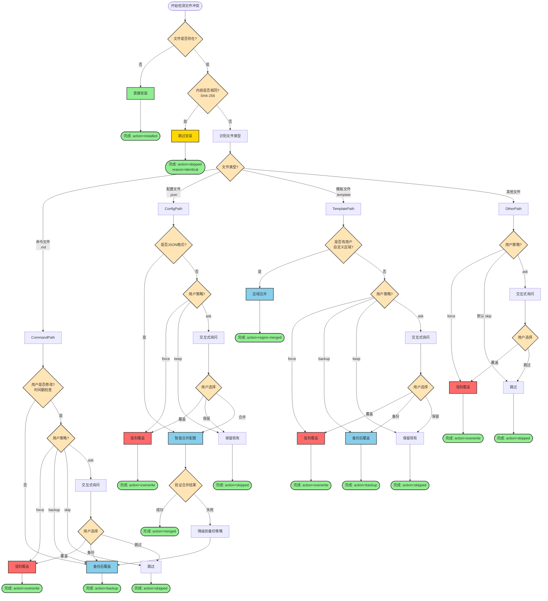
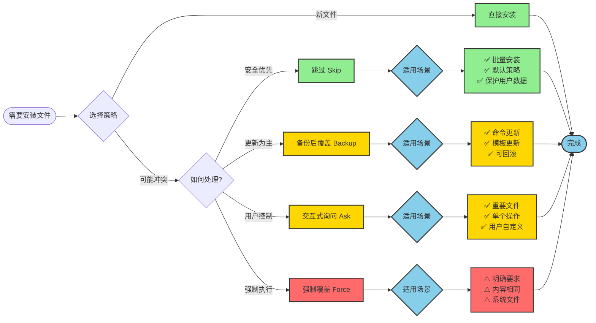
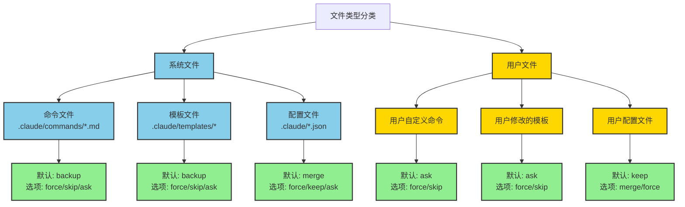
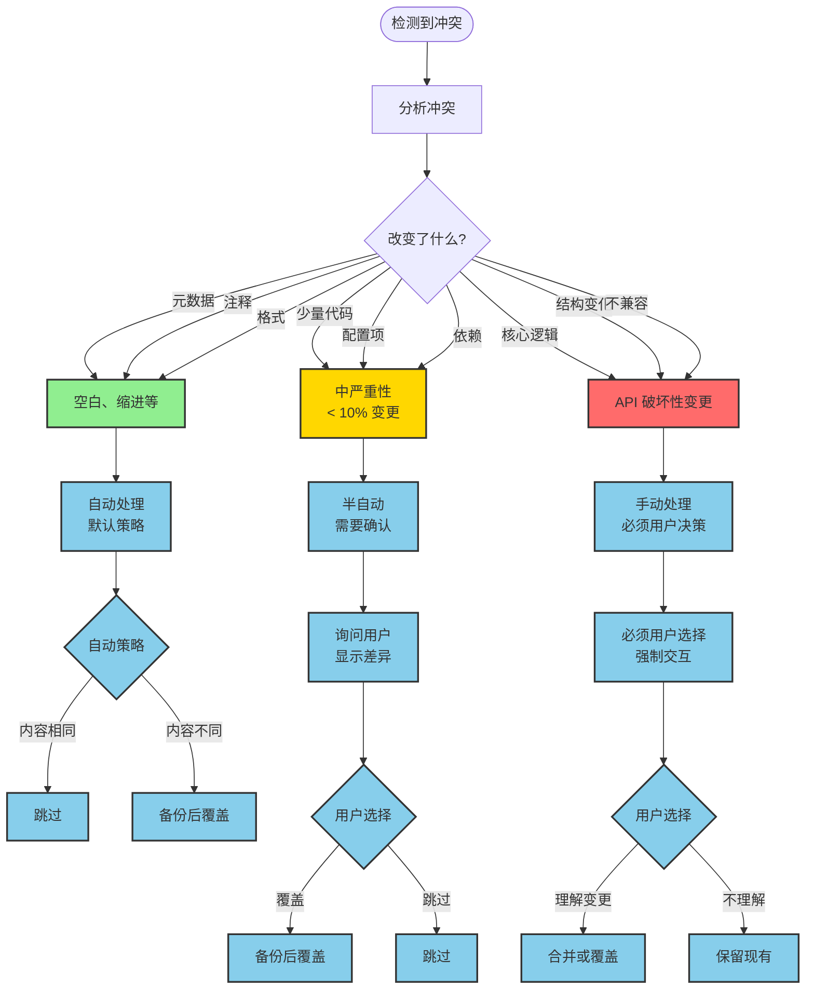
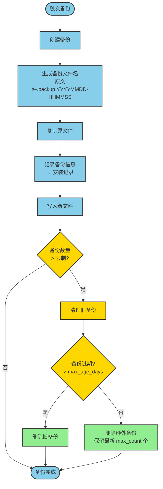
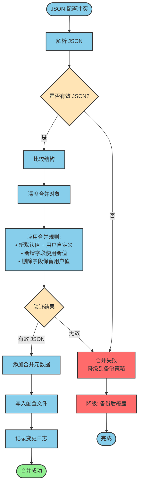
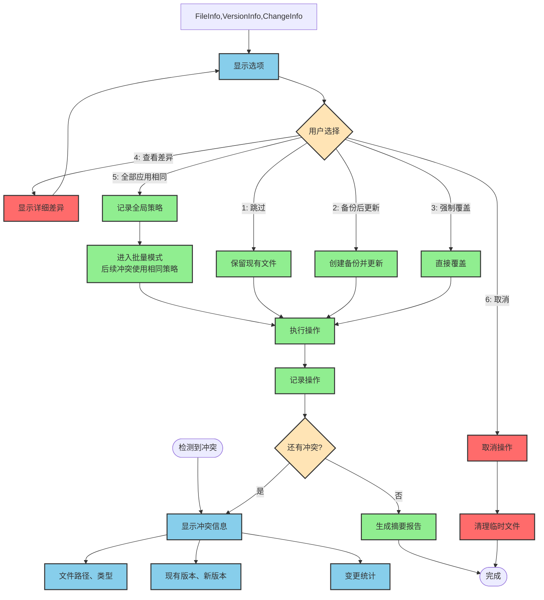
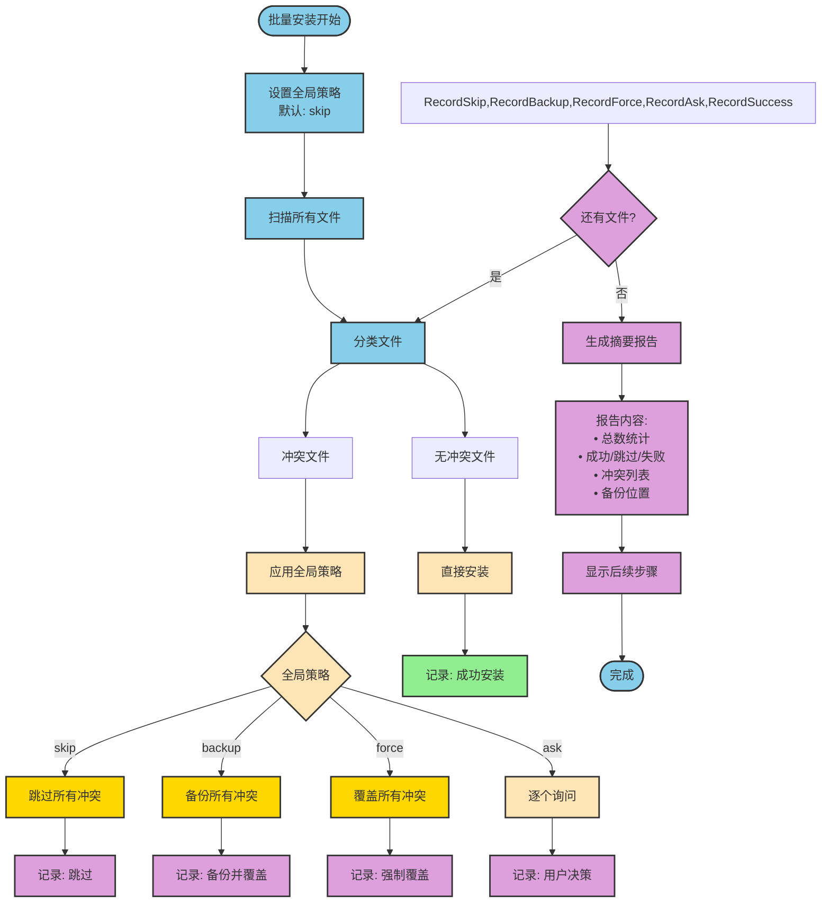
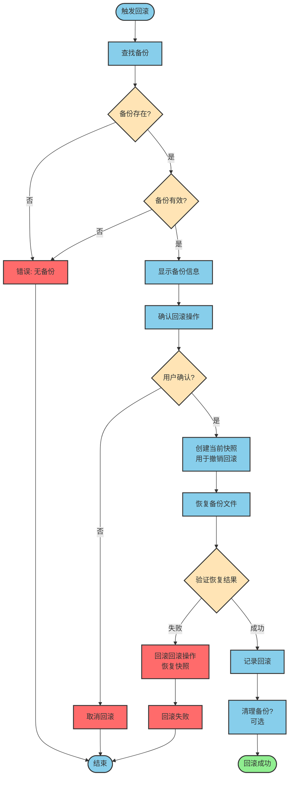

# 文件冲突处理决策树

本文档提供可视化决策流程，帮助理解冲突处理的完整逻辑。

---

## 主决策流程图



---

## 策略选择流程图



---

## 文件类型处理策略矩阵



---

## 冲突严重程度评估



---

## 备份管理流程



---

## 智能合并流程（JSON 配置）



---

## 交互式冲突解决流程



---

## 批量安装冲突处理流程



---

## 回滚流程



---

## 使用这些决策图

### 如何阅读

1. **从上到下**：按照箭头方向阅读流程
2. **菱形框**：表示决策点，根据条件选择路径
3. **颜色编码**：
   - 🟢 绿色：安全操作
   - 🟡 黄色：需要注意的决策点
   - 🔴 红色：危险操作
   - 🔵 蓝色：常规处理流程

### 在实现中应用

1. **代码结构**：每个决策图对应一个或多个函数
2. **状态机**：使用状态机模式跟踪当前决策状态
3. **日志记录**：在每个决策点记录决策理由
4. **测试覆盖**：为每个决策路径编写测试用例

### 示例：实现"主决策流程"

```javascript
class ConflictResolver {
  async resolve(filePath, newContent, options) {
    // 对应决策图：文件是否存在?
    if (!fs.existsSync(filePath)) {
      return { action: 'installed' };
    }

    // 对应决策图：内容是否相同?
    const existingHash = await computeHash(filePath);
    const newHash = await hashContent(newContent);

    if (existingHash === newHash) {
      return { action: 'skipped', reason: 'identical' };
    }

    // 对应决策图：识别文件类型
    const fileType = this.detectFileType(filePath);

    // 对应决策图：根据文件类型处理
    return this.resolveByType(fileType, filePath, newContent, options);
  }
}
```

---

**文档版本**: 1.0.0
**最后更新**: 2025-01-03
**相关文档**:
- `file-conflict-strategy-research.md` (完整研究报告)
- `EXECUTIVE_SUMMARY.md` (执行摘要)
- `spec.md` (功能规范)
