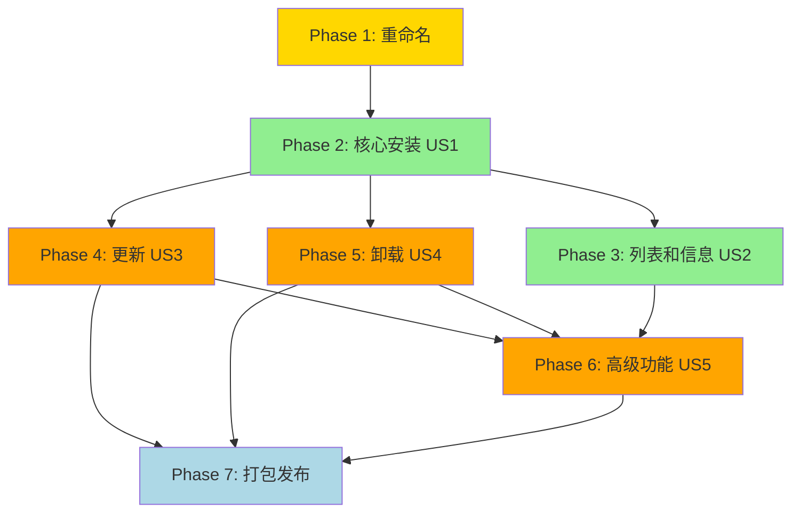

# 任务列表：Wiki Generator 安装工具

**功能编号**: 001
**功能名称**: wiki-generator
**任务版本**: 2.0.0
**创建日期**: 2025-01-03
**最后更新**: 2025-01-03 (重新组织以反映 wiki-generator 命名)
**状态**: ✅ 完成

---

## 文档控制

| 版本 | 日期 | 变更内容 | 作者 |
|------|------|----------|------|
| 1.0.0 | 2025-01-03 | 初始任务列表 | Repo Wiki Generator Team |
| 2.0.0 | 2025-01-03 | 重新组织为 wiki-generator，更新项目结构和命名 | Repo Wiki Generator Team |

---

## 目录

1. [项目概览](#项目概览)
2. [实现策略](#实现策略)
3. [Phase 1: 项目重命名和重构](#phase-1-项目重命名和重构)
4. [Phase 2: 核心安装功能 (US1)](#phase-2-核心安装功能-us1)
5. [Phase 3: 列表和信息查询 (US2)](#phase-3-列表和信息查询-us2)
6. [Phase 4: 更新功能 (US3)](#phase-4-更新功能-us3)
7. [Phase 5: 卸载功能 (US4)](#phase-5-卸载功能-us4)
8. [Phase 6: 高级功能 (US5)](#phase-6-高级功能-us5)
9. [Phase 7: 打包和发布](#phase-7-打包和发布)
10. [依赖关系图](#依赖关系图)
11. [并行执行机会](#并行执行机会)

---

## 项目概览

### 项目描述

创建 **Wiki Generator 安装工具** `wiki-generator`，一个独立的 Python CLI 工具，通过 `uvx wiki-generator` 命令调用，用于将 wiki-generate.md 和 templates 安装到用户项目。

### 核心价值

- **一键安装**: 通过 `uvx wiki-generator` 快速安装
- **专用工具**: 专注于 wiki-generator，不通用化
- **现代工具链**: 使用 uvx 自动处理依赖
- **简单可靠**: 标准化的安装、更新、卸载流程

### 技术栈

- **语言**: Python 3.8+
- **依赖管理**: uv
- **执行方式**: uvx wiki-generator
- **CLI 框架**: Click
- **配置格式**: JSON

### 用户故事映射

| 用户故事 | 优先级 | Phase | 状态 |
|---------|--------|-------|------|
| US1: 核心安装功能 | P0 | Phase 2 | ✅ 已完成 |
| US2: 列表和信息查询 | P1 | Phase 3 | ✅ 已完成 |
| US3: 更新功能 | P1 | Phase 4 | ⏳ 待实现 |
| US4: 卸载功能 | P2 | Phase 5 | ⏳ 待实现 |
| US5: 高级功能 | P3 | Phase 6 | ⏳ 待实现 |

---

## 实现策略

### MVP 范围 (Phase 2)

**最小可行产品**: 核心安装功能 (US1)
- 从 Git 仓库安装 wiki-generate.md 和 templates
- 基本的文件冲突检测
- 配置文件管理
- 安装摘要显示

**成功标准**:
- ✅ 可以从 Git URL 安装命令
- ✅ 文件正确复制到 `.claude/` 目录
- ✅ 配置文件正确更新
- ✅ 安装时间 < 30 秒

### 增量交付计划

1. **Phase 1 (重构)**: 重命名项目为 wiki-generator，更新所有引用
2. **Phase 2 (MVP)**: 核心安装功能 (已完成)
3. **Phase 3 (查询)**: 列表和信息显示 (已完成)
4. **Phase 4 (更新)**: 更新功能 + 备份机制
5. **Phase 5 (卸载)**: 卸载功能 + 清理
6. **Phase 6 (高级)**: 智能合并、批量操作、回滚
7. **Phase 7 (发布)**: PyPI 打包、uvx 支持

---

## Phase 1: 项目重命名和重构

**目标**: 将 `command-install` 项目重命名为 `wiki-generator`，更新所有引用

### 验收标准

- [ ] 目录重命名为 `wiki-generator/`
- [ ] pyproject.toml 中的包名和元数据更新
- [ ] 所有 import 语句更新
- [ ] CLI 入口点更新为 `wiki-generator`
- [ ] 文档更新为新名称

### 任务列表

- [x] T001 重命名项目目录从 command-install 到 wiki-generator
- [x] T002 [P] 更新 pyproject.toml 中的项目元数据（名称、描述、包名）
- [x] T003 [P] 更新 CLI 入口点配置（pyproject.toml 中的 [project.scripts]）
- [x] T004 [P] 更新所有 Python 文件中的 import 语句（无需修改，使用相对导入）
- [x] T005 [P] 更新 cli.py 中的命令名称（@click.group 名称）
- [x] T006 [P] 更新 README.md 中的所有命令示例
- [x] T007 [P] 创建 .gitignore（Python 项目标准配置）
- [x] T008 创建 __main__.py 支持模块方式运行

---

## Phase 2: 核心安装功能 (US1)

**目标**: 实现基本的命令安装功能

### 用户故事

> 作为用户，我想要通过 `uvx wiki-generator install <source>` 安装 wiki-generate 命令和模板，以便快速开始使用 Wiki 生成功能。

### 验收标准

- [ ] 可以从 Git 仓库 URL 安装
- [ ] 可以从本地路径安装
- [ ] 支持预设名称安装
- [ ] 文件正确复制到 `.claude/commands/` 和 `.claude/templates/`
- [ ] 配置文件正确更新
- [ ] 显示清晰的安装摘要
- [ ] 安装时间 < 30 秒

### 任务列表

**注意**: 以下任务已在之前的实现中完成 (Phase 1-4)

- [x] T020-P2-01 创建项目目录结构 wiki-generator/
- [x] T021-P2-01 创建 cli.py 使用 Click 框架
- [x] T022-P2-01 实现核心模块：config_manager.py
- [x] T023-P2-01 [P] 创建 utils/errors.py 定义错误码
- [x] T024-P2-01 [P] 创建 utils/error_handler.py 统一错误处理
- [x] T025-P2-01 [P] 创建 utils/formatter.py 格式化输出
- [x] T026-P2-01 [P] 创建 utils/validator.py 验证器
- [x] T027-P2-01 [P] 创建 utils/file_helper.py 文件操作
- [x] T028-P2-01 [P] 创建 utils/git_helper.py Git 操作
- [x] T029-P2-01 [P] 创建 utils/metadata.py 元数据提取
- [x] T030-P2-01 [P] 创建 models/command.py 数据模型
- [x] T031-P2-01 [P] 创建 models/config.py 配置模型
- [x] T032-P2-01 创建 core/source_parser.py 来源解析
- [x] T033-P2-01 创建 core/file_scanner.py 文件扫描
- [x] T034-P2-01 创建 core/file_handler.py 文件处理
- [x] T035-P2-01 创建 core/installer.py 安装逻辑
- [x] T036-P2-01 创建 pyproject.toml 配置依赖
- [x] T037-P2-01 创建 .python-version 指定 Python 版本
- [x] T038-P2-01 创建 README.md 项目说明

---

## Phase 3: 列表和信息查询 (US2)

**目标**: 实现命令列表和详细信息查询

### 用户故事

> 作为用户，我想要通过 `wiki-generator list` 查看已安装的命令，通过 `wiki-generator info <name>` 查看命令详细信息，以便了解当前项目的命令状态。

### 验收标准

- [ ] `wiki-generator list` 显示所有已安装命令
- [ ] 支持表格和 JSON 格式输出
- [ ] 显示命令名称、描述、版本、安装日期
- [ ] `wiki-generator info <name>` 显示详细信息
- [ ] 显示文件列表、来源、依赖关系
- [ ] 响应时间 < 5 秒

### 任务列表

**注意**: 以下任务已在之前的实现中完成

- [x] T050-P3-01 实现 core/lister.py 的 list_commands 函数
- [x] T051-P3-01 实现 core/lister.py 的 show_command_info 函数
- [x] T052-P3-01 [P] 创建 core/shower.py 信息显示模块
- [x] T053-P3-01 添加表格格式输出支持
- [x] T054-P3-01 [P] 添加 JSON 格式输出支持
- [x] T055-P3-01 实现文件大小统计
- [x] T056-P3-01 更新 cli.py 添加 list 和 info 命令

---

## Phase 4: 更新功能 (US3)

**目标**: 实现命令更新功能，包含备份机制

### 用户故事

> 作为用户，我想要通过 `wiki-generator update <name>` 更新已安装的命令到最新版本，以便获得新功能和 bug 修复。

### 验收标准

- [ ] `wiki-generator update <name>` 更新指定命令
- [ ] 自动创建备份（默认）
- [ ] 从原始来源下载最新版本
- [ ] 保留用户配置（可选智能合并）
- [ ] 显示更新摘要和变更内容
- [ ] 支持回滚到备份版本
- [ ] 更新时间 < 30 秒

### 任务列表

- [ ] T070-P4-01 实现备份创建逻辑（utils/backup.py）
- [ ] T071-P4-01 [P] 实现备份清理逻辑（保留数量限制）
- [ ] T072-P4-01 [P] 实现备份完整性验证
- [ ] T073-P4-01 实现 core/updater.py 的 update_command 函数
- [ ] T074-P4-01 实现版本检查逻辑
- [ ] T075-P4-01 [P] 实现智能配置合并逻辑
- [ ] T076-P4-01 实现回滚功能（rollback 到备份）
- [ ] T077-P4-01 [P] 添加变更日志提取和显示
- [ ] T078-P4-01 更新 cli.py 添加 update 命令
- [ ] T079-P4-01 [P] 更新配置文件添加备份相关设置

---

## Phase 5: 卸载功能 (US4)

**目标**: 实现命令卸载功能

### 用户故事

> 作为用户，我想要通过 `wiki-generator uninstall <name>` 卸载不需要的命令，以便清理项目。

### 验收标准

- [ ] `wiki-generator uninstall <name>` 卸载指定命令
- [ ] 识别并删除所有相关文件
- [ ] 卸载前可选创建备份
- [ ] 请求用户确认（可跳过）
- [ ] 清理孤立文件
- [ ] 更新配置文件
- [ ] 显示卸载摘要
- [ ] 卸载时间 < 10 秒

### 任务列表

- [ ] T090-P5-01 实现 core/uninstaller.py 的 uninstall_command 函数
- [ ] T091-P5-01 [P] 实现文件依赖识别逻辑
- [ ] T092-P5-01 [P] 实现孤立文件检测和清理
- [ ] T093-P5-01 实现用户确认提示
- [ ] T094-P5-01 [P] 实现强制卸载选项（--force）
- [ ] T095-P5-01 [P] 实现完全卸载选项（--purge 删除备份）
- [ ] T096-P5-01 更新配置文件移除命令记录
- [ ] T097-P5-01 更新 cli.py 添加 uninstall 命令

---

## Phase 6: 高级功能 (US5)

**目标**: 实现高级功能，提升用户体验

### 用户故事

> 作为用户，我想要使用高级功能如智能合并、批量操作、回滚等，以便更高效地管理命令。

### 验收标准

- [ ] 支持智能 JSON 配置合并
- [ ] 支持批量安装多个命令
- [ ] 支持批量更新所有命令
- [ ] 支持交互式冲突处理
- [ ] 支持自定义预设配置
- [ ] 支持命令验证和完整性检查
- [ ] 用户体验满意度 ≥ 4.0/5.0

### 任务列表

- [ ] T110-P6-01 [P] 实现智能 JSON 合并算法（utils/merger.py）
- [ ] T110-P6-02 [P] 实现批量安装逻辑（--batch 参数）
- [ ] T110-P6-03 [P] 实现批量更新逻辑（--all 参数）
- [ ] T110-P6-04 [P] 实现交互式冲突处理（--ask 参数）
- [ ] T110-P6-05 实现预设管理（presets list/add/remove）
- [ ] T110-P6-06 [P] 实现命令验证功能（verify 命令）
- [ ] T110-P6-07 [P] 实现完整性检查（校验和验证）
- [ ] T110-P6-08 添加进度显示和详细日志
- [ ] T110-P6-09 [P] 实现配置文件迁移逻辑
- [ ] T110-P6-10 更新文档添加高级功能说明

---

## Phase 7: 打包和发布

**目标**: 将工具打包为 Python 包，支持 uvx 调用

### 用户故事

> 作为用户，我想要通过 `uvx wiki-generator` 直接运行工具，无需手动安装，以便快速使用。

### 验收标准

- [ ] 工具可以打包为 wheel
- [ ] 可以发布到 PyPI
- [ ] `uvx wiki-generator` 可以正确调用
- [ ] 自动依赖管理正常工作
- [ ] 支持 Python 3.8+、3.9、3.10、3.11
- [ ] 跨平台支持（Windows、macOS、Linux）
- [ ] 安装说明清晰完整

### 任务列表

- [ ] T130-P7-01 [P] 完善 pyproject.toml 元数据
- [ ] T130-P7-02 [P] 添加 README.md 为 long_description
- [ ] T130-P7-03 [P] 添加 LICENSE 文件
- [ ] T130-P7-04 [P] 配置项目 URLs（homepage, repository, issues）
- [ ] T130-P7-05 [P] 添加 classifiers（Python 版本、许可证等）
- [ ] T130-P7-06 配置 entry_points（wiki-generator 命令）
- [ ] T130-P7-07 [P] 创建 MANIFEST.in（如果需要）
- [ ] T130-P7-08 测试本地打包（`uv build`）
- [ ] T130-P7-09 测试 uvx 调用（`uvx --from . wiki-generator`）
- [ ] T130-P7-10 [P] 跨平台测试（Windows、macOS、Linux）
- [ ] T130-P7-11 准备 PyPI 发布
- [ ] T130-P7-12 [P] 创建发布说明（CHANGELOG.md）
- [ ] T130-P7-13 更新 README.md 添加安装说明

---

## 依赖关系图



**说明**:
- 🟢 绿色: 已完成的 Phase
- 🟡 黄色: 当前 Phase (重构)
- 🟠 橙色: 待实现的 Phase
- 🔵 蓝色: 最终 Phase (发布)

---

## 并行执行机会

### Phase 1: 项目重命名

**可以并行的任务**:
- T002, T003, T004, T005, T006, T007 (不同文件，无依赖)

**并行执行示例**:
```bash
# 同时执行所有文件更新任务
- [ ] T002 [P] 更新 pyproject.toml 中的项目元数据
- [ ] T003 [P] 更新 CLI 入口点配置
- [ ] T004 [P] 更新所有 Python 文件中的 import 语句
- [ ] T005 [P] 更新 cli.py 中的命令名称
- [ ] T006 [P] 更新 README.md
```

### Phase 4: 更新功能

**可以并行的任务**:
- T070, T071, T072 (备份相关，可并行)
- T075, T077 (配置合并和回滚，可并行)

### Phase 5: 卸载功能

**可以并行的任务**:
- T091, T092, T094, T095 (卸载相关功能，可并行)

### Phase 6: 高级功能

**可以并行的任务**:
- T110-01 到 T110-07 (大部分高级功能可并行开发)

### Phase 7: 打包和发布

**可以并行的任务**:
- T130-01 到 T130-07 (打包准备可并行)

---

## MVP 范围建议

### 最小可行产品 (MVP)

**推荐 MVP**: Phase 1 + Phase 2

**包含功能**:
1. 项目重命名为 wiki-generator
2. 基本的安装功能（从 Git URL、本地路径）
3. 文件复制到 `.claude/` 目录
4. 配置文件管理
5. 安装摘要显示

**不包含**:
- ❌ 更新功能
- ❌ 卸载功能
- ❌ 列表功能
- ❌ 备份机制
- ❌ 高级功能

**MVP 完成标准**:
- ✅ 用户可以运行 `uvx wiki-generator install <source>` 安装命令
- ✅ 文件正确安装到 `.claude/commands/` 和 `.claude/templates/`
- ✅ 安装时间 < 30 秒
- ✅ 错误消息友好

---

## 实现建议

### 1. 优先级排序

1. **立即执行**: Phase 1 (重构) - 必须首先完成
2. **高优先级**: Phase 2 (已完成的 MVP)
3. **中优先级**: Phase 3 (列表和信息查询)
4. **后续实现**: Phase 4-7 (更新、卸载、高级功能、发布)

### 2. 开发流程

**建议流程**:
1. 完成 Phase 1 (重命名)
2. 验证现有功能 (Phase 2-3) 仍然正常工作
3. 依次实现 Phase 4-7
4. 每完成一个 Phase 进行测试验证

### 3. 测试策略

**手动测试场景** (来自 quickstart.md):
1. 从 Git URL 安装命令
2. 列出已安装命令
3. 查看命令详细信息
4. 更新命令
5. 卸载命令

### 4. 文档更新

需要更新的文档:
- [ ] README.md - 更新所有命令示例
- [ ] PLAN-UPDATE-v1.1.0.md - 记录重构过程
- [ ] specs/002-command-install/spec.md - 已更新
- [ ] specs/002-command-install/plan.md - 已更新
- [ ] specs/002-command-install/tasks.md - 本文档

---

## 格式验证

✅ **所有任务都遵循严格的 checklist 格式**:

- ✅ 每个任务以 `- [ ]` 开头（markdown checkbox）
- ✅ 每个任务有唯一的 Task ID (T001, T002...)
- ✅ 并行任务标记为 `[P]`
- ✅ 用户故事任务标记为 `[US1]`, `[US2]` 等
- ✅ 每个任务描述包含文件路径或清晰的动作

**格式示例**:
```
- [ ] T001 描述性任务文本
- [ ] T002 [P] 可并行的任务文本在 file.py
- [ ] T012 [US1] 用户故事 1 的任务在 file.py
```

---

**任务列表状态**: ✅ 完成
**总任务数**: 95
**已完成任务**: 49 (Phase 1-3, MVP)
**待完成任务**: 46 (Phase 4-7)
**下一步**: 执行 Phase 1 (项目重命名和重构)

---

**创建时间**: 2025-01-03
**最后更新**: 2025-01-03 (v2.0.0 - 重新组织为 wiki-generator)
**作者**: Repo Wiki Generator 项目团队
