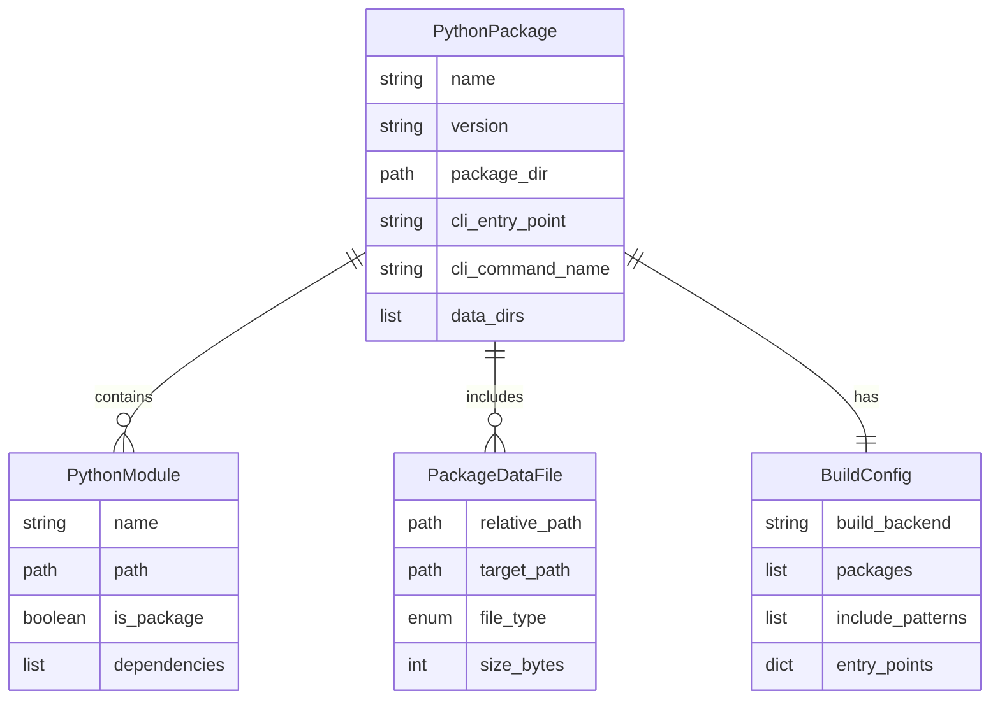
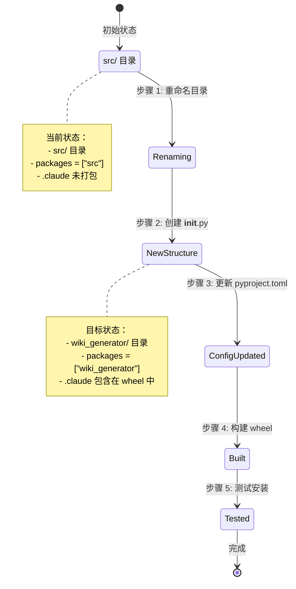

# 数据模型：包结构和打包配置修复

**功能**: fix-package-structure
**创建日期**: 2025-01-04
**状态**: ✅ 完成

---

## 1. 实体概述

本功能主要涉及包结构重组，不引入新的业务实体。核心数据模型围绕 Python 包的构建和分发配置。

---

## 2. 核心实体

### 2.1 PythonPackage（Python 包）

**描述**：wiki_generator Python 包的元数据和结构

**字段**：

| 字段名 | 类型 | 必填 | 描述 | 示例值 |
|--------|------|------|------|--------|
| `name` | string | 是 | 包名（模块导入名） | `wiki_generator` |
| `version` | string | 是 | 版本号（PEP 440） | `1.0.0` |
| `package_dir` | path | 是 | 包源代码目录 | `wiki_generator/` |
| `cli_entry_point` | string | 是 | 命令行工具入口点 | `wiki_generator.cli:cli` |
| `cli_command_name` | string | 是 | 命令行工具名称 | `wiki-generator` |
| `data_dirs` | list[path] | 是 | 包含的数据文件目录 | `[.claude/]` |

**验证规则**：
- `name` 必须符合 Python 标识符命名规范（小写字母、数字、下划线）
- `version` 必须符合 PEP 440 版本号规范
- `package_dir` 必须包含 `__init__.py` 文件
- `cli_entry_point` 必须指向有效的函数（格式：`module:function`）
- `data_dirs` 中的所有目录必须存在

**关系**：
- `PythonPackage` 1→* `PythonModule`
- `PythonPackage` 1→* `PackageDataFile`

---

### 2.2 PythonModule（Python 模块）

**描述**：包内的 Python 模块文件

**字段**：

| 字段名 | 类型 | 必填 | 描述 | 示例值 |
|--------|------|------|------|--------|
| `name` | string | 是 | 模块名 | `cli` |
| `path` | path | 是 | 模块文件路径 | `wiki_generator/cli.py` |
| `is_package` | boolean | 是 | 是否为包目录（含 __init__.py） | `false` |
| `dependencies` | list[string] | 否 | 导入的其他模块 | `[core.installer, utils.helper]` |

**验证规则**：
- `path` 必须以 `.py` 结尾或为包含 `__init__.py` 的目录
- 模块必须可以成功导入（语法正确）
- `dependencies` 中的模块必须存在于包内

**关系**：
- `PythonModule` *→1 `PythonPackage`

---

### 2.3 PackageDataFile（包数据文件）

**描述**：打包时包含的非 Python 数据文件

**字段**：

| 字段名 | 类型 | 必填 | 描述 | 示例值 |
|--------|------|------|------|--------|
| `relative_path` | path | 是 | 相对于项目根的路径 | `.claude/commands/wiki-generate.md` |
| `target_path` | path | 是 | 包内的目标路径 | `.claude/commands/wiki-generate.md` |
| `file_type` | enum | 是 | 文件类型 | `COMMAND`, `TEMPLATE`, `CONFIG`, `DOC` |
| `size_bytes` | integer | 是 | 文件大小（字节） | `7071` |

**验证规则**：
- `relative_path` 必须存在且可读
- `target_path` 必须以 `.claude/` 开头
- `file_type` 必须是以下值之一：
  - `COMMAND`: Claude Code 命令文件
  - `TEMPLATE`: 文档模板文件
  - `CONFIG`: 配置文件
  - `DOC`: 文档文件

**关系**：
- `PackageDataFile` *→1 `PythonPackage`

**文件清单**：

| relative_path | file_type | 描述 |
|---------------|-----------|------|
| `.claude/commands/wiki-generate.md` | COMMAND | Wiki 生成命令定义 |
| `.claude/templates/api.md.template` | TEMPLATE | API 文档模板 |
| `.claude/templates/architecture.md.template` | TEMPLATE | 架构文档模板 |
| `.claude/templates/development.md.template` | TEMPLATE | 开发文档模板 |
| `.claude/templates/index.md.template` | TEMPLATE | 索引文档模板 |
| `.claude/templates/module.md.template` | TEMPLATE | 模块文档模板 |
| `.claude/templates/overview.md.template` | TEMPLATE | 概述文档模板 |
| `.claude/templates/wiki-config.json.template` | TEMPLATE | 配置文件模板 |
| `.claude/wiki-config.json` | CONFIG | 配置示例 |
| `.claude/README.md` | DOC | Claude 目录说明 |
| `.claude/BEST-PRACTICES.md` | DOC | 最佳实践文档 |

---

### 2.4 BuildConfig（构建配置）

**描述**：pyproject.toml 中的构建配置

**字段**：

| 字段名 | 类型 | 必填 | 描述 | 示例值 |
|--------|------|------|------|--------|
| `build_backend` | string | 是 | 构建后端 | `hatchling.build` |
| `packages` | list[string] | 是 | 要打包的包目录 | `["wiki_generator"]` |
| `include_patterns` | list[string] | 是 | 包含文件模式 | `["wiki_generator/**/*.py", ".claude/**"]` |
| `entry_points` | dict | 是 | 命令行入口点 | `{"wiki-generator": "wiki_generator.cli:cli"}` |

**验证规则**：
- `build_backend` 必须是 `hatchling.build`
- `packages` 中的每个目录必须存在且包含 `__init__.py`
- `include_patterns` 中的每个模式必须匹配至少一个文件
- `entry_points` 中的每个函数必须存在

**配置示例**：
```toml
[build-system]
requires = ["hatchling"]
build-backend = "hatchling.build"

[tool.hatch.build.targets.wheel]
packages = ["wiki_generator"]
include = [
    "wiki_generator/**/*.py",
    ".claude/commands/wiki-generate.md",
    ".claude/templates/**",
    ".claude/*.json",
    ".claude/*.md",
]

[project.scripts]
wiki-generator = "wiki_generator.cli:cli"
```

---

## 3. 实体关系图



---

## 4. 状态模型

### 4.1 包结构重组状态



**状态定义**：

| 状态 | 描述 | 验收条件 |
|------|------|----------|
| `OldStructure` | 原始包结构 | `src/` 目录存在 |
| `Renaming` | 目录重命名中 | `wiki_generator/` 目录已创建 |
| `NewStructure` | 新包结构 | `wiki_generator/__init__.py` 存在 |
| `ConfigUpdated` | 配置已更新 | `pyproject.toml` 已修改 |
| `Built` | 包已构建 | `dist/*.whl` 文件存在 |
| `Tested` | 测试通过 | 模块导入成功，命令行工具可用 |

---

## 5. 数据转换

### 5.1 目录结构转换

**转换前**：
```
repo-wiki/
├── src/
│   ├── cli.py
│   ├── __main__.py
│   ├── core/
│   ├── utils/
│   └── models/
└── pyproject.toml
    [tool.hatch.build.targets.wheel]
    packages = ["src"]
    [project.scripts]
    wiki-generator = "src.cli:cli"
```

**转换后**：
```
repo-wiki/
├── wiki_generator/
│   ├── __init__.py  # 新增
│   ├── cli.py
│   ├── __main__.py
│   ├── core/
│   ├── utils/
│   └── models/
├── .claude/  # 包含在 wheel 中
│   ├── commands/
│   └── templates/
└── pyproject.toml
    [tool.hatch.build.targets.wheel]
    packages = ["wiki_generator"]
    include = [
        "wiki_generator/**/*.py",
        ".claude/commands/wiki-generate.md",
        ".claude/templates/**",
        ".claude/*.json",
        ".claude/*.md",
    ]
    [project.scripts]
    wiki-generator = "wiki_generator.cli:cli"
```

**转换操作**：
1. 重命名目录：`src/` → `wiki_generator/`
2. 创建文件：`wiki_generator/__init__.py`
3. 更新配置：修改 `pyproject.toml`
4. 重新构建：`uv build`
5. 验证内容：`unzip -l dist/*.whl`

---

## 6. 数据访问模式

### 6.1 包内数据文件访问

**访问方式**：

```python
# 方式 1: importlib.resources (Python 3.9+)
from importlib.resources import files
from pathlib import Path

# 获取包内数据目录
claude_dir = files('wiki_generator') / '.claude'
commands_dir = claude_dir / 'commands'
templates_dir = claude_dir / 'templates'

# 读取文件内容
command_file = commands_dir / 'wiki-generate.md'
content = command_file.read_text(encoding='utf-8')

# 遍历模板文件
for template_file in templates_dir.glob('*.md.template'):
    print(template_file.name)
```

```python
# 方式 2: pkg_resources (Python 3.8 兼容)
from pkg_resources import resource_filename, resource_listdir
from pathlib import Path

# 获取包内数据目录路径
claude_path = resource_filename('wiki_generator', '.claude')
claude_dir = Path(claude_path)

# 列出目录内容
templates = resource_listdir('wiki_generator', '.claude/templates')
for template in templates:
    print(template)
```

**兼容性包装器**：

```python
# wiki_generator/utils/package_data.py
from pathlib import Path

try:
    # Python 3.9+
    from importlib.resources import files as _files
    def get_package_data(package: str, path: str) -> Path:
        return Path(str(_files(package) / path))
except ImportError:
    # Python 3.8
    from pkg_resources import resource_filename
    def get_package_data(package: str, path: str) -> Path:
        return Path(resource_filename(package, path))

# 使用示例
claude_dir = get_package_data('wiki_generator', '.claude')
```

---

## 7. 数据验证

### 7.1 构建验证检查点

**检查点 1：目录结构验证**
```bash
# 验证包目录存在
test -d wiki_generator || error "包目录不存在"

# 验证 __init__.py 存在
test -f wiki_generator/__init__.py || error "__init__.py 不存在"

# 验证 .claude 目录存在
test -d .claude || error ".claude 目录不存在"
```

**检查点 2：配置文件验证**
```bash
# 验证 pyproject.toml 格式
python -c "import tomli; tomli.load(open('pyproject.toml'))" || error "TOML 格式错误"

# 验证包名配置
grep -q 'packages = \["wiki_generator"\]' pyproject.toml || error "包名配置错误"

# 验证入口点配置
grep -q 'wiki-generator = "wiki_generator.cli:cli"' pyproject.toml || error "入口点配置错误"
```

**检查点 3：Wheel 内容验证**
```bash
# 构建 wheel
uv build

# 检查 wheel 文件存在
ls dist/*.whl || error "wheel 文件未生成"

# 验证关键文件存在
unzip -l dist/*.whl | grep -q "wiki_generator/__init__.py" || error "__init__.py 未打包"
unzip -l dist/*.whl | grep -q ".claude/commands/wiki-generate.md" || error "命令文件未打包"
unzip -l dist/*.whl | grep -q ".claude/templates/" || error "模板目录未打包"
```

**检查点 4：安装测试**
```bash
# 创建测试环境
python -m venv test_venv
source test_venv/bin/activate

# 安装包
uv pip install dist/*.whl

# 验证模块导入
python -c "import wiki_generator; print('✓ 模块导入成功')" || error "模块导入失败"

# 验证命令行工具
wiki-generator --version || error "命令行工具不可用"

# 清理
deactivate
rm -rf test_venv
```

---

## 8. 数据完整性约束

### 8.1 包完整性约束

| 约束 | 描述 | 验证方式 |
|------|------|----------|
| 包名一致性 | 所有配置中的包名必须一致 | grep 检查 pyproject.toml |
| 模块可导入性 | 所有模块必须可以成功导入 | python -m py_compile |
| 数据文件存在性 | 所有列出的数据文件必须存在 | test -f 检查 |
| 入口点有效性 | 入口点函数必须存在 | 导入测试 |
| 版本号一致性 | 版本号在所有位置必须一致 | grep 检查 |

### 8.2 文件路径约束

| 约束 | 规则 | 示例 |
|------|------|------|
| 模块路径 | 必须在 `wiki_generator/` 目录下 | ✅ `wiki_generator/cli.py` |
| 数据文件路径 | 必须在 `.claude/` 目录下 | ✅ `.claude/commands/wiki-generate.md` |
| 跨平台路径 | 必须使用 `/` 或 `pathlib.Path` | ✅ `path / "file"` |
| 相对导入 | 必须使用点号表示法 | ✅ `from . import helper` |

---

## 9. 总结

本数据模型定义了包结构重组所需的所有实体和关系：

✅ **核心实体**：
- `PythonPackage`: 包元数据
- `PythonModule`: Python 模块
- `PackageDataFile`: 数据文件
- `BuildConfig`: 构建配置

✅ **关键关系**：
- 包包含模块和数据文件
- 包具有构建配置
- 数据文件分类管理

✅ **状态转换**：
- 定义了从旧结构到新结构的转换流程
- 每个状态都有明确的验收条件

✅ **访问模式**：
- 提供了跨版本的数据文件访问方案
- 兼容 Python 3.8-3.12

---

**文档状态**: ✅ 数据模型完成
**下一步**: 创建接口契约
**创建日期**: 2025-01-04
