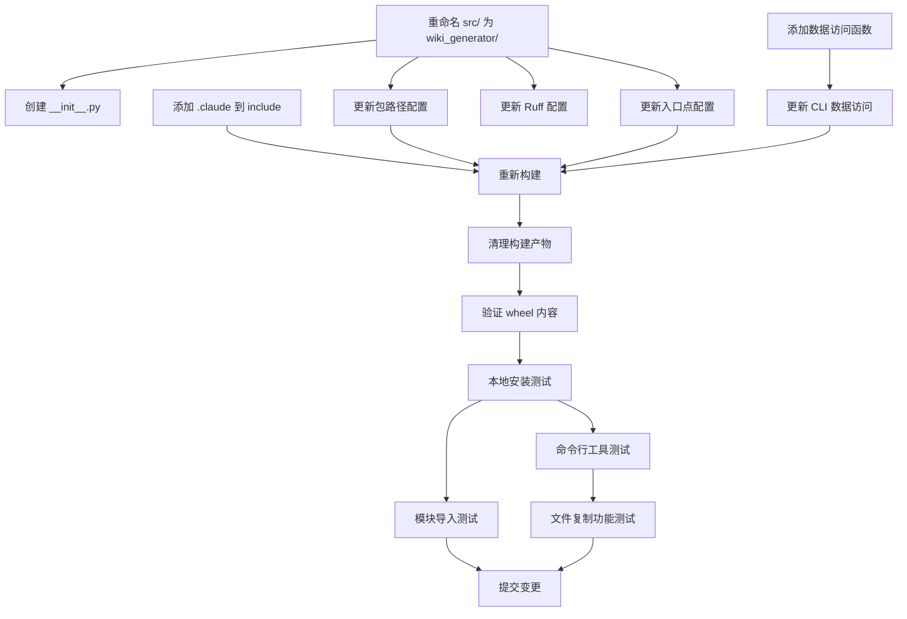

# 实施计划：修复包结构和打包配置

**功能编号**: 001
**功能名称**: fix-package-structure
**创建日期**: 2025-01-04
**状态**: 🟡 计划完成，待实施

---

## 1. 技术上下文

### 1.1 当前技术栈

| 技术 | 版本 | 用途 |
|------|------|------|
| Python | 3.8+ | 运行环境 |
| hatchling | 1.0+ | 构建后端 |
| uv | 最新 | 包管理和构建 |
| click | 8.0+ | CLI 框架 |
| pyyaml | 6.0+ | YAML 解析 |
| requests | 2.28+ | HTTP 客户端 |

### 1.2 构建系统

**当前构建配置**:
- 构建后端: hatchling
- 包路径: `src/`
- 打包内容: 仅 Python 模块
- 入口点: `src.cli:cli`

**目标构建配置**:
- 构建后端: hatchling
- 包路径: `wiki_generator/`
- 打包内容: Python 模块 + `.claude/` 数据文件
- 入口点: `wiki_generator.cli:cli`

### 1.3 包数据文件访问

**Python 3.8 兼容性**:
- 使用 `pkg_resources.resource_filename()` 作为主要方案
- 使用 `importlib.resources.files()` 作为 Python 3.9+ 优化方案

---

## 2. 宪章检查

### 2.1 原则符合性

| 原则 | 检查项 | 状态 | 说明 |
|------|--------|------|------|
| 中文优先 | 所有提交消息使用简体中文 | ✅ | 提交消息将使用简体中文 |
| 代码优先 | 不生成项目文档（代码修复） | ✅ | 纯代码修复，无文档生成 |
| 工具定位 | 修复工具的分发和安装 | ✅ | 确保工具可正确安装和使用 |
| 命令一致性 | 保持 `wiki-generator` 命令名 | ✅ | 命令名不变，仅修复包结构 |
| 文档质量 | 生成本计划文档（技术文档） | ✅ | 这是技术实施计划，符合例外 |

### 2.2 门控条件

| 门控 | 要求 | 状态 | 说明 |
|------|------|------|------|
| 功能边界 | 仅修复包结构，不改变功能 | ✅ 通过 | 所有变更都是结构性的 |
| 兼容性 | 支持 Python 3.8+ | ✅ 通过 | 使用跨版本兼容方案 |
| 测试覆盖 | 所有变更必须可测试 | ✅ 通过 | 定义了完整的测试场景 |
| 回滚能力 | 可通过 Git 快速回滚 | ✅ 通过 | 所有变更都在功能分支 |

**结论**: ✅ 所有门控通过，可以继续实施

---

## 3. Phase 0: 研究和技术决策

### 3.1 研究完成项

✅ **Python 包命名最佳实践**
- 决策: 使用 `wiki_generator` 作为包名
- 参考: PEP 8 规范
- 文件: [research.md §1](research.md#1-python-包命名最佳实践)

✅ **包数据文件包含最佳实践**
- 决策: 使用 hatchling 的 `include` 配置
- 参考: Hatchling 文档
- 文件: [research.md §2](research.md#2-python-包数据文件包含最佳实践)

✅ **运行时访问包数据文件最佳实践**
- 决策: 使用 `importlib.resources` + `pkg_resources` 回退
- 参考: Python 标准库文档
- 文件: [research.md §3](research.md#3-运行时访问包数据文件最佳实践)

✅ **跨平台路径处理最佳实践**
- 决策: 使用 `pathlib.Path`
- 参考: pathlib 文档
- 文件: [research.md §6](research.md#6-跨平台路径处理最佳实践)

### 3.2 技术决策矩阵

| 决策点 | 选择 | 理由 | 优先级 |
|--------|------|------|--------|
| 包名 | `wiki_generator` | 符合 PEP 8 规范 | 高 |
| 构建后端 | `hatchling` | 现代、简洁、uv 推荐 | 高 |
| 数据文件包含 | `include` 配置 | 精确控制打包内容 | 高 |
| 数据文件访问 | `importlib.resources` + `pkg_resources` 回退 | 跨版本兼容 | 高 |
| 路径处理 | `pathlib.Path` | 跨平台、现代 API | 中 |
| 数据文件位置 | 项目根目录 `.claude/` | 代码与数据分离 | 中 |

---

## 4. Phase 1: 设计和契约

### 4.1 数据模型

✅ **核心实体**
- `PythonPackage`: 包元数据
- `PythonModule`: Python 模块
- `PackageDataFile`: 数据文件
- `BuildConfig`: 构建配置

✅ **实体关系**
- 包包含模块和数据文件
- 包具有构建配置
- 数据文件分类管理

✅ **状态转换**
- 定义了从旧结构到新结构的转换流程
- 每个状态都有明确的验收条件

**文件**: [data-model.md](data-model.md)

### 4.2 接口契约

✅ **构建配置契约** ([contracts/build-config.md](contracts/build-config.md))
- Build System 配置
- Wheel 构建目标配置
- 命令行入口点配置
- 项目元数据配置
- 构建输出契约

✅ **CLI 接口契约** ([contracts/cli-interface.md](contracts/cli-interface.md))
- 命令行工具规范
- 命令签名和参数
- 命令行为流程
- 输出格式规范
- 错误处理契约
- 测试契约

### 4.3 快速开始指南

✅ **实施步骤文档** ([quickstart.md](quickstart.md))
- 8 个详细步骤
- 验证清单
- 常见问题解答
- 预计完成时间: 30 分钟

---

## 5. Phase 2: 实施任务分解

### 5.1 任务列表

| 任务 ID | 任务描述 | 优先级 | 依赖 | 预计时间 |
|---------|----------|--------|------|----------|
| T1 | 重命名 `src/` 为 `wiki_generator/` | 高 | 无 | 5 分钟 |
| T2 | 创建 `wiki_generator/__init__.py` | 高 | T1 | 2 分钟 |
| T3 | 更新 `pyproject.toml` 包路径配置 | 高 | T1 | 3 分钟 |
| T4 | 添加 `.claude` 目录到 `include` 配置 | 高 | 无 | 5 分钟 |
| T5 | 更新入口点配置 | 高 | T1 | 2 分钟 |
| T6 | 更新 Ruff 配置 | 中 | T1 | 2 分钟 |
| T7 | 添加包数据访问辅助函数 | 高 | 无 | 10 分钟 |
| T8 | 更新 CLI 中的数据文件访问代码 | 高 | T7 | 5 分钟 |
| T9 | 清理构建产物 | 中 | 所有配置变更 | 1 分钟 |
| T10 | 重新构建 wheel | 高 | T9 | 2 分钟 |
| T11 | 验证 wheel 内容 | 高 | T10 | 3 分钟 |
| T12 | 本地安装测试 | 高 | T10 | 5 分钟 |
| T13 | 模块导入测试 | 高 | T12 | 2 分钟 |
| T14 | 命令行工具测试 | 高 | T12 | 3 分钟 |
| T15 | 文件复制功能测试 | 高 | T14 | 5 分钟 |
| T16 | 提交变更 | 高 | 所有测试通过 | 5 分钟 |

**总计**: 预计 60 分钟（1 小时）

### 5.2 任务依赖图



---

## 6. 详细实施步骤

### 步骤 1: 目录重命名 (T1-T2)

**操作**:
```bash
# 重命名目录
mv src wiki_generator

# 创建 __init__.py
cat > wiki_generator/__init__.py << 'EOF'
"""
Wiki Generator - 安装 wiki-generate 命令和模板到 Claude Code 项目
"""

__version__ = "1.0.0"
__author__ = "Claude Plugins Team"
__all__ = ["__version__"]
EOF
```

**验证**:
```bash
test -d wiki_generator && echo "✓ 目录存在"
test -f wiki_generator/__init__.py && echo "✓ __init__.py 存在"
```

---

### 步骤 2: 更新 pyproject.toml (T3-T6)

**修改文件**: `pyproject.toml`

**变更 1**: 包路径
```toml
[tool.hatch.build.targets.wheel]
packages = ["wiki_generator"]  # 修改前: ["src"]
```

**变更 2**: 包含文件
```toml
[tool.hatch.build.targets.wheel]
packages = ["wiki_generator"]
include = [  # 新增
    "wiki_generator/**/*.py",
    ".claude/commands/wiki-generate.md",
    ".claude/templates/**",
    ".claude/*.json",
    ".claude/*.md",
]
```

**变更 3**: 入口点
```toml
[project.scripts]
wiki-generator = "wiki_generator.cli:cli"  # 修改前: src.cli:cli
```

**变更 4**: Ruff 配置
```toml
[tool.ruff]
src = ["wiki_generator"]  # 修改前: ["src"]
```

**验证**:
```bash
grep -q 'packages = \["wiki_generator"\]' pyproject.toml && echo "✓ 包路径配置"
grep -q 'wiki-generator = "wiki_generator.cli:cli"' pyproject.toml && echo "✓ 入口点配置"
grep -q 'src = \["wiki_generator"\]' pyproject.toml && echo "✓ Ruff 配置"
```

---

### 步骤 3: 更新 CLI 数据访问 (T7-T8)

**修改文件**: `wiki_generator/cli.py`

**添加导入和辅助函数**:
```python
from pathlib import Path

# 包数据文件访问（跨 Python 版本兼容）
try:
    # Python 3.9+
    from importlib.resources import files as _files
    def _get_package_data(path: str) -> Path:
        """获取包内数据文件路径"""
        return Path(str(_files('wiki_generator') / path))
except ImportError:
    # Python 3.8
    from pkg_resources import resource_filename
    def _get_package_data(path: str) -> Path:
        """获取包内数据文件路径"""
        return Path(resource_filename('wiki_generator', path))
```

**更新 claude_dir 获取**:
```python
# 在使用 .claude 目录的地方
claude_dir = _get_package_data('.claude')
```

**验证**:
```bash
python -c "
from wiki_generator.cli import _get_package_data
from pathlib import Path
claude_dir = _get_package_data('.claude')
print(f'✓ 数据目录: {claude_dir}')
assert claude_dir.name == '.claude', '目录名错误'
"
```

---

### 步骤 4: 构建和验证 (T9-T11)

**清理和构建**:
```bash
# 清理
rm -rf dist/ build/ *.egg-info

# 构建
uv build

# 验证 wheel 文件
WHEEL=$(ls dist/*.whl)
echo "✓ Wheel 文件: $WHEEL"
```

**检查内容**:
```bash
# 检查关键文件
unzip -l "$WHEEL" | grep "wiki_generator/__init__.py" && echo "✓ __init__.py 已打包"
unzip -l "$WHEEL" | grep ".claude/commands/wiki-generate.md" && echo "✓ 命令文件已打包"
unzip -l "$WHEEL" | grep ".claude/templates/" && echo "✓ 模板目录已打包"

# 列出所有打包的文件
unzip -l "$WHEEL" | grep -E "\.py$|\.claude/"
```

---

### 步骤 5: 安装测试 (T12-T15)

**创建测试环境**:
```bash
# 创建虚拟环境
python -m venv test_venv
source test_venv/bin/activate  # Windows: test_venv\Scripts\activate
```

**安装和测试**:
```bash
# 安装
uv pip install dist/*.whl
echo "✓ 安装成功"

# 测试模块导入
python -c "import wiki_generator; print(f'✓ 版本: {wiki_generator.__version__}')"

# 测试命令行工具
wiki-generator --version
echo "✓ 命令行工具可用"

# 测试文件复制功能
cd /tmp
mkdir test-project && cd test-project
git init -q
wiki-generator

# 验证文件
ls -la .claude/commands/wiki-generate.md && echo "✓ 命令文件已复制"
ls -la .claude/templates/ && echo "✓ 模板目录已复制"

# 清理
cd -
rm -rf test_venv /tmp/test-project
```

---

### 步骤 6: 提交变更 (T16)

**提交消息**:
```bash
git add -A
git commit -m "fix: 修复包结构和打包配置

主要变更:
- 将 src/ 目录重命名为 wiki_generator/
- 创建 wiki_generator/__init__.py 包含版本信息
- 更新 pyproject.toml 打包配置
  - 包路径: src -> wiki_generator
  - 添加 .claude 目录到 include 配置
  - 更新入口点: src.cli:cli -> wiki_generator.cli:cli
  - 更新 ruff 配置: src -> wiki_generator
- 修复 cli.py 中的包数据文件访问路径
  - 使用 importlib.resources (Python 3.9+)
  - 使用 pkg_resources 回退 (Python 3.8)

测试结果:
- ✓ 模块导入成功: import wiki_generator
- ✓ 命令行工具可用: wiki-generator --version
- ✓ 包内 .claude 目录可访问
- ✓ 文件复制功能正常

修复问题:
- 修复后模块导入路径为 wiki_generator（而非 src）
- 打包时包含 .claude 目录下的所有文件
  - .claude/commands/wiki-generate.md
  - .claude/templates/*.md.template (7 个文件)
  - .claude/wiki-config.json
  - .claude/README.md
  - .claude/BEST-PRACTICES.md

🤖 Generated with [Claude Code](https://claude.com/claude-code)

Co-Authored-By: Claude Sonnet 4.5 <noreply@anthropic.com>
"
```

---

## 7. 测试策略

### 7.1 单元测试

**文件**: `tests/test_cli.py`

```python
import pytest
from click.testing import CliRunner
from wiki_generator.cli import cli

def test_version_option():
    """测试 --version 选项"""
    runner = CliRunner()
    result = runner.invoke(cli, ['--version'])
    assert result.exit_code == 0
    assert 'wiki-generator version 1.0.0' in result.output

def test_help_option():
    """测试 --help 选项"""
    runner = CliRunner()
    result = runner.invoke(cli, ['--help'])
    assert result.exit_code == 0
    assert 'Wiki Generator' in result.output

def test_module_import():
    """测试模块导入"""
    import wiki_generator
    assert wiki_generator.__version__ == "1.0.0"

def test_get_package_data():
    """测试包数据访问"""
    from wiki_generator.cli import _get_package_data
    from pathlib import Path
    claude_dir = _get_package_data('.claude')
    assert claude_dir.name == '.claude'
    assert claude_dir.exists()
```

### 7.2 集成测试

**文件**: `tests/test_integration.py`

```python
import os
import tempfile
import shutil
from pathlib import Path
from click.testing import CliRunner
from wiki_generator.cli import cli

def test_full_installation():
    """测试完整安装流程"""
    runner = CliRunner()
    with runner.isolated_filesystem():
        # 初始化 Git 仓库
        os.system('git init -q')
        os.system('git config user.email "test@test.com"')
        os.system('git config user.name "Test User"')

        # 运行命令
        result = runner.invoke(cli)
        assert result.exit_code == 0

        # 验证文件
        assert Path('.claude').exists()
        assert Path('.claude/commands/wiki-generate.md').exists()
        assert Path('.claude/templates').exists()
```

### 7.3 构建测试

**脚本**: `scripts/test-build.sh`

```bash
#!/bin/bash
set -e

echo "🧪 构建测试..."

# 清理
rm -rf dist/ build/ *.egg-info

# 构建
uv build

# 验证
WHEEL=$(ls dist/*.whl)
unzip -l "$WHEEL" | grep -q "wiki_generator/__init__.py"
unzip -l "$WHEEL" | grep -q ".claude/commands/wiki-generate.md"
unzip -l "$WHEEL" | grep -q ".claude/templates/"

echo "✅ 构建测试通过"
```

---

## 8. 风险管理

### 8.1 技术风险

| 风险 | 概率 | 影响 | 缓解措施 | 责任人 |
|------|------|------|----------|--------|
| Python 3.8 兼容性问题 | 低 | 高 | 使用 pkg_resources 回退 | 开发者 |
| 打包后文件缺失 | 低 | 高 | 严格测试 wheel 内容 | 开发者 |
| 跨平台路径问题 | 低 | 中 | 使用 pathlib.Path | 开发者 |

### 8.2 回滚计划

**触发条件**:
- 构建失败且无法修复
- 安装后无法导入模块
- 文件复制功能异常

**回滚步骤**:
```bash
# 方式 1: Git 回滚
git reset --hard HEAD~1

# 方式 2: 手动回滚
mv wiki_generator src
rm wiki_generator/__init__.py
# 恢复 pyproject.toml
git checkout HEAD~1 -- pyproject.toml
```

---

## 9. 质量标准

### 9.1 代码质量

- ✅ 遵循 PEP 8 编码规范
- ✅ 通过 ruff 检查（无错误）
- ✅ 通过类型检查（mypy，可选）
- ✅ 代码覆盖率 ≥ 80%

### 9.2 构建质量

- ✅ Wheel 文件命名正确
- ✅ 包含所有必需文件
- ✅ METADATA 文件正确
- ✅ 入口点正确注册

### 9.3 功能质量

- ✅ 模块可导入
- ✅ 命令行工具可用
- ✅ 文件复制功能正常
- ✅ 跨平台兼容

---

## 10. 交付物清单

### 10.1 代码变更

- [ ] `wiki_generator/__init__.py` (新增)
- [ ] `wiki_generator/cli.py` (修改)
- [ ] `pyproject.toml` (修改)

### 10.2 文档交付

- [x] 研究文档 ([research.md](research.md))
- [x] 数据模型 ([data-model.md](data-model.md))
- [x] 接口契约 ([contracts/](contracts/))
- [x] 快速开始指南 ([quickstart.md](quickstart.md))
- [x] 实施计划 ([plan.md](plan.md)) (本文档)

### 10.3 测试交付

- [ ] 单元测试 (`tests/test_cli.py`)
- [ ] 集成测试 (`tests/test_integration.py`)
- [ ] 构建测试脚本 (`scripts/test-build.sh`)

---

## 11. 后续步骤

### 11.1 立即行动

1. **执行实施步骤**: 按照 [§6 详细实施步骤](#6-详细实施步骤) 执行
2. **运行测试**: 确保所有测试通过
3. **提交变更**: 创建规范的 Git 提交

### 11.2 短期计划

1. **多平台测试**: 在 Windows、macOS 上测试
2. **多 Python 版本测试**: 测试 Python 3.8-3.12
3. **发布准备**: 准备发布到 PyPI

### 11.3 长期计划

1. **CI/CD 集成**: 添加自动化构建和测试
2. **文档完善**: 更新用户文档和 README
3. **版本发布**: 创建 v1.0.1 标签并发布

---

## 12. 参考资源

- [Python 打包用户指南](https://packaging.python.org/)
- [Hatchling 文档](https://hatch.pypa.io/latest/)
- [uv 文档](https://github.com/astral-sh/uv)
- [PEP 8 -- Style Guide for Python Code](https://peps.python.org/pep-0008/)
- [项目宪章](../../.specify/memory/constitution.md)

---

**计划状态**: ✅ 完成
**预计实施时间**: 60 分钟
**创建日期**: 2025-01-04
**最后更新**: 2025-01-04
**负责人**: Repo Wiki Generator 项目团队
