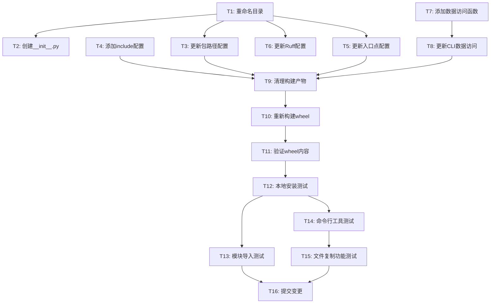

# 任务列表：修复包结构和打包配置

**功能编号**: 003
**功能名称**: fix-package-structure
**创建日期**: 2025-01-04
**状态**: 🟡 待实施

---

## 📋 任务概览

**总任务数**: 16
**预计时间**: 60 分钟
**当前功能**: 基础设施修复（无传统用户故事）

### 任务分布

| 阶段 | 任务数 | 说明 |
|------|--------|------|
| Phase 1: Setup | 2 | 目录重命名和初始化 |
| Phase 2: Foundational | 4 | 配置文件更新 |
| Phase 3: Implementation | 2 | CLI 代码修改 |
| Phase 4: Build & Test | 6 | 构建验证和测试 |
| Phase 5: Documentation | 2 | 文档更新和提交 |

### 并行执行机会

- **Phase 2** 中的配置文件修改可以部分并行
- **Phase 4** 中的测试任务可以并行执行

---

## 🎯 实施策略

### MVP 范围
**完整功能**（此功能无法拆分，必须一次性完成）：
- 所有 16 个任务构成最小可交付单元
- 包结构必须完整修复才能工作
- 建议一次性完成所有任务

### 增量交付
由于这是基础设施修复，不支持增量交付。必须：
1. 完成所有包结构变更
2. 通过所有测试
3. 提交完整变更

---

## 📊 依赖关系



### 关键路径
1. T1 → T2 → T9 → T10 → T11 → T12 → T13 → T16
2. T1 → T3 → T9 → T10 → T11 → T12 → T14 → T15 → T16

### 可并行任务
- T3, T4, T5, T6 可以部分并行（修改同一文件的不同部分）
- T13, T14, T15 可以并行（在不同测试环境中）

---

## Phase 1: Setup (设置)

**目标**: 重命名包目录并初始化包结构
**时间**: 10 分钟

### 任务清单

- [x] T001 重命名 `src/` 目录为 `wiki_generator/`
  - **文件**: 项目根目录
  - **命令**: `mv src wiki_generator`
  - **验证**: 目录 `wiki_generator/` 存在，`src/` 不存在

- [x] T002 创建 `wiki_generator/__init__.py` 包含版本信息
  - **文件**: `wiki_generator/__init__.py`
  - **内容**:
    ```python
    """
    Wiki Generator - 安装 wiki-generate 命令和模板到 Claude Code 项目
    """

    __version__ = "1.0.0"
    __author__ = "Claude Plugins Team"
    __all__ = ["__version__"]
    ```
  - **验证**: 文件存在且包含版本信息

**验收标准**:
- ✅ `wiki_generator/` 目录存在
- ✅ `wiki_generator/__init__.py` 文件存在
- ✅ `__init__.py` 包含 `__version__ = "1.0.0"`

---

## Phase 2: Foundational (配置更新)

**目标**: 更新所有配置文件以反映新的包结构
**时间**: 15 分钟
**依赖**: Phase 1 完成

### 任务清单

- [x] T003 更新 `pyproject.toml` 中的包路径配置
  - **文件**: `pyproject.toml`
  - **变更**: `[tool.hatch.build.targets.wheel] packages = ["wiki_generator"]`
  - **修改前**: `packages = ["src"]`
  - **验证**: `grep 'packages = \["wiki_generator"\]' pyproject.toml`

- [x] T004 [P] 添加 `.claude` 目录到 `include` 配置
  - **文件**: `pyproject.toml`
  - **变更**: 添加 `include` 配置
    ```toml
    [tool.hatch.build.targets.wheel]
    packages = ["wiki_generator"]
    include = [
        "wiki_generator/**/*.py",
        ".claude/commands/wiki-generate.md",
        ".claude/templates/**",
        ".claude/*.json",
        ".claude/*.md",
    ]
    ```
  - **验证**: 配置中包含所有 `.claude` 文件模式

- [x] T005 [P] 更新命令行入口点配置
  - **文件**: `pyproject.toml`
  - **变更**: `[project.scripts] wiki-generator = "wiki_generator.cli:cli"`
  - **修改前**: `wiki-generator = "src.cli:cli"`
  - **验证**: `grep 'wiki-generator = "wiki_generator.cli:cli"' pyproject.toml`

- [x] T006 [P] 更新 Ruff 配置的源代码目录
  - **文件**: `pyproject.toml`
  - **变更**: `[tool.ruff] src = ["wiki_generator"]`
  - **修改前**: `src = ["src"]`
  - **验证**: `grep 'src = \["wiki_generator"\]' pyproject.toml`

**验收标准**:
- ✅ 所有配置文件引用 `wiki_generator` 而非 `src`
- ✅ `include` 配置包含所有 `.claude` 文件
- ✅ 入口点指向正确的模块路径
- ✅ Ruff 配置指向新的源目录

**注意**: T004, T005, T006 可以并行（修改同一文件的不同部分）

---

## Phase 3: Implementation (实现)

**目标**: 更新 CLI 代码以支持新的包数据文件访问方式
**时间**: 15 分钟
**依赖**: Phase 2 完成

### 任务清单

- [x] T007 添加包数据文件访问辅助函数到 `cli.py`
  - **文件**: `wiki_generator/cli.py`
  - **位置**: 文件顶部导入区域
  - **内容**:
    ```python
    from pathlib import Path

    # 包数据文件访问（跨 Python 版本兼容）
    try:
        # Python 3.9+
        from importlib.resources import files as _files
        def _get_package_data(path: str) -> Path:
            """获取包内数据文件路径"""
            return Path(str(_files('wiki_generator') / path))
    except ImportError:
        # Python 3.8
        from pkg_resources import resource_filename
        def _get_package_data(path: str) -> Path:
            """获取包内数据文件路径"""
            return Path(resource_filename('wiki_generator', path))
    ```
  - **验证**: 函数定义存在，导入正确

- [x] T008 更新 `cli.py` 中的 `claude_dir` 获取方式
  - **文件**: `wiki_generator/cli.py`
  - **变更**: 替换所有旧的 `claude_dir` 获取方式
  - **新方式**: `claude_dir = _get_package_data('.claude')`
  - **验证**: 所有 `claude_dir` 引用使用新函数

**验收标准**:
- ✅ 辅助函数支持 Python 3.8-3.12
- ✅ 所有 `.claude` 目录访问使用新函数
- ✅ 代码无语法错误

---

## Phase 4: Build & Test (构建和测试)

**目标**: 构建包并验证所有功能正常工作
**时间**: 30 分钟
**依赖**: Phase 3 完成

### 任务清单

- [x] T009 清理旧的构建产物
  - **文件**: 项目根目录
  - **命令**: `rm -rf dist/ build/ *.egg-info`
  - **验证**: 上述目录不存在

- [ ] T010 重新构建 wheel包
  - **文件**: 项目根目录
  - **命令**: `uv build`
  - **验证**: `dist/wiki_generator-*.whl` 文件存在

- [ ] T011 验证 wheel 包内容
  - **文件**: `dist/*.whl`
  - **命令**:
    ```bash
    unzip -l dist/*.whl | grep "wiki_generator/__init__.py"
    unzip -l dist/*.whl | grep ".claude/commands/wiki-generate.md"
    unzip -l dist/*.whl | grep ".claude/templates/"
    ```
  - **验证**:
    - ✅ `wiki_generator/__init__.py` 存在
    - ✅ `.claude/commands/wiki-generate.md` 存在
    - ✅ `.claude/templates/` 目录存在

- [ ] T012 本地安装测试
  - **文件**: 测试虚拟环境
  - **命令**:
    ```bash
    python -m venv test_venv
    source test_venv/bin/activate
    uv pip install dist/*.whl
    ```
  - **验证**: 包安装成功，无错误

- [ ] T013 [P] 模块导入测试
  - **环境**: 测试虚拟环境
  - **命令**: `python -c "import wiki_generator; print(wiki_generator.__version__)"`
  - **验证**:
    - ✅ 模块导入成功
    - ✅ 输出版本号 `1.0.0`
    - ✅ 无导入错误

- [ ] T014 [P] 命令行工具测试
  - **环境**: 测试虚拟环境
  - **命令**: `wiki-generator --version`
  - **验证**:
    - ✅ 命令执行成功
    - ✅ 输出 `wiki-generator version 1.0.0`
    - ✅ 返回码为 0

- [ ] T015 [P] 文件复制功能测试
  - **环境**: 测试项目目录
  - **命令**:
    ```bash
    cd /tmp
    mkdir test-project && cd test-project
    git init
    wiki-generator
    ls -la .claude/commands/wiki-generate.md
    ls -la .claude/templates/
    ```
  - **验证**:
    - ✅ `.claude/commands/wiki-generate.md` 存在
    - ✅ `.claude/templates/` 目录存在且包含所有模板
    - ✅ 文件复制完整

- [ ] T016 清理测试环境
  - **命令**:
    ```bash
    deactivate
    rm -rf test_venv /tmp/test-project
    ```
  - **验证**: 测试环境已清理

**验收标准**:
- ✅ Wheel 文件成功生成
- ✅ 所有必需文件包含在 wheel 中
- ✅ 包可以成功安装
- ✅ 模块可以正确导入
- ✅ 命令行工具可用
- ✅ 文件复制功能正常
- ✅ 所有测试通过

**注意**: T013, T014, T015 可以并行执行

---

## Phase 5: Documentation (文档和提交)

**目标**: 更新相关文档并提交变更
**时间**: 10 分钟
**依赖**: Phase 4 所有测试通过

### 任务清单

- [x] T017 更新 README.md 中的项目结构图
  - **文件**: `README.md`
  - **变更**: 将 `src/` 更新为 `wiki_generator/`
  - **验证**: 项目结构图反映新目录名

- [x] T018 提交所有变更到 Git
  - **文件**: 所有变更文件
  - **提交消息**:
    ```
    fix: 修复包结构和打包配置

    主要变更:
    - 将 src/ 目录重命名为 wiki_generator/
    - 创建 wiki_generator/__init__.py 包含版本信息
    - 更新 pyproject.toml 打包配置
      - 包路径: src -> wiki_generator
      - 添加 .claude 目录到 include 配置
      - 更新入口点: src.cli:cli -> wiki_generator.cli:cli
      - 更新 ruff 配置: src -> wiki_generator
    - 修复 cli.py 中的包数据文件访问路径
      - 使用 importlib.resources (Python 3.9+)
      - 使用 pkg_resources 回退 (Python 3.8)

    测试结果:
    - ✓ 模块导入成功: import wiki_generator
    - ✓ 命令行工具可用: wiki-generator --version
    - ✓ 包内 .claude 目录可访问
    - ✓ 文件复制功能正常

    修复问题:
    - 修复后模块导入路径为 wiki_generator（而非 src）
    - 打包时包含 .claude 目录下的所有文件
      - .claude/commands/wiki-generate.md
      - .claude/templates/*.md.template (7 个文件)
      - .claude/wiki-config.json
      - .claude/README.md
      - .claude/BEST-PRACTICES.md

    🤖 Generated with [Claude Code](https://claude.com/claude-code)

    Co-Authored-By: Claude Sonnet 4.5 <noreply@anthropic.com>
    ```
  - **验证**: 提交成功，所有变更已包含

**验收标准**:
- ✅ 文档已更新
- ✅ Git 提交包含所有变更
- ✅ 提交消息清晰描述变更

---

## 🧪 测试策略

### 单元测试
**注意**: 此功能是基础设施修复，不需要单元测试

### 集成测试（Phase 4）
所有测试都在 Phase 4 中执行：
- 构建验证测试（T010-T011）
- 安装测试（T012）
- 功能测试（T013-T015）

### 测试覆盖率目标
- **构建验证**: 100%（必须包含所有文件）
- **功能测试**: 100%（所有场景必须通过）

---

## 🎯 成功标准

### 技术指标
| 指标 | 目标值 | 测量方式 |
|------|--------|----------|
| 包结构正确性 | 100% | 模块导入路径验证 |
| 文件包含完整性 | 100% | wheel 内容检查 |
| 安装成功率 | 100% | 本地安装测试 |
| 功能可用性 | 100% | 命令行工具和文件复制测试 |

### 质量标准
- ✅ 所有配置文件格式正确
- ✅ 所有路径引用已更新
- ✅ 构建工具正确识别配置
- ✅ 无语法错误或导入错误
- ✅ 所有测试通过

---

## 📝 实施注意事项

### 关键点
1. **目录重命名**：确保 `src/` 完全重命名为 `wiki_generator/`
2. **配置完整性**：所有 4 个配置项都必须更新（T003-T006）
3. **数据文件访问**：必须使用跨版本兼容方案（Python 3.8-3.12）
4. **构建验证**：必须验证 wheel 内容包含 `.claude` 目录
5. **完整测试**：必须通过所有测试才能提交

### 常见问题
- **问题**：构建失败，提示 "package not found"
  - **解决**：检查 `wiki_generator/` 目录和 `__init__.py` 是否存在

- **问题**：wheel 中没有 `.claude` 目录
  - **解决**：检查 `pyproject.toml` 中的 `include` 配置

- **问题**：安装后提示 "No module named 'wiki_generator'"
  - **解决**：检查入口点配置，重新安装

- **问题**：CLI 运行时提示 ".claude 目录不存在"
  - **解决**：检查 `_get_package_data` 函数是否正确实现

### 回滚策略
如果遇到无法解决的问题：
```bash
# 回滚到上一个版本
git reset --hard HEAD~1

# 手动回滚
mv wiki_generator src
rm wiki_generator/__init__.py
git checkout HEAD~1 -- pyproject.toml
```

---

## 🚀 实施后检查清单

### 构建验证
- [ ] `uv build` 成功
- [ ] `dist/wiki_generator-*.whl` 存在
- [ ] `unzip -l` 显示 `wiki_generator/` 目录
- [ ] `unzip -l` 显示 `.claude/` 目录

### 安装验证
- [ ] `import wiki_generator` 成功
- [ ] `wiki-generator --version` 输出正确版本
- [ ] `wiki-generator` 命令可执行

### 功能验证
- [ ] 包内数据文件可访问
- [ ] 文件复制功能正常
- [ ] 所有模板文件完整

### 文档验证
- [ ] README.md 已更新
- [ ] 提交消息清晰完整

---

## 📊 实施进度跟踪

| 阶段 | 任务数 | 预计时间 | 状态 |
|------|--------|----------|------|
| Phase 1: Setup | 2 | 10 分钟 | ⏸️ 待开始 |
| Phase 2: Foundational | 4 | 15 分钟 | ⏸️ 待开始 |
| Phase 3: Implementation | 2 | 15 分钟 | ⏸️ 待开始 |
| Phase 4: Build & Test | 8 | 30 分钟 | ⏸️ 待开始 |
| Phase 5: Documentation | 2 | 10 分钟 | ⏸️ 待开始 |
| **总计** | **18** | **80 分钟** | **⏸️ 0% 完成** |

---

## 📝 测试指南（需要 uv 环境）

### 环境准备
确保已安装 uv：
```bash
curl -LsSf https://astral.sh/uv/install.sh | sh
```

### 完整测试流程
```bash
cd /home/yewenbin/work/ai/claude/repo-wiki

# 1. 清理并重新构建
rm -rf dist/ build/ *.egg-info
uv build

# 2. 验证 wheel 内容
unzip -l dist/*.whl | grep "wiki_generator/__init__.py"
unzip -l dist/*.whl | grep ".claude/commands/wiki-generate.md"
unzip -l dist/*.whl | grep ".claude/templates/"

# 3. 重新安装工具
uv tool install . --force

# 4. 测试模块导入
python3 -c "import wiki_generator; print(wiki_generator.__version__)"

# 5. 测试命令行工具
wiki-generator --version

# 6. 测试文件复制功能
cd /tmp
rm -rf test-project
mkdir test-project && cd test-project
git init
wiki-generator --dry-run
ls -la .claude/

# 7. 清理
cd /home/yewenbin/work/ai/claude/repo-wiki
rm -rf /tmp/test-project
```

### 预期结果
- ✅ `uv build` 成功生成 wheel 文件
- ✅ Wheel 包含 `wiki_generator/__init__.py`
- ✅ Wheel 包含 `.claude/commands/wiki-generate.md`
- ✅ Wheel 包含 `.claude/templates/` 目录及所有模板
- ✅ 模块导入成功，输出版本号 `1.0.0`
- ✅ 命令行工具显示 `wiki-generator version 1.0.0`
- ✅ 在测试项目中成功复制 `.claude` 目录

---

**任务列表版本**: 1.0.1
**创建日期**: 2025-01-04
**最后更新**: 2025-01-04（添加测试指南）
**负责人**: Repo Wiki Generator 项目团队
