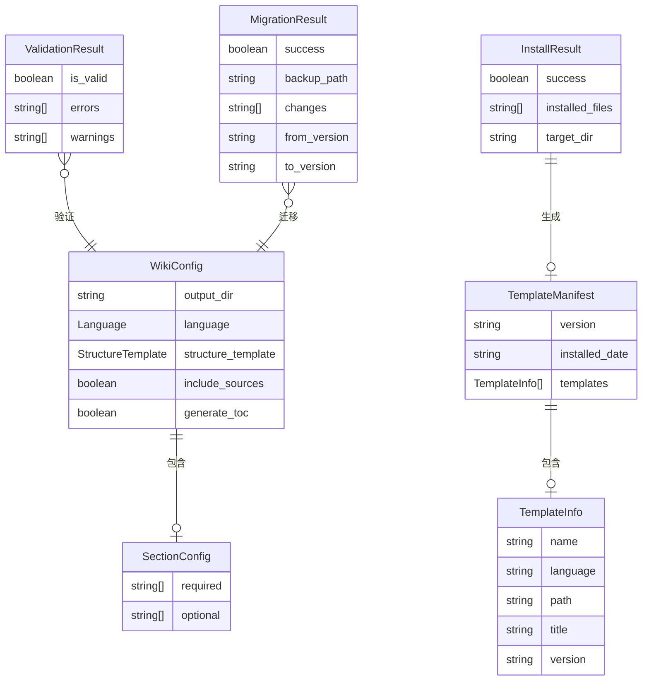

# 数据模型：优化 Wiki 文档结构和模板（v2.0）

**版本**: 2.0.0
**创建日期**: 2025-01-04
**功能**: [spec.md](spec.md)

**架构说明**: 基于架构澄清会话，Python 包只负责安装、配置验证和迁移工具。文档生成逻辑由 Claude Code 命令实现。

---

## 1. 实体定义

### 1.1 WikiConfig（Wiki 配置）

**描述**: Wiki 文档生成的配置文件结构

**用途**: 定义 `.claude/wiki-config.json` 的数据结构

**字段**:
```json
{
  "output_dir": "string",           // 输出目录（默认: "docs"）
  "language": "string",              // 语言："zh" | "en" | "both"
  "structure_template": "string",    // 结构模板："reference" | "simple" | "custom"
  "include_sources": "boolean",      // 是否包含 Section sources
  "generate_toc": "boolean",         // 是否生成目录
  "sections": {                      // 文档章节配置
    "required": ["string"],          // 必需文档列表
    "optional": ["string"]           // 可选文档列表
  }
}
```

**验证规则**:
- `language`: 必需，必须是 `"zh"`, `"en"`, 或 `"both"` 之一
- `structure_template`: 可选，默认为 `"reference"`
- `output_dir`: 可选，默认为 `"docs"`
- `include_sources`: 可选，默认为 `true`
- `generate_toc`: 可选，默认为 `true`
- `sections`: 可选，取决于 `structure_template`

**默认值**:
```json
{
  "output_dir": "docs",
  "language": "zh",
  "structure_template": "reference",
  "include_sources": true,
  "generate_toc": true,
  "sections": {
    "required": [
      "quickstart",
      "overview",
      "techstack",
      "architecture",
      "development",
      "deployment",
      "testing",
      "troubleshooting",
      "security"
    ],
    "optional": [
      "datamodel",
      "corefeatures"
    ]
  }
}
```

---

### 1.2 TemplateInfo（模板信息）

**描述**: 单个模板文件的信息

**字段**:
```json
{
  "name": "string",              // 模板名称（如 "quickstart"）
  "language": "string",          // 语言："zh" | "en"
  "path": "string",              // 相对路径（如 "templates/zh/quickstart.md.template"）
  "title": "string",             // 模板标题（如 "快速开始"）
  "version": "string",           // 模板版本
  "variables": ["string"]        // 模板使用的变量列表
}
```

**验证规则**:
- `name`: 必需，唯一标识符
- `language`: 必需，`"zh"` 或 `"en"`
- `path`: 必需，相对于 `.claude/` 目录
- `title`: 必需，用于显示
- `version`: 必需，语义化版本号
- `variables`: 可选，列表中的变量名

---

### 1.3 TemplateManifest（模板清单）

**描述**: 所有已安装模板的清单

**字段**:
```json
{
  "version": "string",           // 模板集版本号
  "installed_date": "string",     // 安装日期（ISO 8601）
  "templates": [TemplateInfo],   // 模板列表
  "total_count": "integer"        // 模板总数
}
```

**验证规则**:
- `version`: 必需，格式为 `MAJOR.MINOR.PATCH`
- `installed_date`: 必需，ISO 8601 格式
- `templates`: 必需，非空数组
- `total_count`: 必需，等于 `templates.length`

**状态转换**:
```
未安装 → 已安装 → 已更新 → 已过时
  ↓                      ↓
删除                   卸载
```

---

### 1.4 ValidationResult（验证结果）

**描述**: 配置文件验证的结果

**字段**:
```json
{
  "is_valid": "boolean",         // 是否通过验证
  "errors": ["string"],          // 错误列表
  "warnings": ["string"],        // 警告列表
  "config_path": "string"         // 配置文件路径
}
```

**验证规则**:
- `is_valid`: 必需
- `errors`: 如果 `is_valid=false` 则必需，非空
- `warnings`: 可选
- `config_path`: 必需

**使用场景**:
- `wiki-generator --validate` 命令的输出
- `--init` 命令后的自动验证
- Claude Code 命令使用前的预检查

---

### 1.5 MigrationResult（迁移结果）

**描述**: 配置文件迁移的结果

**字段**:
```json
{
  "success": "boolean",          // 迁移是否成功
  "backup_path": "string",       // 备份文件路径
  "changes": ["string"],         // 变更列表
  "errors": ["string"],          // 错误列表
  "from_version": "string",      // 原版本号
  "to_version": "string"         // 目标版本号
}
```

**验证规则**:
- `success`: 必需
- `backup_path`: 如果迁移成功则必需
- `changes`: 如果迁移成功则必需，非空
- `errors`: 如果 `success=false` 则必需，非空
- `from_version`: 必需
- `to_version`: 必需

**变更列表示例**:
```json
[
  "添加字段: language = zh",
  "重命名字段: lang -> language",
  "更新版本: 1.0 -> 2.0"
]
```

---

### 1.6 InstallResult（安装结果）

**描述**: `.claude/` 文件安装的结果

**字段**:
```json
{
  "success": "boolean",          // 安装是否成功
  "installed_files": ["string"], // 已安装的文件列表
  "skipped_files": ["string"],   // 跳过的文件列表
  "error": "string",             // 错误消息（如果失败）
  "target_dir": "string",        // 目标目录
  "backup_dir": "string"         // 备份目录（如果有）
}
```

**验证规则**:
- `success`: 必需
- `installed_files`: 如果 `success=true` 则必需，非空
- `error`: 如果 `success=false` 则必需
- `target_dir`: 必需
- `backup_dir`: 可选

---

### 1.7 SectionConfig（章节配置）

**描述**: 文档章节的配置

**字段**:
```json
{
  "required": ["string"],        // 必需章节列表
  "optional": ["string"]         // 可选章节列表
}
```

**验证规则**:
- `required`: 可选，但如果 `structure_template="custom"` 则必需
- `optional`: 可选
- 章节名称必须是预定义的值：
  ```python
  VALID_SECTIONS = [
    "quickstart", "overview", "techstack", "architecture",
    "datamodel", "corefeatures", "development", "deployment",
    "testing", "troubleshooting", "security"
  ]
  ```

---

## 2. 枚举类型

### 2.1 Language（语言）

```python
class Language(str, Enum):
    ZH = "zh"      # 中文
    EN = "en"      # 英文
    BOTH = "both"  # 双语
```

### 2.2 StructureTemplate（结构模板）

```python
class StructureTemplate(str, Enum):
    REFERENCE = "reference"  # 参考项目结构
    SIMPLE = "simple"        # 简化结构
    CUSTOM = "custom"        # 自定义结构
```

---

## 3. 关系图



---

## 4. 数据流

### 4.1 初始化流程

```
用户执行 wiki-generator --init
    ↓
创建默认配置（WikiConfig）
    ↓
创建模板清单（TemplateManifest）
    ↓
安装 .claude/ 文件
    ↓
验证配置（ValidationResult）
    ↓
完成
```

### 4.2 配置验证流程

```
用户执行 wiki-generator --validate
    ↓
读取配置文件
    ↓
加载 JSON Schema
    ↓
验证配置（jsonschema）
    ↓
生成验证结果（ValidationResult）
    ↓
显示结果
```

### 4.3 配置迁移流程

```
用户执行 wiki-generator --migrate
    ↓
读取当前配置
    ↓
检测配置版本
    ↓
备份原文件
    ↓
应用迁移规则
    ↓
生成迁移结果（MigrationResult）
    ↓
更新配置文件
    ↓
显示变更
```

---

## 5. 文件映射

### 5.1 配置文件

**文件**: `.claude/wiki-config.json`

**映射到**: WikiConfig

**示例**:
```json
{
  "output_dir": "docs",
  "language": "zh",
  "structure_template": "reference",
  "include_sources": true,
  "generate_toc": true,
  "sections": {
    "required": ["quickstart", "overview"],
    "optional": ["datamodel"]
  }
}
```

### 5.2 版本文件

**文件**: `.claude/.template-version`

**内容**: 版本号字符串（如 "2.0.0"）

**用途**: 追踪已安装的模板版本

---

## 6. 验证示例

### 6.1 有效配置

```json
{
  "language": "zh",
  "structure_template": "reference"
}
```

**验证结果**:
```json
{
  "is_valid": true,
  "errors": [],
  "warnings": []
}
```

### 6.2 无效配置

```json
{
  "language": "chinese",  // ❌ 错误：必须是 "zh", "en", "both"
  "structure_template": "custom"
  // ❌ 错误：custom 模式下 sections 必需
}
```

**验证结果**:
```json
{
  "is_valid": false,
  "errors": [
    "字段 'language':必须是 'zh', 'en', 或 'both' 之一",
    "字段 'sections':当 structure_template='custom' 时必需"
  ],
  "warnings": []
}
```

---

## 7. 实现检查清单

- [ ] 实现 `WikiConfig` 类，包含所有字段和验证
- [ ] 实现 `TemplateInfo` 和 `TemplateManifest` 类
- [ ] 实现 `ValidationResult` 类
- [ ] 实现 `MigrationResult` 类
- [ ] 实现 `InstallResult` 类
- [ ] 实现 `SectionConfig` 类
- [ ] 创建 JSON Schema 验证器
- [ ] 编写单元测试覆盖所有实体
- [ ] 编写集成测试测试完整数据流

---

## 8. 与 v1.0 的差异

| 实体 | v1.0 | v2.0 | 变化原因 |
|------|------|------|---------|
| WikiConfig | ✅ 保留 | ✅ 保留 | 仍然需要配置验证 |
| DocumentMetadata | ✅ 存在 | ❌ 移除 | 由 Claude Code 命令管理 |
| ProjectInfo | ✅ 存在 | ❌ 移除 | 由 Claude Code 命令分析 |
| ConditionDocs | ✅ 存在 | ❌ 移除 | 由 Claude Code 命令检测 |
| DocumentStructure | ✅ 存在 | ❌ 移除 | 由 Claude Code 命令生成 |
| LinkReference | ✅ 存在 | ❌ 移除 | 由 Claude Code 命令生成 |
| TemplateInfo | ❌ 不存在 | ✅ 新增 | 新增模板管理 |
| TemplateManifest | ❌ 不存在 | ✅ 新增 | 新增模板版本管理 |
| ValidationResult | ⚠️ 简化 | ✅ 完整 | 增强验证功能 |
| MigrationResult | ❌ 不存在 | ✅ 新增 | 新增迁移工具 |
| InstallResult | ❌ 不存在 | ✅ 新增 | 新增安装工具 |

**变化说明**: v2.0 显著简化了数据模型，移除了所有文档生成相关的实体，只保留工具化功能（安装、验证、迁移）所需的实体。

---

**状态**: 草稿 - 待审查
**下一步**: 创建 contracts/
