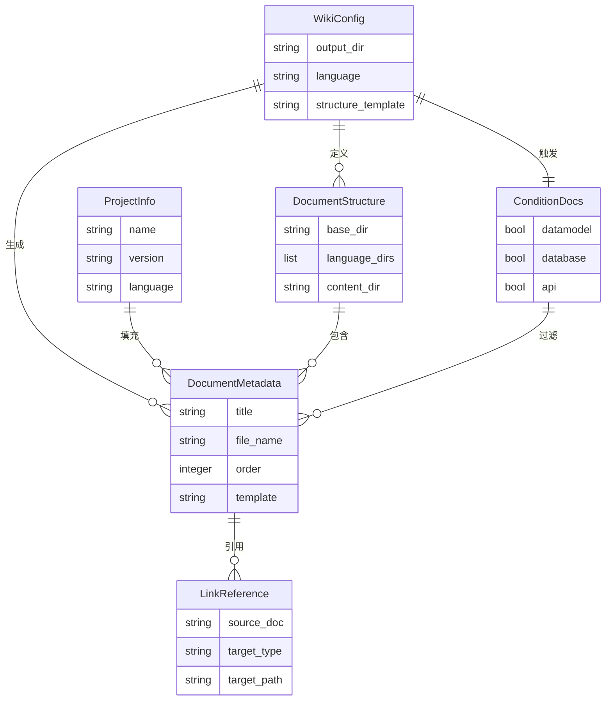

# 数据模型：优化 Wiki 文档结构和模板

**版本**: 1.0.0
**创建日期**: 2025-01-04
**功能**: [spec.md](spec.md)

---

## 1. 实体定义

### 1.1 WikiConfig（Wiki 配置）

**描述**: Wiki 文档生成的全局配置

**字段**:
```json
{
  "output_dir": "string",           // 输出目录（默认: "docs"）
  "language": "string",              // 语言："zh" | "en" | "both"
  "structure_template": "string",    // 结构模板："reference" | "simple" | "custom"
  "include_sources": "boolean",      // 是否包含 Section sources
  "generate_toc": "boolean",         // 是否生成目录
  "sections": {                      // 文档章节配置
    "required": ["string"],          // 必需文档列表
    "optional": ["string"]           // 可选文档列表
  },
  "formatting": {                    // 格式化配置
    "code_block_syntax": "boolean",  // 代码块语法高亮
    "line_numbers": "boolean",       // 是否显示行号
    "section_sources": "boolean"     // 是否显示章节来源
  },
  "links": {                         // 链接配置
    "auto_generate": "boolean",      // 是否自动生成链接
    "validate": "boolean"            // 是否验证链接
  }
}
```

**验证规则**:
- `output_dir`: 必须是非空字符串，不能包含特殊字符 `<>:"|?*`
- `language`: 必须是 `"zh"`, `"en"`, 或 `"both"` 之一
- `structure_template`: 必须是 `"reference"`, `"simple"`, 或 `"custom"` 之一
- `sections.required`: 如果 `structure_template="custom"` 则必需，否则可选
- `sections.optional`: 可选列表
- 所有布尔值默认为 `true`

**默认值**:
```json
{
  "output_dir": "docs",
  "language": "zh",
  "structure_template": "reference",
  "include_sources": true,
  "generate_toc": true
}
```

---

### 1.2 DocumentMetadata（文档元数据）

**描述**: 单个文档的元数据信息

**字段**:
```json
{
  "title": "string",              // 文档标题
  "file_name": "string",          // 文件名（如 "00-快速开始.md"）
  "order": "integer",             // 排序序号（00-99）
  "template": "string",           // 使用的模板名称
  "language": "string",           // 语言："zh" | "en"
  "cite_files": ["string"],       // 引用的文件列表
  "sections": [{                  // 章节列表
    "title": "string",            // 章节标题
    "anchor": "string",           // 锚点名称
    "sources": ["string"]         // 章节来源文件列表（如 "README.md#L1-L50"）
  }]
}
```

**验证规则**:
- `title`: 必需，非空
- `file_name`: 必需，必须以 `.md` 结尾
- `order`: 必需，0-99 范围内
- `template`: 必需，对应模板文件名
- `language`: 必需，与配置文件一致
- `cite_files`: 至少包含一个文件
- `sections`: 可以为空（但建议有内容）

**状态转换**:
```
创建 → 渲染中 → 已完成 → 已验证
   ↓       ↓        ↓
  失败    失败     验证失败
```

---

### 1.3 ProjectInfo（项目信息）

**描述**: 从代码库分析提取的项目信息

**字段**:
```json
{
  "name": "string",               // 项目名称
  "version": "string",            // 版本号
  "description": "string",        // 项目描述
  "author": "string",             // 作者
  "license": "string",            // 许可证
  "language": "string",           // 主要编程语言
  "tech_stack": ["string"],       // 技术栈列表
  "dependencies": [{              // 依赖项
    "name": "string",             // 依赖名称
    "version": "string"           // 版本要求
  }],
  "file_count": "integer",        // 文件数量
  "line_count": "integer",        // 代码行数
  "project_type": "string"        // 项目类型："web" | "cli" | "lib" | "other"
}
```

**验证规则**:
- `name`: 必需，非空
- `version`: 可选，符合语义化版本规范（如 "1.0.0"）
- `language`: 可选，默认从文件扩展名推断
- `file_count`: 必需，≥ 0
- `line_count`: 必需，≥ 0
- `project_type`: 必需，枚举值之一

**推断规则**:
- `language`: 统计文件扩展名，取最多的
- `tech_stack`: 从依赖文件推断（pyproject.toml → Python, package.json → Node.js）
- `project_type`: 根据文件结构推断
  - 有 `app.py` 或 `main.py` → 可能是 CLI
  - 有 `package.json` 和 `src/` → 可能是 Web
  - 有 `__init__.py` 但无入口文件 → 可能是库

---

### 1.4 ConditionDocs（条件文档）

**描述**: 根据项目特征判断是否生成的文档

**字段**:
```json
{
  "datamodel": "boolean",         // 数据模型文档（如检测到 ORM）
  "database": "boolean",          // 数据库相关文档（如检测到数据库连接）
  "api": "boolean",               // API 文档（如检测到 API 路由）
  "ui": "boolean",                // UI 文档（如检测到前端代码）
  "async_tasks": "boolean",       // 异步任务文档（如检测到 Celery）
  "auth": "boolean"               // 认证文档（如检测到登录代码）
}
```

**验证规则**:
- 所有字段均为布尔值
- 默认值为 `false`

**检测规则**（FR-02）:
- `datamodel`: 检测到 SQLAlchemy, Django ORM, Peewee 等
- `database`: 检测到数据库驱动（psycopg2, pymongo, redis-py）
- `api`: 检测到 FastAPI, Flask, Django REST framework
- `ui`: 检测到 React, Vue, HTML/CSS 文件
- `async_tasks`: 检测到 Celery, RQ, asyncio 相关代码
- `auth`: 检测到 `login`, `auth`, `jwt` 相关代码或模块

**检测权重**:
```python
SCORE_THRESHOLD = 1  # 至少得 1 分才生成

# 关键词匹配：1 分
# import 语句匹配：2 分
# 文件名匹配：3 分
```

---

### 1.5 DocumentStructure（文档结构）

**描述**: 文档的目录结构定义

**字段**:
```json
{
  "base_dir": "string",           // 基础目录（如 "docs"）
  "language_dirs": ["string"],    // 语言目录列表（["zh", "en"]）
  "content_dir": "string",        // 内容目录（"content"）
  "documents": [{                 // 文档列表
    "path": "string",             // 相对路径（如 "zh/content/00-快速开始.md"）
    "metadata": DocumentMetadata  // 文档元数据
  }],
  "modules": [{                   // 模块目录
    "name": "string",             // 模块名称
    "path": "string",             // 相对路径（如 "zh/content/核心功能"）
    "documents": ["string"]       // 包含的文档列表
  }]
}
```

**验证规则**:
- `base_dir`: 必需，相对路径
- `language_dirs`: 必需，非空，根据配置生成
- `content_dir`: 必需，固定为 "content"
- `documents`: 必需，至少包含一个文档
- `modules`: 可选

**结构模板**（FR-01）:
```python
# Reference 模板（默认）
structure = {
    "base_dir": "docs",
    "language_dirs": ["zh"],  # 根据 language 配置
    "content_dir": "content",
    "documents": [
        "00-快速开始.md",
        "01-项目概述.md",
        "02-技术栈与依赖.md",
        # ...
    ],
    "modules": [
        {
            "name": "数据模型",
            "path": "数据模型",
            "documents": ["数据库表结构.md", "关系图.md"]
        }
        # ...
    ]
}
```

---

### 1.6 LinkReference（链接引用）

**描述**: 文档中的交叉引用信息

**字段**:
```json
{
  "source_doc": "string",         // 源文档路径
  "target_type": "string",        // 目标类型："doc" | "code" | "anchor"
  "target_path": "string",        // 目标路径
  "link_text": "string",          // 链接文本
  "line_number": "integer"        // 在源文档中的行号
}
```

**验证规则**:
- `source_doc`: 必需，已存在的文档路径
- `target_type`: 必需，枚举值之一
- `target_path`: 必需，根据类型验证：
  - `doc`: 必须是已存在的文档
  - `code`: 必须是项目中的文件
  - `anchor`: 必须是当前文档中的锚点
- `link_text`: 必需，非空
- `line_number`: 必需，≥ 1

**链接生成规则**（FR-06）:
- `doc`: `[文档名](../relative/path/to/doc.md)`
- `code`: `[文件名](file://../../relative/path/to/file.py#L10)`
- `anchor`: `[章节名](#anchor-name)`

---

## 2. 关系图



---

## 3. 数据流

### 3.1 配置加载流程

```
.claude/wiki-config.json
    ↓
读取并验证（JSON Schema）
    ↓
WikiConfig 实体
    ↓
应用默认值
    ↓
可用配置对象
```

### 3.2 文档生成流程

```
ProjectInfo + ConditionDocs
    ↓
分析项目特征
    ↓
确定需要生成的文档列表
    ↓
结合 WikiConfig
    ↓
生成 DocumentStructure
    ↓
为每个文档创建 DocumentMetadata
    ↓
渲染模板 → 生成 .md 文件
    ↓
生成 LinkReference（交叉引用）
    ↓
更新文档中的链接
```

---

## 4. 验证示例

### 4.1 有效配置

```json
{
  "output_dir": "docs",
  "language": "zh",
  "structure_template": "reference",
  "include_sources": true,
  "sections": {
    "required": ["quickstart", "overview"],
    "optional": ["datamodel"]
  }
}
```

### 4.2 无效配置

```json
{
  "output_dir": "docs",
  "language": "chinese",  // ❌ 错误：必须是 "zh", "en", "both"
  "structure_template": "custom",
  "sections": {}  // ❌ 错误：custom 模式下 sections 必需
}
```

---

## 5. 实现检查清单

- [ ] 实现 `WikiConfig` 类，包含所有字段和验证
- [ ] 实现 `DocumentMetadata` 类，包含状态转换
- [ ] 实现 `ProjectInfo` 类，包含推断逻辑
- [ ] 实现 `ConditionDocs` 类，包含检测规则
- [ ] 实现 `DocumentStructure` 类，支持结构模板
- [ ] 实现 `LinkReference` 类，支持三种链接类型
- [ ] 创建 JSON Schema 验证器
- [ ] 编写单元测试覆盖所有验证规则
- [ ] 编写集成测试测试完整数据流

---

**状态**: 草稿 - 待审查
**下一步**: 创建 API contracts
