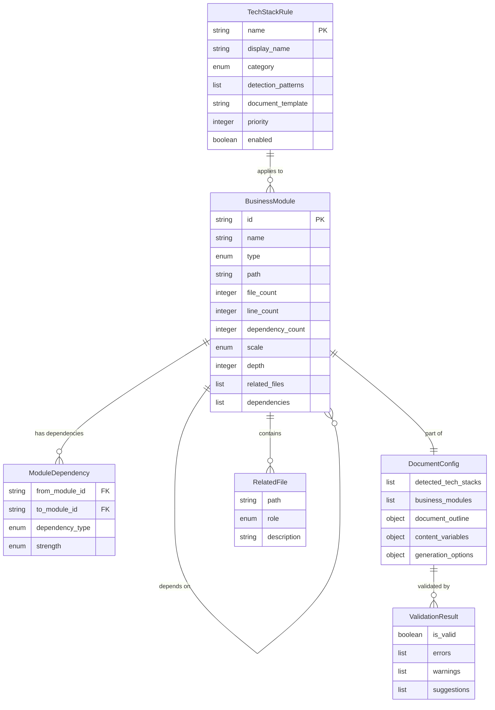

# Data Model: 自动文档大纲提取与主题映射

**功能版本**: 1.0.0
**创建日期**: 2026-01-04
**状态**: 草稿

---

## 概述

本文档定义了自动文档大纲提取功能的核心数据模型。这些模型用于表示技术栈规则、业务模块、文档配置等核心实体。

---

## 1. TechStackRule（技术栈规则）

### 描述

定义单个技术栈的检测规则和对应的文档生成配置。

### 字段

| 字段名 | 类型 | 必需 | 说明 | 示例值 |
|--------|------|------|------|--------|
| `name` | string | ✅ | 技术栈名称（唯一标识符） | `"fastapi"` |
| `display_name` | string | ✅ | 显示名称（中文） | `"FastAPI"` |
| `category` | enum | ✅ | 技术栈类别 | `"backend_framework"` |
| `detection_patterns` | list | ✅ | 检测模式列表 | 见下方 |
| `document_template` | string | ✅ | 对应的文档模板路径 | `"api/interface.md.template"` |
| `priority` | integer | ✅ | 优先级（用于去重，数值越大优先级越高） | `10` |
| `enabled` | boolean | ✅ | 是否启用 | `true` |

### DetectionPattern（检测模式）

| 字段名 | 类型 | 必需 | 说明 | 示例值 |
|--------|------|------|------|--------|
| `type` | enum | ✅ | 检测类型 | `"import_statement"` / `"config_file"` / `"file_exists"` |
| `pattern` | string | ✅ | 匹配模式 | `"from fastapi"` |
| `path` | string | ❌ | 检测路径（可选，用于缩小范围） | `"src/"` |
| `threshold` | integer | ❌ | 最小匹配次数（阈值过滤） | `3` |

### Category（技术栈类别）枚举

| 值 | 说明 |
|----|------|
| `backend_framework` | 后端框架（FastAPI、Flask、Django 等） |
| `orm` | ORM 框架（SQLAlchemy、Django ORM 等） |
| `cli_framework` | CLI 框架（Click、Typer 等） |
| `frontend_framework` | 前端框架（React、Vue 等） |
| `task_queue` | 任务队列（Celery、RQ 等） |
| `message_queue` | 消息队列（Kafka、RabbitMQ 等） |
| `test_framework` | 测试框架（pytest、unittest 等） |
| `database` | 数据库（PostgreSQL、MySQL 等） |
| `cache` | 缓存（Redis、Memcached 等） |
| `containerization` | 容器化（Docker、Kubernetes 等） |
| `api_specification` | API 规范（OpenAPI、GraphQL 等） |

### 示例

```json
{
  "name": "fastapi",
  "display_name": "FastAPI",
  "category": "backend_framework",
  "detection_patterns": [
    {
      "type": "import_statement",
      "pattern": "from fastapi",
      "path": "src/",
      "threshold": 3
    },
    {
      "type": "import_statement",
      "pattern": "import fastapi",
      "path": "src/",
      "threshold": 3
    }
  ],
  "document_template": "api/interface.md.template",
  "priority": 10,
  "enabled": true
}
```

### 验证规则

- `name` 必须是唯一的
- `priority` 范围：1-10
- `detection_patterns` 至少包含一个模式
- `category` 必须是有效的枚举值

---

## 2. BusinessModule（业务模块）

### 描述

表示从项目结构中识别出的单个业务模块。

### 字段

| 字段名 | 类型 | 必需 | 说明 | 示例值 |
|--------|------|------|------|--------|
| `id` | string | ✅ | 模块唯一标识符 | `"user_service"` |
| `name` | string | ✅ | 模块名称（中文） | `"用户管理服务"` |
| `type` | enum | ✅ | 模块类型 | `"service"` |
| `path` | string | ✅ | 模块路径（绝对路径或相对路径） | `"src/services/user_service.py"` |
| `file_count` | integer | ✅ | 文件数量 | `5` |
| `line_count` | integer | ❌ | 代码行数（可选） | `1500` |
| `dependency_count` | integer | ❌ | 依赖数量（可选） | `8` |
| `scale` | enum | ✅ | 规模等级 | `"medium"` |
| `depth` | integer | ✅ | 文档层级深度（1-4） | `2` |
| `related_files` | list | ✅ | 相关文件列表 | 见下方 |
| `dependencies` | list | ❌ | 依赖的其他模块 ID 列表 | `["database_service"]` |

### RelatedFile（相关文件）

| 字段名 | 类型 | 必需 | 说明 | 示例值 |
|--------|------|------|------|--------|
| `path` | string | ✅ | 文件路径（相对于项目根目录） | `"src/services/user_service.py"` |
| `role` | enum | ✅ | 文件角色 | `"main"` / `"helper"` / `"test"` |
| `description` | string | ❌ | 文件描述（可选） | `"用户管理服务主逻辑"` |

### Type（模块类型）枚举

| 值 | 说明 | 扫描路径 |
|----|------|---------|
| `service` | 服务层 | `src/services/`, `app/services/`, `services/` |
| `page` | 页面层 | `pages/`, `app/pages/`, `src/pages/` |
| `api` | API 层 | `api/`, `routers/`, `views/` |
| `model` | 模型层 | `models/`, `src/models/` |

### Scale（规模等级）枚举

| 值 | 文件数量 | 层级深度 | 生成策略 |
|----|---------|---------|---------|
| `small` | 1-4 | 1 | 只生成索引文档 |
| `medium` | 5-20 | 2 | 索引 + 子功能文档 |
| `large` | 21-50 | 3 | 索引 + 子功能 + 机制文档 |
| `xlarge` | >50 | 4 | 完整层级（分类子模块） |

### Role（文件角色）枚举

| 值 | 说明 |
|----|------|
| `main` | 主文件（包含核心逻辑） |
| `helper` | 辅助文件（工具函数） |
| `test` | 测试文件（单元测试、集成测试） |

### 示例

```json
{
  "id": "user_service",
  "name": "用户管理服务",
  "type": "service",
  "path": "src/services/user_service.py",
  "file_count": 5,
  "line_count": 1500,
  "dependency_count": 8,
  "scale": "medium",
  "depth": 2,
  "related_files": [
    {
      "path": "src/services/user_service.py",
      "role": "main",
      "description": "用户管理服务主逻辑"
    },
    {
      "path": "src/services/user_service_test.py",
      "role": "test",
      "description": "用户管理服务单元测试"
    }
  ],
  "dependencies": ["database_service", "cache_service"]
}
```

### 验证规则

- `id` 必须是唯一的
- `file_count` 必须 ≥ 1
- `line_count` 必须 ≥ 0（如果提供）
- `dependency_count` 必须 ≥ 0（如果提供）
- `depth` 范围：1-4
- `type` 必须是有效的枚举值
- `scale` 必须是有效的枚举值
- `scale` 和 `file_count` 必须匹配（见规模等级表）

---

## 3. DocumentConfig（文档配置）

### 描述

文档生成的全局配置，包含检测到的技术栈、业务模块和文档大纲。

### 字段

| 字段名 | 类型 | 必需 | 说明 | 示例值 |
|--------|------|------|------|--------|
| `detected_tech_stacks` | list | ✅ | 检测到的技术栈列表（已去重） | `["fastapi", "sqlalchemy", "pytest"]` |
| `business_modules` | list | ✅ | 业务模块列表 | 见下方 |
| `document_outline` | object | ✅ | 文档大纲（树状结构） | 见下方 |
| `content_variables` | object | ✅ | 内容变量（从项目提取） | 见下方 |
| `generation_options` | object | ❌ | 生成选项（可选） | 见下方 |

### DocumentOutline（文档大纲）

文档大纲是一个树状结构，表示生成的文档层级。

```json
{
  "required_documents": [
    {
      "order": 1,
      "filename": "00-快速开始.md",
      "title": "快速开始",
      "template": "quickstart.md.template"
    },
    {
      "order": 2,
      "filename": "01-项目概述.md",
      "title": "项目概述",
      "template": "overview.md.template"
    }
  ],
  "conditional_documents": [
    {
      "category": "数据模型",
      "tech_stack": "sqlalchemy",
      "documents": [
        {
          "filename": "数据模型/数据模型.md",
          "title": "数据模型",
          "template": "datamodel.md.template"
        },
        {
          "filename": "数据模型/用户模型.md",
          "title": "用户模型",
          "module_id": "user_model"
        }
      ]
    },
    {
      "category": "API 文档",
      "tech_stack": "fastapi",
      "documents": [
        {
          "filename": "API 文档/API 接口.md",
          "title": "API 接口",
          "template": "api.md.template"
        }
      ]
    }
  ],
  "business_module_documents": [
    {
      "module_id": "user_service",
      "filename": "业务模块/用户管理服务.md",
      "title": "用户管理服务",
      "depth": 2,
      "sub_documents": [
        {
          "filename": "业务模块/用户管理服务/用户创建.md",
          "title": "用户创建",
          "template": "service_subfeature.md.template"
        },
        {
          "filename": "业务模块/用户管理服务/用户查询.md",
          "title": "用户查询",
          "template": "service_subfeature.md.template"
        }
      ]
    }
  ]
}
```

### ContentVariables（内容变量）

从项目中提取的变量，用于填充文档模板。

```json
{
  "project": {
    "name": "dingtalk-notable-connect",
    "description": "钉钉多维表格与 PostgreSQL 数据同步系统",
    "version": "1.0.0",
    "python_version": "3.11",
    "features": [
      "安全的数据库连接管理",
      "灵活的字段映射配置",
      "自动创建目标表",
      "按需数据导入"
    ]
  },
  "tech_stack": {
    "backend_framework": "Streamlit",
    "orm": "SQLAlchemy",
    "database": "PostgreSQL",
    "test_framework": "pytest"
  },
  "dependencies": {
    "production": [
      "streamlit==1.28.0",
      "sqlalchemy==2.0.23",
      "psycopg2-binary==2.9.9"
    ],
    "development": [
      "pytest==7.4.3",
      "ruff==0.1.6",
      "mypy==1.7.1"
    ]
  }
}
```

### GenerationOptions（生成选项）

```json
{
  "max_modules": 50,
  "max_depth": 4,
  "parallel_workers": 4,
  "enable_cache": true,
  "verbose": false
}
```

### 验证规则

- `detected_tech_stacks` 不能包含重复项
- `business_modules` 中的 `module_id` 必须唯一
- `document_outline` 中的文件路径不能冲突
- `content_variables.project.version` 必须符合语义化版本规范

---

## 4. ValidationResult（验证结果）

### 描述

表示配置或文档验证的结果。

### 字段

| 字段名 | 类型 | 必需 | 说明 | 示例值 |
|--------|------|------|------|--------|
| `is_valid` | boolean | ✅ | 是否有效 | `true` |
| `errors` | list | ✅ | 错误列表 | 见下方 |
| `warnings` | list | ✅ | 警告列表 | 见下方 |
| `suggestions` | list | ❌ | 改进建议列表（可选） | 见下方 |

### ValidationError（验证错误）

| 字段名 | 类型 | 必需 | 说明 | 示例值 |
|--------|------|------|------|--------|
| `code` | string | ✅ | 错误代码 | `"INVALID_MODULE_SCALE"` |
| `message` | string | ✅ | 错误消息 | `"模块规模等级与文件数量不匹配"` |
| `field` | string | ❌ | 相关字段（可选） | `"scale"` |
| `value` | any | ❌ | 错误值（可选） | `"small"` |

### ValidationWarning（验证警告）

| 字段名 | 类型 | 必需 | 说明 | 示例值 |
|--------|------|------|------|--------|
| `code` | string | ✅ | 警告代码 | `"LARGE_MODULE_SIZE"` |
| `message` | string | ✅ | 警告消息 | `"模块文件数量超过 50，建议拆分"` |
| `field` | string | ❌ | 相关字段（可选） | `"file_count"` |

### 示例

```json
{
  "is_valid": true,
  "errors": [],
  "warnings": [
    {
      "code": "LARGE_MODULE_SIZE",
      "message": "模块文件数量超过 50，建议拆分",
      "field": "file_count"
    }
  ],
  "suggestions": [
    {
      "code": "CONSIDER_SPLITTING",
      "message": "考虑将 user_service 拆分为多个子模块"
    }
  ]
}
```

### 验证规则

- `is_valid` 为 `false` 时，`errors` 不能为空
- `errors` 中的错误代码必须是预定义的错误代码
- `warnings` 和 `suggestions` 可以为空

---

## 5. ModuleDependency（模块依赖）

### 描述

表示业务模块之间的依赖关系。

### 字段

| 字段名 | 类型 | 必需 | 说明 | 示例值 |
|--------|------|------|------|--------|
| `from_module_id` | string | ✅ | 源模块 ID | `"user_service"` |
| `to_module_id` | string | ✅ | 目标模块 ID | `"database_service"` |
| `dependency_type` | enum | ✅ | 依赖类型 | `"imports"` |
| `strength` | enum | ❌ | 依赖强度（可选） | `"strong"` |

### DependencyType（依赖类型）枚举

| 值 | 说明 |
|----|------|
| `imports` | 导入依赖（Python import） |
| `calls` | 调用依赖（函数调用） |
| `data_flow` | 数据流依赖（数据传递） |
| `inherits` | 继承依赖（类继承） |

### Strength（依赖强度）枚举

| 值 | 说明 |
|----|------|
| `strong` | 强依赖（直接依赖，必需） |
| `weak` | 弱依赖（可选依赖） |
| `indirect` | 间接依赖（通过中间层） |

### 示例

```json
{
  "from_module_id": "user_service",
  "to_module_id": "database_service",
  "dependency_type": "calls",
  "strength": "strong"
}
```

---

## 数据关系

### Entity-Relationship Diagram



---

## 数据模型使用场景

### 场景 1：技术栈检测

```
TechStackRule (检测规则)
    ↓ detect_tech_stack()
detected_tech_stacks: ["fastapi", "sqlalchemy"]
    ↓ 去重（优先级规则）
final_tech_stacks: ["fastapi", "sqlalchemy"]
```

### 场景 2：业务模块识别

```
project_root/src/services/
    ↓ identify_business_modules()
BusinessModule[] (业务模块列表)
    ↓ calculate_module_scale()
BusinessModule.scale, BusinessModule.depth
    ↓ 生成文档
document_outline.business_module_documents
```

### 场景 3：文档生成

```
DocumentConfig (文档配置)
    ├── detected_tech_stacks → 确定条件文档
    ├── business_modules → 确定业务模块文档
    ├── content_variables → 填充模板变量
    └── document_outline → 文档结构树
        ↓ generate_document()
输出文档文件（Markdown）
```

---

## 验证规则汇总

### 必需字段验证

所有模型的必需字段都不能为空或 `null`。

### 唯一性验证

- `TechStackRule.name` 必须唯一
- `BusinessModule.id` 必须唯一
- `DocumentConfig.detected_tech_stacks` 不能包含重复项
- `DocumentConfig.business_modules` 中的 `module_id` 必须唯一

### 范围验证

- `TechStackRule.priority`: 1-10
- `BusinessModule.file_count`: ≥ 1
- `BusinessModule.line_count`: ≥ 0
- `BusinessModule.dependency_count`: ≥ 0
- `BusinessModule.depth`: 1-4

### 格式验证

- `TechStackRule.name`: 小写字母、数字、下划线
- `BusinessModule.id`: 小写字母、数字、下划线
- `BusinessModule.path`: 有效的文件路径格式
- `content_variables.project.version`: 语义化版本（X.Y.Z）

### 逻辑验证

- `BusinessModule.scale` 和 `file_count` 必须匹配（见规模等级表）
- `BusinessModule.depth` 必须根据 `scale` 确定（见规模等级表）
- `ModuleDependency.from_module_id` 和 `to_module_id` 不能相同（无自依赖）

---

**数据模型版本**: 1.0.0
**最后更新**: 2026-01-04
**状态**: ✅ 完成 - 已定义所有核心实体和验证规则
