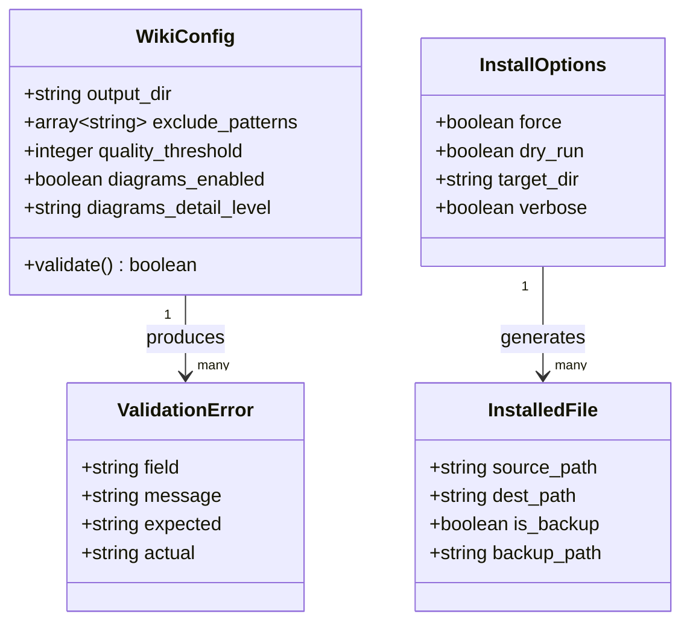
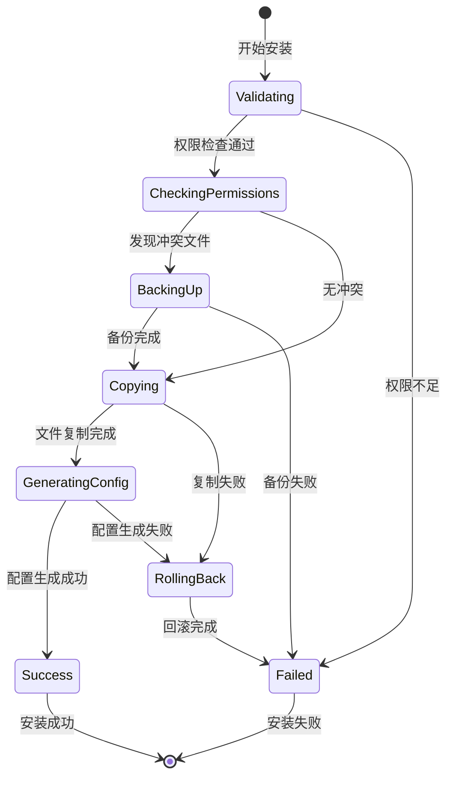

# Data Model: Wiki Generator CLI 安装工具

**功能版本**: 1.0.0
**创建日期**: 2026-01-04
**状态**: Draft

---

## 核心实体

### 1. WikiConfig

**描述**: Wiki 生成器的配置文件结构

**属性**:

| 字段名 | 类型 | 必需 | 默认值 | 约束 | 说明 |
|--------|------|------|--------|------|------|
| `output_dir` | `string` | ✅ | `"docs"` | 非空字符串 | 文档输出目录路径（相对或绝对） |
| `exclude_patterns` | `array<string>` | ✅ | `["node_modules", "dist", ".git"]` | 至少 1 个元素 | 排除的文件/目录模式列表 |
| `quality_threshold` | `integer` | ✅ | `80` | `0-100` 范围 | 文档质量分数阈值 |
| `diagrams_enabled` | `boolean` | ✅ | `true` | - | 是否生成 Mermaid 图表 |
| `diagrams_detail_level` | `enum` | ✅ | `"medium"` | `"low"` \| `"medium"` \| `"high"` | 图表细节级别 |

**验证规则**:
- `diagrams_detail_level` 必须是 `"low"`, `"medium"`, 或 `"high"` 之一
- `quality_threshold` 必须在 0 到 100 之间（包含边界）
- `exclude_patterns` 不能为空数组

**示例**:
```json
{
  "output_dir": "docs",
  "exclude_patterns": ["node_modules", "dist", ".git", "__pycache__"],
  "quality_threshold": 85,
  "diagrams_enabled": true,
  "diagrams_detail_level": "high"
}
```

---

### 2. InstalledFile

**描述**: 跟踪已安装的文件信息，用于回滚

**属性**:

| 字段名 | 类型 | 必需 | 默认值 | 说明 |
|--------|------|------|--------|------|
| `source_path` | `string` | ✅ | - | 源文件路径（包内路径） |
| `dest_path` | `string` | ✅ | - | 目标文件路径（项目内路径） |
| `is_backup` | `boolean` | ❌ | `false` | 是否是已存在文件的备份 |
| `backup_path` | `string` | ❌ | `null` | 备份文件路径（如果 `is_backup=true`） |

**使用场景**:
- 安装过程中记录每个复制的文件
- 回滚时根据 `dest_path` 删除文件
- 如果覆盖了现有文件，从 `backup_path` 恢复

---

### 3. InstallOptions

**描述**: 安装命令的选项配置

**属性**:

| 字段名 | 类型 | 必需 | 默认值 | 说明 |
|--------|------|------|--------|------|
| `force` | `boolean` | ❌ | `false` | 强制覆盖已存在文件 |
| `dry_run` | `boolean` | ❌ | `false` | 显示将要安装的文件，不实际复制 |
| `target_dir` | `string` | ❌ | `"."` | 目标安装目录（默认当前目录） |
| `verbose` | `boolean` | ❌ | `false` | 显示详细输出 |

---

### 4. ValidationError

**描述**: 配置文件验证错误

**属性**:

| 字段名 | 类型 | 必需 | 说明 |
|--------|------|------|------|
| `field` | `string` | ✅ | 出错字段名 |
| `message` | `string` | ✅ | 错误描述（用户可读） |
| `expected` | `string` | ❌ | 期望的值类型或范围 |
| `actual` | `string` | ❌ | 实际值（用于调试） |

**示例**:
```python
ValidationError(
    field="quality_threshold",
    message="质量阈值必须在 0 到 100 之间",
    expected="0-100",
    actual="150"
)
```

---

## 实体关系图



---

## 状态机

### 安装过程状态



**状态说明**:
- **Validating**: 验证目标目录和选项
- **CheckingPermissions**: 检查写入权限
- **BackingUp**: 备份已存在的文件
- **Copying**: 复制 `.claude/` 文件
- **GeneratingConfig**: 生成 `wiki-config.json`
- **RollingBack**: 回滚已安装的文件
- **Success**: 安装成功
- **Failed**: 安装失败

---

## 数据格式

### wiki-config.json Schema

```json
{
  "$schema": "http://json-schema.org/draft-07/schema#",
  "type": "object",
  "required": ["output_dir", "exclude_patterns", "quality_threshold", "diagrams_enabled", "diagrams_detail_level"],
  "properties": {
    "output_dir": {
      "type": "string",
      "minLength": 1,
      "description": "文档输出目录"
    },
    "exclude_patterns": {
      "type": "array",
      "minItems": 1,
      "items": {
        "type": "string"
      },
      "description": "排除的文件/目录模式"
    },
    "quality_threshold": {
      "type": "integer",
      "minimum": 0,
      "maximum": 100,
      "description": "文档质量分数阈值"
    },
    "diagrams_enabled": {
      "type": "boolean",
      "description": "是否生成图表"
    },
    "diagrams_detail_level": {
      "type": "string",
      "enum": ["low", "medium", "high"],
      "description": "图表细节级别"
    }
  }
}
```

---

## 数据访问模式

### 只读操作
- 读取现有 `wiki-config.json`（用于验证和保留）
- 读取包内 `.claude/` 目录结构（用于 dry-run）

### 写入操作
- 写入新的 `wiki-config.json`
- 复制文件到目标目录
- 创建备份文件（如果需要覆盖）

### 事务性
- 安装过程应该是原子的（全成功或全回滚）
- 使用文件列表跟踪实现回滚机制

---

## 扩展性考虑

### 未来可能添加的字段

**WikiConfig** 可能扩展：
- `template_dir`: 自定义模板目录
- `max_file_size`: 最大文件大小限制
- `include_hidden_files`: 是否包含隐藏文件
- `language`: 文档语言（中文/英文）

**InstallOptions** 可能扩展：
- `no_config`: 跳过配置文件生成
- `config_only`: 只生成配置文件
- `upgrade`: 升级模式（保留用户配置）

---

**数据模型版本**: 1.0.0
**最后更新**: 2026-01-04
