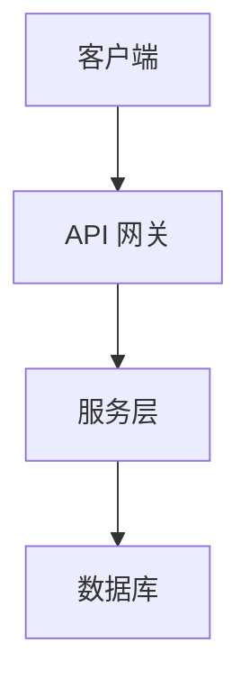

# Wiki 模板格式规范

**版本**: 2.0.0
**最后更新**: 2025-01-04

---

## 概述

本文档定义了 Wiki Generator 的模板格式规范。模板由 Claude Code `/wiki-generate` 命令使用，通过 AI 分析代码库并填充变量来生成文档。

---

## 模板结构

### 必需元素

每个模板必须包含以下元素：

1. **标题变量**: `{title}`
2. **引用块**: `<cite>...</cite>`
3. **目录占位符**: `{toc}`
4. **Section sources**: 每个 section 后的来源引用
5. **参考来源**: 文档末尾的 `{sources}`

### 模板示例

```markdown
# {title}

<cite>
**本文档中引用的文件**
{cite_files}
</cite>

## 目录
{toc}

## 章节 1

{section_1_content}

**Section sources**
{section_1_sources}

## 章节 2

{section_2_content}

**Section sources**
{section_2_sources}

---

## 参考来源

{sources}
```

---

## 变量语法

### 变量格式

变量使用 `{variable_name}` 格式。

### 标准变量

| 变量名 | 类型 | 说明 | 示例 |
|--------|------|------|------|
| `{title}` | string | 文档标题 | "快速开始" |
| `{cite_files}` | list | 引用文件列表 | `- [README.md](file://README.md)` |
| `{toc}` | markdown | 目录索引（自动生成） | `1. [简介](#简介)\n2. [安装](#安装)` |
| `{sources}` | list | 所有参考来源 | `- [src/main.py](file://src/main.py#L10-L50)` |

### Section 变量

每个 section 应包含：
- 内容变量: `{section_name_content}`
- 来源变量: `{section_name_sources}`

### Claude 指导注释

使用 HTML 注释向 Claude Code 提供指导：

```markdown
<!-- Claude: 请从 README.md 提取项目概述 -->
{project_overview}
```

---

## Section Sources 格式

### 格式规范

每个 section 后必须包含 **Section sources** 块：

```markdown
**Section sources**
- [filename.py](file://filename.py#L1-L100)
- [README.md](file://README.md#L50-L80)
```

### 行号定位

引用应包含精确的行号范围：
- `#L1-L100`: 第 1-100 行
- `#L50`: 仅第 50 行
- `#L10-L50, L60-L70`: 多个范围

---

## 文件引用格式

### Cite 块

文档顶部的 `<cite>` 块列出所有引用的文件：

```markdown
<cite>
**本文档中引用的文件**
- [README.md](file://README.md)
- [src/main.py](file://src/main.py)
- [pyproject.toml](file://pyproject.toml)
</cite>
```

### File URI 格式

使用 `file://` 协议：
- 相对路径: `[README.md](file://README.md)`
- 带行号: `[main.py](file://src/main.py#L10-L50)`

---

## 目录（TOC）生成

### 手动 TOC

Claude Code 可以生成手动 TOC：

```markdown
## 目录
1. [简介](#简介)
2. [安装](#安装)
3. [配置](#配置)
```

### 自动 TOC 标记

使用 `{toc}` 变量，Claude Code 将自动生成：

```markdown
## 目录
{toc}
```

---

## Mermaid 图表

### 支持的图表类型

- **架构图**: `graph TB` / `graph LR`
- **ER 图**: `erDiagram`
- **序列图**: `sequenceDiagram`
- **流程图**: `flowchart TD`

### 示例

````markdown
## 系统架构


````

### 变量占位符

````markdown
```mermaid
{architecture_diagram}
```
````

---

## 代码块格式

### 标准代码块

````markdown
```bash
npm install
npm run dev
```
````

### 带文件路径的代码块

````markdown
```python title="src/main.py"
def main():
    print("Hello, World!")
```
````

---

## 语言规范

### 中文模板

- 标题: 简体中文
- 变量名: 英文（例如 `{project_overview}`）
- 注释: 简体中文

### 英文模板

- 标题: 英文
- 变量名: 英文
- 注释: 英文

---

## 最佳实践

### 1. 一致的结构

所有模板应遵循相同的结构：
1. 标题
2. Cite 块
3. TOC
4. 章节（每个带 Section sources）
5. 参考来源

### 2. 清晰的变量命名

- 使用描述性变量名: `{project_overview}` 而非 `{content}`
- 按功能分组: `{installation_steps}`, `{configuration_steps}`
- 添加下划线分隔: `{feature_1_title}`, `{feature_1_description}`

### 3. 模块化设计

将复杂 section 拆分为多个变量：

```markdown
## 核心功能

### 功能 1: {feature_1_title}
{feature_1_description}

### 功能 2: {feature_2_title}
{feature_2_description}
```

### 4. Claude 指导

使用注释引导 Claude Code：

```markdown
<!-- Claude: 从以下文件提取配置信息:
     - .env.example
     - src/config.py
     - README.md#配置章节
-->
{configuration_content}
```

### 5. 验证完整性

确保每个变量：
- 在 `<cite>` 块中有对应文件引用
- 有明确的 Section sources
- 包含行号定位

---

## 模板检查清单

创建新模板时，确保：

- [ ] 包含 `{title}` 变量
- [ ] 包含 `<cite>` 块和 `{cite_files}` 变量
- [ ] 包含 `{toc}` 变量
- [ ] 每个 section 后有 **Section sources** 块
- [ ] 文档末尾有 `{sources}` 变量
- [ ] 所有变量使用 `{variable_name}` 格式
- [ ] 变量名具有描述性
- [ ] 添加必要的 Claude 指导注释
- [ ] 文件引用使用 `file://` 协议
- [ ] Section sources 包含行号定位

---

## 模板文件命名

### 格式

`{document_name}.md.template`

### 示例

- `quickstart.md.template`
- `overview.md.template`
- `architecture.md.template`

---

## 目录组织

```
.claude/
├── templates/
│   ├── zh/
│   │   ├── quickstart.md.template
│   │   ├── overview.md.template
│   │   └── ...
│   └── en/
│       ├── quickstart.md.template
│       ├── overview.md.template
│       └── ...
└── schema/
    └── wiki-config-schema-v2.json
```

---

## 版本控制

模板版本由 `.claude/.template-version` 文件管理：

```
2.0.0
```

格式: `MAJOR.MINOR.PATCH`
- **MAJOR**: 重大结构变更
- **MINOR**: 新增模板或功能
- **PATCH**: 小修复或改进

---

## 故障排除

### 问题 1: Claude Code 未填充变量

**解决方案**:
1. 检查变量名是否正确（使用 `{variable_name}` 格式）
2. 确保 `<cite>` 块包含相关文件
3. 添加 Claude 指导注释

### 问题 2: Section sources 缺失

**解决方案**:
在每个 section 后手动添加：

```markdown
**Section sources**
- [file.py](file://path/to/file.py#L1-L100)
```

### 问题 3: TOC 链接错误

**解决方案**:
确保标题使用标准 Markdown 格式：
- `# H1` → `#h1`
- `## H2` → `#h2`
- 中文标题自动转换

---

## 示例：完整模板

参见 [quickstart.md.template](./zh/quickstart.md.template) 获取完整示例。

---

**版本**: 2.0.0
**最后更新**: 2025-01-04
